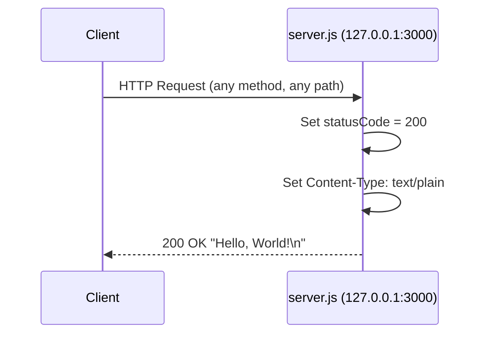
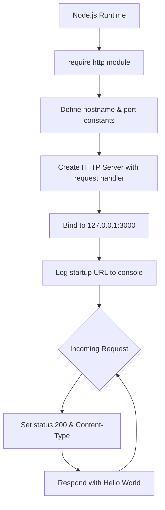

# hello_world

> A minimal Node.js HTTP server that responds with `"Hello, World!"` — a pedagogical example using only Node.js built-in modules with zero external dependencies.

[](https://opensource.org/licenses/MIT)
[](https://nodejs.org)

## Table of Contents

- [Prerequisites](#prerequisites)
- [Installation](#installation)
- [Usage / Quick Start](#usage--quick-start)
- [API Documentation](#api-documentation)
- [Code Walkthrough](#code-walkthrough)
- [Project Structure](#project-structure)
- [Deployment Guide](#deployment-guide)
- [Generating Documentation](#generating-documentation)
- [Troubleshooting](#troubleshooting)
- [License](#license)

---

## Prerequisites

Before running this project, ensure you have the following installed:

- **Node.js** v12.0.0 or later (the project runs on v20.20.0)
  - Download from [nodejs.org](https://nodejs.org)
- **npm** v7.0.0 or later (bundled with Node.js)
  - Required for installing devDependencies such as `jsdoc`

Verify your installed versions:

```bash
node --version
npm --version
```

---

## Installation

1. Clone the repository:

   ```bash
   git clone https://github.com/your-username/hello_world.git
   ```

2. Navigate to the project directory:

   ```bash
   cd hello_world
   ```

3. Install development dependencies:

   ```bash
   npm install
   ```

   This installs `jsdoc` (listed under `devDependencies` in `package.json`) for generating HTML documentation. The server itself has **zero runtime dependencies** and requires no additional packages to run.

---

## Usage / Quick Start

Start the server:

```bash
node server.js
```

Expected console output:

```
Server running at http://127.0.0.1:3000/
```

The server is now listening at `http://127.0.0.1:3000/`. Test it using `curl`:

```bash
curl http://127.0.0.1:3000/
```

Expected response:

```
Hello, World!
```

Press `Ctrl+C` to stop the server.

---

## API Documentation

The server exposes a single endpoint that responds identically to **all** incoming HTTP requests, regardless of HTTP method or URL path — there is no routing logic.

### Endpoint Specification

| Field | Value |
|-------|-------|
| URL | `http://127.0.0.1:3000/` |
| Method | Any (`GET`, `POST`, `PUT`, `DELETE`, etc. — no routing) |
| Status Code | `200 OK` |
| Response Header | `Content-Type: text/plain` |
| Response Body | `Hello, World!\n` |

### Example Request

```bash
curl -i http://127.0.0.1:3000/
```

### Example Response

```
HTTP/1.1 200 OK
Content-Type: text/plain
Date: Mon, 01 Jan 2024 00:00:00 GMT
Connection: keep-alive
Keep-Alive: timeout=5
Transfer-Encoding: chunked

Hello, World!
```

> **Note:** The `Date` header value will vary based on the time of the request. All other fields are constant and determined by the server implementation.

---

## Code Walkthrough

This section provides an annotated explanation of each logical section of `server.js` (14 lines of functional code, 53 lines including JSDoc documentation and inline comments). The snippets below show the code with inline comments as it appears in the annotated source file; JSDoc block annotations are described separately within each section.

---

### 1. Module Import

**Source: `server.js` line 12**

```javascript
const http = require('http');
```

The `require('http')` call loads Node.js's built-in `http` module using **CommonJS** module syntax. This module provides `createServer` and all related HTTP utility methods. No external packages are needed — `http` is part of the Node.js standard library and is available in all Node.js environments without installation.

> **JSDoc annotation:** The file includes a `@module hello_world/server` block at the top of `server.js`, documenting the module name, description, author (`hxu`), version (`1.0.0`), and license (`MIT`).

---

### 2. Server Configuration

**Source: `server.js` lines 21 and 28**

```javascript
const hostname = '127.0.0.1';
const port = 3000;
```

Two constants define the server's network binding:

- **`hostname`** — Set to `'127.0.0.1'`, the IPv4 loopback (localhost) address. This restricts connections to the local machine only; external clients and other devices on the network cannot reach the server at this address.
- **`port`** — Set to `3000`, a common port for local development servers. Ports above 1023 do not require elevated system privileges to bind.

> **JSDoc annotations:** Each constant has a `@constant` block with `@type {string}` / `@type {number}` tags and a `@default` tag documenting the value.

---

### 3. Request Handler

**Source: `server.js` lines 37–44**

```javascript
const server = http.createServer((req, res) => {
  // Set the HTTP response status code to 200 (OK)
  res.statusCode = 200;
  // Set the response Content-Type header to plain text
  res.setHeader('Content-Type', 'text/plain');
  // Send the response body and signal that the response is complete
  res.end('Hello, World!\n');
});
```

`http.createServer()` creates an HTTP server instance and accepts a **request handler** callback that is invoked for every incoming HTTP request:

- **`req`** (`http.IncomingMessage`) — The incoming request object, containing headers, URL, HTTP method, and body stream. This implementation does not inspect `req` — every request receives the same response.
- **`res`** (`http.ServerResponse`) — The response object used to send data back to the client:
  - `res.statusCode = 200` — Sets the HTTP response status code to `200 OK`.
  - `res.setHeader('Content-Type', 'text/plain')` — Sets the response `Content-Type` header to indicate plain-text content.
  - `res.end('Hello, World!\n')` — Sends the response body string and signals that the response is complete. The trailing `\n` is a conventional newline after the greeting text.

> **JSDoc annotation:** The `createServer` callback is documented with `@description`, `@param {http.IncomingMessage} req`, and `@param {http.ServerResponse} res` tags in the source file.

---

### 4. Server Startup

**Source: `server.js` lines 50–53**

```javascript
server.listen(port, hostname, () => {
  // Log the server URL to the console to confirm successful startup
  console.log(`Server running at http://${hostname}:${port}/`);
});
```

`server.listen()` binds the HTTP server to `hostname:port` (`127.0.0.1:3000`) and begins accepting incoming connections. The third argument is a **startup callback** that fires exactly once, after the server is successfully bound and listening. It uses a template literal to construct and log the exact server URL to the console, confirming successful startup.

> **JSDoc annotation:** The `listen` callback is documented with a `@description` tag describing its role as a startup confirmation logger.

---

### Request-Response Flow

The following sequence diagram illustrates the complete lifecycle of an HTTP request through the server:



### Server Architecture

The following flowchart shows the server's startup sequence and request handling loop:



---

## Project Structure

The repository uses a **flat structure** — all files reside at the root level with no subdirectories.

| File | Description |
|------|-------------|
| `server.js` | Main HTTP server — the project entry point |
| `server - Copy.js` | Byte-for-byte duplicate of `server.js` (test artifact) |
| `package.json` | NPM package manifest (name: `hello_world`, v1.0.0, MIT) |
| `package-lock.json` | NPM dependency lockfile (lockfileVersion 3) |
| `jsdoc.json` | JSDoc generator configuration file |
| `README.md` | Project documentation (this file) |
| `LoginTest.java` | Java login test placeholder (non-compilable stub) |
| `LoginTest - Copy.java` | Duplicate of `LoginTest.java` (test artifact) |
| `industry.csv` | CSV file with 43 industry categories |
| `industry - Copy.csv` | Duplicate of `industry.csv` (test artifact) |
| `test.py - Copy.txt` | Zero-byte placeholder file |
| `test.py.txt` | Zero-byte placeholder file |
| `test.txt.txt` | Zero-byte placeholder file |
| `100Pages.pdf` | PDF test artifact (multi-page document) |
| `100Pages - Copy.pdf` | Duplicate of `100Pages.pdf` (test artifact) |
| `demo.jpg` | JPEG image test artifact |
| `demo - Copy.jpg` | Duplicate of `demo.jpg` (test artifact) |
| `sample.doc` | Word document test artifact |
| `sample - Copy.doc` | Duplicate of `sample.doc` (test artifact) |

> **⚠️ Known anomaly:** `package.json` declares `"main": "index.js"`, but `index.js` does not exist in this repository. The actual entry point is `server.js`. This discrepancy is an intentional test fixture characteristic; run the server directly with `node server.js`.

> **ℹ️ Duplicate files:** Several files ending in ` - Copy` (or `.txt` variants) are intentional test artifacts for the Blitzy Backprop integration test suite. They are not part of the server logic.

---

## Deployment Guide

### Local Development

Start the server directly using Node.js:

```bash
node server.js
```

The server binds to `127.0.0.1:3000` — **localhost only**. It is accessible only from the same machine and is not reachable by external clients or other devices on the network. This is the intended configuration for local development.

### Production Considerations

For production deployments, consider the following modifications and additions:

**1. Allow external connections**

Change the `hostname` constant in `server.js` from `'127.0.0.1'` to `'0.0.0.0'` to bind to all available network interfaces:

```javascript
const hostname = '0.0.0.0';
```

**2. Use environment variables for configuration**

Avoid hardcoded values for `hostname` and `port` by reading from environment variables:

```javascript
const port = process.env.PORT || 3000;
const hostname = process.env.HOSTNAME || '0.0.0.0';
```

**3. Use a process manager**

Tools such as [PM2](https://pm2.keymetrics.io/) provide automatic restarts on crash, clustering across CPU cores, and centralized logging:

```bash
npm install -g pm2
pm2 start server.js --name hello_world
pm2 save
```

**4. Add HTTPS / TLS termination**

This server uses plain HTTP with no encryption. In production, place it behind a reverse proxy — such as [nginx](https://nginx.org) or [Caddy](https://caddyserver.com) — to handle TLS certificate management and HTTPS termination.

### Generating Documentation

Generate HTML API documentation from the JSDoc comments in `server.js`:

```bash
npm run docs
```

This runs `jsdoc -c jsdoc.json` and outputs HTML documentation files to the `docs-output/` directory (created automatically if it does not exist).

Open the generated documentation in a browser:

```bash
# macOS
open docs-output/index.html

# Linux
xdg-open docs-output/index.html

# Windows
start docs-output/index.html
```

The `jsdoc.json` configuration file at the project root controls the source file paths, output directory, and template settings.

---

## Troubleshooting

### Port Already in Use (`EADDRINUSE`)

**Error message:**

```
Error: listen EADDRINUSE: address already in use 127.0.0.1:3000
```

**Cause:** Another process is already listening on port 3000.

**Solution:**

```bash
# Find the process using port 3000
lsof -i :3000

# Kill the process using its PID
kill -9 <PID>
```

Alternatively, change the `port` constant in `server.js` to an available port (e.g., `3001`) and restart.

---

### Address Not Available (`EADDRNOTAVAIL`)

**Error message:**

```
Error: listen EADDRNOTAVAIL: address not available 127.0.0.1:3000
```

**Cause:** The specified `hostname` does not match any network interface available on the machine.

**Solution:** Verify the `hostname` value is a valid local address. The loopback address `'127.0.0.1'` is available on virtually all systems. If you changed `hostname` to a custom value, ensure it matches an existing network interface (`ip addr` on Linux, `ifconfig` on macOS).

---

### Connection Refused

**Error message:**

```
curl: (7) Failed to connect to 127.0.0.1 port 3000: Connection refused
```

**Cause:** The server is not running, or it started with an error.

**Solution:** Start the server with `node server.js` and confirm the console displays:

```
Server running at http://127.0.0.1:3000/
```

before attempting to connect.

---

## License

This project is licensed under the **MIT License**.

| Field | Value |
|-------|-------|
| License | MIT |
| Author | hxu |
| Declared in | `package.json` |

The MIT License is a permissive open-source license that allows free use, modification, and distribution of this software, provided the original copyright notice is retained.

---

*`hello_world` — a minimal HTTP server fixture demonstrating Node.js's built-in `http` module capabilities with zero external runtime dependencies.*
