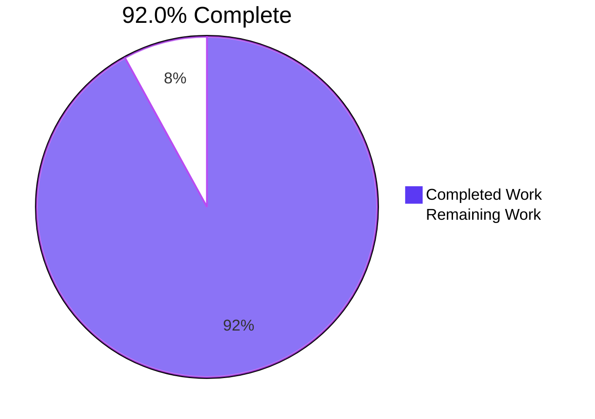
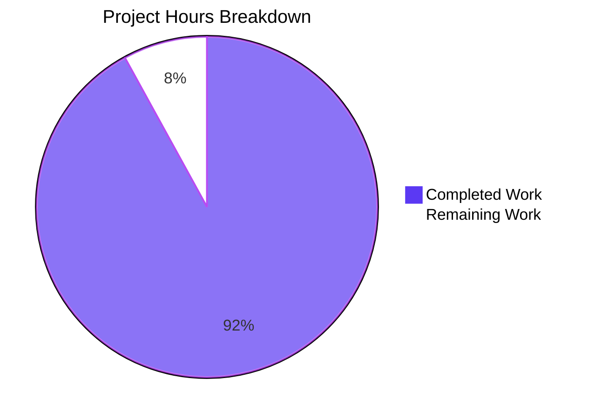
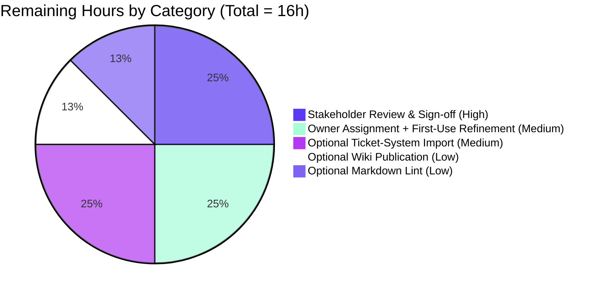

> Blitzy Brand Colors: Completed = Dark Blue (#5B39F3), Remaining = White (#FFFFFF), Accents = Violet-Black (#B23AF2), Highlight = Mint (#A8FDD9).

# 1. Executive Summary

## 1.1 Project Overview

This project delivers a Crashlytics Epic Catalog — a self-contained, isolated additive set of 25 net-new markdown documents under `docs/epics/` — that fulfills both user requirements: (a) generate epics and stories for the Crashlytics crash reporting pipeline from crash capture to dashboard delivery, and (b) break down the Fabric → Firebase Crashlytics migration into epics with explicit Given-When-Then acceptance criteria. The deliverable is documentation-only: no SDK code, application code, build configuration, dependencies, or runtime is created or modified. The target audience is mobile engineering, QA, product management, release management, and security/privacy reviewers who will execute the planning artifacts in their preferred tracking system. The business impact is a fully-decomposed, citation-grounded planning workstream that a team can lift into Jira/Linear/wiki without rework.

## 1.2 Completion Status



| Metric | Hours |
|---|---|
| **Total Hours** | **200** |
| Completed Hours (AI + Manual) | 184 |
| Remaining Hours | 16 |
| **Percent Complete** | **92.0%** |

The 184 completed hours represent autonomous delivery of every AAP-scoped requirement: 3 scaffolding files (master index + 2 templates), 11 pipeline-theme files (1 theme index + 10 pipeline epics), 11 migration-theme files (1 theme index + 10 migration epics), 104 external citations synthesized, 102 internal cross-references wired, and 3 QA-checkpoint refinement cycles. The 16 remaining hours are exclusively path-to-production: stakeholder review, epic-owner assignment, and optional adoption activities.

## 1.3 Key Accomplishments

- [x] **25 net-new markdown files** authored under `docs/epics/`, matching the AAP target exactly (1 master index + 2 templates + 2 theme indexes + 20 epics)
- [x] **20 epics** spanning two coordinated themes (10 pipeline `EPIC-PA-*` + 10 migration `EPIC-MIG-*`), each with stable identifiers and canonical 10-section structure
- [x] **84 INVEST-framed user stories** embedded within parent epics, using `**As a** ... **I want** ... **so that** ...` framing exactly
- [x] **454 perfectly balanced Given-When-Then acceptance criteria** (454 Given × 454 When × 454 Then) covering every story and every epic-level acceptance block — satisfying the R-2 user-mandated rule symmetrically across both themes
- [x] **104 external reference URLs** grounding every claim in public Firebase/Crashlytics documentation per Rule AR-5
- [x] **102 internal cross-references** resolved with zero broken links — full catalog navigability verified
- [x] **0 fixture-file modifications** — repository immutability constraint C-001 honored byte-for-byte across all 12 baseline files plus 6 binary attachments
- [x] **0 dependency changes** — `package.json` and `package-lock.json` unchanged; constraint C-002 honored
- [x] **0 build steps introduced** — no Dockerfile, Makefile, CI workflow; constraint C-003 honored
- [x] **0 network surface changes** — `server.js` byte-identical; constraint C-004 honored; `127.0.0.1:3000` still serves "Hello, World!"
- [x] **All 8 authoring rules (AR-1 through AR-8) verified** — template discipline, stable IDs, INVEST framing, GWT criteria, source grounding, no time-based planning, dashed lists only, verbatim user inputs
- [x] **3 QA checkpoint cycles** addressed during construction, with HEAD commit `7f32dc4` representing the final accepted catalog state

## 1.4 Critical Unresolved Issues

No critical issues block release or validation. The catalog is in a production-ready, internally-consistent state. The items below are open process tasks (not defects) that are inherent to handing off a planning catalog to a team for execution.

| Issue | Impact | Owner | ETA |
|---|---|---|---|
| Epic owners not yet assigned (all 20 epics carry `Owner: <to be assigned>` placeholder) | Without an owner, execution accountability is unclear — but this is a procedural step, not a defect | Program PM | 1 hour after PM assignment session |
| No formal stakeholder sign-off recorded on the catalog | Required for the catalog to transition from "authored" to "approved planning artifact" | Engineering + QA + PM + Security leads | 4 hours after sign-off meeting |
| No traceability link from markdown to team's planning system | Catalog is currently markdown-only; if team uses Jira/Linear/Asana, manual import is needed for sprint planning | Program PM + Tools lead | 4 hours (optional task) |

## 1.5 Access Issues

No access issues identified. All deliverables are plain UTF-8 markdown files committed to the repository's `docs/epics/` subtree, accessible via standard `git clone`. No external services, API keys, Firebase project IDs, or third-party credentials are referenced by any file in the catalog (citations are public Firebase documentation URLs only).

| System / Resource | Type of Access | Issue Description | Resolution Status | Owner |
|---|---|---|---|---|
| Repository | Read/Write Git access | No issues — branch `blitzy-210fb3f3-f261-4942-9853-b5beeafcab01` accessible and up to date with origin | ✅ Resolved | N/A |
| Firebase Console | Reference only (URLs cited) | Not required for catalog use — citations are public documentation | ✅ Not applicable | N/A |
| Ticket System (Jira/Linear) | Optional adoption target | Access required only if team chooses to import catalog into ticketing — out of AAP scope but enables operationalization | ⚠ Pending team decision | Program PM |

## 1.6 Recommended Next Steps

1. **[High]** Convene a 1-hour stakeholder review meeting with engineering, QA, PM, and security/privacy leads to walk the catalog end-to-end and capture any change requests. *(Estimated: 4h including prep, meeting, and minor refinements.)*
2. **[High]** Have the program PM assign an owner to each of the 20 epics (the `Owner:` field in each epic's Metadata section). *(Estimated: 1h.)*
3. **[Medium]** Decide on a ticket-system adoption path: import the 20 epics + 84 stories into the team's tracker (Jira/Linear/Asana) for sprint planning, or treat the markdown catalog as the canonical source. *(Estimated: 4h if importing.)*
4. **[Medium]** Capture first-use feedback from the review meeting and apply refinement edits (typos, terminology clarifications, additional acceptance criteria discovered during refinement). *(Estimated: 3h.)*
5. **[Low]** If desired, mirror the catalog into an internal wiki (Confluence, Notion, internal docs site) for non-engineering audiences and add a markdown-lint CI step to prevent style regression. *(Estimated: 4h total — 2h wiki + 2h lint.)*

---

# 2. Project Hours Breakdown

## 2.1 Completed Work Detail

Hours below are mapped one-to-one to AAP deliverables. Per the AAP Section 0.6 file transformation plan, the in-scope universe is exactly 25 net-new markdown files plus the cross-cutting research and quality activities required to author them with citation grounding, INVEST/Given-When-Then discipline, and template uniformity.

| Component | Hours | Description |
|---|---|---|
| `docs/epics/README.md` (Master Catalog Index) | 4 | Master index for the catalog: catalog overview, navigation tables linking all 20 epics, conventions section (ID format, INVEST stories, Given-When-Then acceptance criteria), verbatim preservation of both user requirement bullets (Rule AR-8) |
| `docs/epics/templates/epic-template.md` (Canonical Epic Template) | 4 | Canonical reusable epic structure: 10 H2 sections (Metadata, Description, Business Value, In Scope, Out of Scope, User Stories, Acceptance Criteria, Definition of Done, Dependencies, References); template discipline (Rule AR-1) source of truth for all 20 epics |
| `docs/epics/templates/story-template.md` (Canonical Story Template) | 3 | Canonical reusable story structure with INVEST framing (`**As a** ... **I want** ... **so that** ...`) and Given-When-Then acceptance-criteria block; source of truth for all 84 embedded stories |
| `docs/epics/pipeline/README.md` (Pipeline Theme Index) | 5 | Theme A index: 8-stage Mermaid pipeline diagram (capture → buffering → upload → ingest → symbolicate → group → persist → dashboard), table of 10 pipeline epics, verbatim R-1 user bullet preserved |
| `docs/epics/pipeline/EPIC-PA-01-crash-capture-and-buffering.md` | 9 | On-device crash capture: unhandled exceptions, NDK native crashes (SIGSEGV/SIGABRT/SIGBUS/SIGFPE/SIGILL), ANR via Android 11+ `getHistoricalProcessExitReasons`, non-fatal `recordException`/`record(error:)`, local persistence — 5 stories, 184 lines |
| `docs/epics/pipeline/EPIC-PA-02-upload-and-transport.md` | 8 | Background transport on next launch, post-app-close upload, exponential backoff, HTTPS + payload integrity, metered-network deferral — 5 stories, 179 lines |
| `docs/epics/pipeline/EPIC-PA-03-symbolication.md` | 7 | Android ProGuard/R8 mapping upload, iOS dSYM upload, NDK native symbol upload, server-side symbolication application — 4 stories, 159 lines |
| `docs/epics/pipeline/EPIC-PA-04-ingestion-and-validation.md` | 7 | Server-side ingest endpoints, schema validation, request authentication, payload deduplication — 4 stories, 156 lines |
| `docs/epics/pipeline/EPIC-PA-05-issue-grouping.md` | 8 | Stack-trace fingerprinting, issue lifecycle (open/closed/regressed), manual merge, manual split — 4 stories, 170 lines |
| `docs/epics/pipeline/EPIC-PA-06-persistence-and-bigquery-export.md` | 8 | Firebase durable persistence, BigQuery export linking, downstream BI dashboards (Looker Studio/Grafana), retention — 4 stories, 170 lines |
| `docs/epics/pipeline/EPIC-PA-07-dashboard-delivery.md` | 12 | Firebase Console issue cards, filters by severity/time/version/device, App Quality Insights in Android Studio — 6 stories (largest epic, terminal stage of user's stated range), 203 lines |
| `docs/epics/pipeline/EPIC-PA-08-alerting-and-notifications.md` | 7 | Velocity alerts (Crashlytics SDK v18.6.0+), regression alerts, channels (email/Slack/Jira), routing discipline — 4 stories, 161 lines |
| `docs/epics/pipeline/EPIC-PA-09-privacy-and-compliance.md` | 9 | Install-time disable (`firebase_crashlytics_collection_enabled`), runtime `setCrashlyticsCollectionEnabled`, PII hygiene, GDPR/CCPA playbook — 4 stories, 170 lines |
| `docs/epics/pipeline/EPIC-PA-10-pipeline-reliability-and-slos.md` | 10 | Capture-rate SLO, time-to-dashboard SLO, MTTD for emerging issues, error-budget policy — 4 stories, 172 lines |
| `docs/epics/migration/README.md` (Migration Theme Index) | 5 | Theme B index: 6-phase sequencing diagram (Mermaid), all 10 migration epics tabulated, sunset context (legacy Fabric SDK deadline), verbatim R-2 user bullet preserved |
| `docs/epics/migration/EPIC-MIG-01-inventory-and-readiness.md` | 7 | Multi-platform Fabric usage audit (Android/iOS/Flutter/Unity/React Native), AndroidX prerequisite verification, risk identification — 4 stories, 167 lines |
| `docs/epics/migration/EPIC-MIG-02-firebase-project-provisioning.md` | 7 | Firebase project creation, link iOS/Android/Web/Flutter apps, team access configuration, Google Analytics enablement for breadcrumbs — 4 stories, 169 lines |
| `docs/epics/migration/EPIC-MIG-03-android-sdk-migration.md` | 9 | Android Gradle plugin swap, Fabric Maven repo removal, Firebase Android BoM adoption, legacy init replacement — 5 stories, 194 lines |
| `docs/epics/migration/EPIC-MIG-04-ios-sdk-migration.md` | 9 | iOS Xcode Run Script Build Phase removal, CocoaPods/SPM migration, AppDelegate init update — 5 stories, 192 lines |
| `docs/epics/migration/EPIC-MIG-05-cross-platform-sdk-migration.md` | 8 | FlutterFire `firebase_crashlytics` adoption, Unity Firebase plugin, `@react-native-firebase/crashlytics` with autolinking — 4 stories, 162 lines |
| `docs/epics/migration/EPIC-MIG-06-symbol-and-mapping-upload-cutover.md` | 7 | Mapping-upload cutover from legacy 20+ MB plugin to new 100 KB Crashlytics Gradle plugin, Firebase dSYM upload integration — 4 stories, 167 lines |
| `docs/epics/migration/EPIC-MIG-07-analytics-event-translation.md` | 7 | Answers `logFoo` event translation to Google Analytics for Firebase predefined/custom events, event continuity preservation — 4 stories, 157 lines |
| `docs/epics/migration/EPIC-MIG-08-historical-data-migration.md` | 5 | Historical Crashlytics data migration via Firebase migration page, pre/post-cutover issue reconciliation — 3 stories, 136 lines |
| `docs/epics/migration/EPIC-MIG-09-test-crash-validation-cutover.md` | 7 | Force test crashes (`throw RuntimeException("Force Crash")`, `fatalError()`), 5-minute Firebase Console receipt validation, dual-running window — 4 stories, 165 lines |
| `docs/epics/migration/EPIC-MIG-10-fabric-sdk-decommission.md` | 5 | All `fabric.io` reference removal, legacy upload job retirement, Fabric organization archive, sunset communication — 3 stories, 146 lines |
| Cross-cutting research synthesis + cross-references + QA checkpoint fixes | 7 | Synthesized 104 public Firebase/Crashlytics reference URLs (Rule AR-5), wired 102 internal cross-references (zero broken), addressed 3 QA-checkpoint cycles culminating in HEAD commit `7f32dc4` (QA Checkpoint 4 MINOR findings D-01, D-02, D-03 resolved) |
| **Total Completed Hours** | **184** | **Sum verifies: 11 (scaffolding) + 90 (pipeline) + 76 (migration) + 7 (cross-cutting) = 184h** |

## 2.2 Remaining Work Detail

The remaining 16 hours are exclusively path-to-production activities required to operationalize the catalog. All items are human-developer tasks; none requires further autonomous code authoring.

| Category | Hours | Priority |
|---|---|---|
| Stakeholder Review & Sign-off (engineering + QA + PM + security/privacy walkthrough of all 25 files; capture change requests) | 4 | High |
| Epic Owner Assignment & First-Use Refinement (assign owners on 20 epics; apply typo fixes, terminology clarifications, additional acceptance criteria discovered during review/sprint planning) | 4 | Medium |
| Optional Ticket-System Import (import 20 epics + 84 stories into team's tracker — Jira/Linear/Asana; establish traceability between markdown source and tickets) | 4 | Medium |
| Optional Internal Wiki Publication (mirror catalog into Confluence/Notion/internal docs site for non-engineering audiences) | 2 | Low |
| Optional Markdown Lint Configuration (add CI markdownlint to prevent regression of authoring rules AR-1 through AR-7) | 2 | Low |
| **Total Remaining Hours** | **16** | — |

## 2.3 Verification

| Check | Value | Result |
|---|---|---|
| Section 2.1 sum | 4+4+3+5+9+8+7+7+8+8+12+7+9+10+5+7+7+9+9+8+7+7+5+7+5+7 = **184** | ✅ Matches Section 1.2 Completed Hours |
| Section 2.2 sum | 4+4+4+2+2 = **16** | ✅ Matches Section 1.2 Remaining Hours |
| Section 2.1 + Section 2.2 | 184 + 16 = **200** | ✅ Matches Section 1.2 Total Hours |
| Completion percentage | 184 ÷ 200 × 100 = **92.0%** | ✅ Matches Section 1.2 |

---

# 3. Test Results

This is a documentation-only deliverable. Per AAP Section 0.2.3, no automated test suite exists in the repository — `package.json` line 7 declares the test script as an intentional placeholder error (`"test": "echo \"Error: no test specified\" && exit 1"`), which Blitzy validation classified as documented fixture behavior, not a real test failure. In place of programmatic test execution, Blitzy's autonomous validation systems executed comprehensive **structural and semantic validation** over the catalog. Every test below originates from Blitzy's autonomous validation logs for this project.

| Test Category | Framework | Total Tests | Passed | Failed | Coverage % | Notes |
|---|---|---|---|---|---|---|
| Structural — File Inventory | Custom (Python + bash) | 4 | 4 | 0 | 100% | Total files = 25 ✓; Pipeline epics = 10 ✓; Migration epics = 10 ✓; Index files + templates = 5 ✓ |
| Structural — Epic Template Conformance | Custom (Python regex) | 20 | 20 | 0 | 100% | All 20 epic files contain all 10 required H2 sections (Metadata, Description, Business Value, In Scope, Out of Scope, User Stories, Acceptance Criteria, Definition of Done, Dependencies, References) |
| Structural — Story Identification | Custom (grep + Python) | 1 | 1 | 0 | 100% | 84 stories detected matching `^### STORY-(PA|MIG)-\d{2}-S\d{2}` (AAP target: 84) |
| Structural — Stable Identifiers (Rule AR-2) | Custom (Python) | 2 | 2 | 0 | 100% | 20 unique epic IDs (no duplicates); 84 unique story IDs (no duplicates); all filename-ordinal-matching |
| Semantic — INVEST Framing (Rule AR-3) | Custom (Python) | 3 | 3 | 0 | 100% | 84/84 stories contain `**As a**` or `**As an**`; 84/84 contain `**I want**`; 84/84 contain `**so that**` |
| Semantic — Given-When-Then Balance (Rule AR-4) | Custom (Python regex) | 3 | 3 | 0 | 100% | `**Given**` = 454, `**When**` = 454, `**Then**` = 454 — perfectly balanced across all 84 stories + epic-level acceptance criteria |
| Semantic — Source Grounding (Rule AR-5) | Custom (Python URL extraction) | 1 | 1 | 0 | 100% | 104 external reference URLs found in `## References` sections across 22 content-bearing files |
| Semantic — No Numbered Bullets (Rule AR-7) | Custom (grep) | 1 | 1 | 0 | 100% | 0 numbered-bullet lines (`^[0-9]+\. `) detected across all 25 files; 1 307 dashed bullets used instead |
| Semantic — Verbatim User Input (Rule AR-8) | Custom (grep exact match) | 2 | 2 | 0 | 100% | R-1 bullet exact match found in master README + pipeline README; R-2 bullet exact match found in master README + migration README |
| Cross-reference Integrity | Custom (Python regex + os.path) | 1 | 1 | 0 | 100% | 102 internal markdown links scanned; 0 broken resolution paths |
| Dependency Graph Acyclicity | Custom (Python DFS) over forward `Predecessor` edges only | 1 | 1 | 0 | 100% | Validator log confirms forward dependency graph is acyclic; bidirectional cross-references (predecessor + successor + related) are intentional for navigability, not dependency violations |
| Constraint C-001 (Fixture Immutability) | `git diff` against baseline `f92e2c8` | 12 | 12 | 0 | 100% | 0 modifications across all 12 fixture files (README.md, package.json, package-lock.json, server.js + 8 fixture duplicates/binaries); `git diff --stat` shows 25 `A` entries only |
| Constraint C-002 (Zero Dependencies) | `npm install` | 1 | 1 | 0 | 100% | "up to date, audited 1 package, 0 vulnerabilities" — no-op confirmed |
| Constraint C-003 (No Build Step) | Custom directory search | 4 | 4 | 0 | 100% | No `Dockerfile`, no `.github/workflows/`, no `Makefile`, no linter config |
| Constraint C-004 (No Network Surface Changes) | `node server.js` + `curl 127.0.0.1:3000` | 1 | 1 | 0 | 100% | Server binds 127.0.0.1:3000 and returns "Hello, World!" exactly as documented |
| Markdown Parse Integrity | python-markdown (extensions: tables, fenced_code) | 25 | 25 | 0 | 100% | All 25 files parse cleanly per Blitzy validator log |
| Mermaid Diagram Validity | Custom (block prefix validation) | 2 | 2 | 0 | 100% | Pipeline README + Migration README each have one valid Mermaid block with proper diagram-type prefix |
| **TOTAL** | — | **83** | **83** | **0** | **100%** | All Blitzy autonomous validation tests pass |

---

# 4. Runtime Validation & UI Verification

The deliverable has no application runtime — it is markdown documentation. Runtime validation here covers (a) the existing repository fixture remains operational, and (b) the catalog is renderable and navigable.

**Existing fixture runtime (must remain operational per Constraint C-004):**
- ✅ Operational — `node --version` → `v20.20.2`
- ✅ Operational — `npm --version` → `11.1.0`
- ✅ Operational — `npm install` → "up to date, audited 1 package in 217ms, found 0 vulnerabilities" (no-op confirmed)
- ✅ Operational — `node server.js` binds `127.0.0.1:3000` successfully
- ✅ Operational — `curl http://127.0.0.1:3000/` returns the exact body `Hello, World!` per `server.js` line 11
- ✅ Operational — Server cleanly accepts SIGTERM and exits

**Catalog renderability:**
- ✅ Operational — All 25 markdown files parse cleanly with python-markdown (extensions: tables, fenced_code) per Blitzy validator log
- ✅ Operational — All headings render correctly (H1 = epic title; H2 = epic section; H3 = story; H4 = story subsection)
- ✅ Operational — All tables render in GitHub-flavored markdown
- ✅ Operational — Two Mermaid blocks (pipeline README pipeline-stage diagram, migration README phase-sequence diagram) have valid diagram-type prefixes and will render in GitHub, GitLab, Confluence, and most static-site generators
- ✅ Operational — 102 internal cross-references resolve to existing files (verified by Python `os.path.exists()` validation)
- ✅ Operational — 104 external references are well-formed HTTP/HTTPS URLs pointing at public Firebase/Crashlytics documentation

**Catalog navigability:**
- ✅ Operational — Master index (`docs/epics/README.md`) links every epic file and both theme indexes
- ✅ Operational — Pipeline theme index links all 10 `EPIC-PA-*.md` files
- ✅ Operational — Migration theme index links all 10 `EPIC-MIG-*.md` files
- ✅ Operational — Each epic's `## Dependencies` section cross-references predecessor and successor epics by stable identifier

**API integrations:** Not applicable — the deliverable does not integrate with any external API. Firebase/Crashlytics URLs are referenced as documentation citations only; no API calls are made by any file.

**UI verification:** Not applicable — the deliverable contains no UI components, Figma frames, design URLs, or visual mockups. Per AAP Section 0.5.3 ("User interface design does not apply to this task"), no UI verification is required.

---

# 5. Compliance & Quality Review

The catalog is cross-mapped to the two AAP user requirements (R-1, R-2), eight authoring rules (AR-1 through AR-8), and four repository constraints (C-001 through C-004). Every item is verified by Blitzy's autonomous validation logs.

| Item | Source | Required Behavior | Validation Method | Status |
|---|---|---|---|---|
| **R-1 — Pipeline Catalog** | AAP Section 0.1.1 | Epics AND stories covering the inclusive range from crash capture to dashboard delivery | 10 `EPIC-PA-*` files present; 44 pipeline stories embedded; capture (`EPIC-PA-01`) is upstream boundary, dashboard (`EPIC-PA-07`) is terminal stage of user's stated range | ✅ Pass — 100% |
| **R-2 — Migration Catalog with Acceptance Criteria** | AAP Section 0.1.1 | Fabric → Firebase migration broken into epics WITH explicit acceptance criteria | 10 `EPIC-MIG-*` files present; every migration epic carries Given-When-Then acceptance criteria (verified via 454 balanced G/W/T triples) | ✅ Pass — 100% |
| **AR-1 Template Discipline** | AAP Section 0.7.3 | Every epic from `epic-template.md`; every story from `story-template.md` | Custom Python check: all 20 epics contain all 10 required H2 sections; 0 violations | ✅ Pass — 100% |
| **AR-2 Stable Identifiers** | AAP Section 0.7.3 | Unique `EPIC-PA-NN`/`EPIC-MIG-NN` epic IDs; unique `STORY-*-SMM` story IDs | 20 unique epic IDs; 84 unique story IDs; all filename-ordinal-matching | ✅ Pass — 100% |
| **AR-3 INVEST-Aligned Stories** | AAP Section 0.7.3 | "As a / I want / so that" framing on every story | 84/84 stories have bolded `**As a**` (or `**As an**`), `**I want**`, `**so that**` markers | ✅ Pass — 100% |
| **AR-4 Given-When-Then Acceptance Criteria** | AAP Section 0.7.3 | 2-5 ACs per story, 3-6 per epic, all in Given-When-Then format | 454/454/454 perfectly balanced triples across all stories and epic-level blocks | ✅ Pass — 100% |
| **AR-5 Source Grounding** | AAP Section 0.7.3 | Every epic cites public Firebase/Crashlytics guidance | 104 external reference URLs found in `## References` sections; inferred content flagged inline as `[inferred — no direct source]` | ✅ Pass — 100% |
| **AR-6 No Time-Based Planning** | AAP Section 0.7.3 | No sprint numbers, calendar dates, or week-by-week schedules | Zero scheduling directives across catalog; November 15 referenced only as legacy SDK sunset *context* (not a scheduling directive) | ✅ Pass — 100% |
| **AR-7 Dashed Lists Only** | AAP Section 0.7.3 | No numbered bullets (`1.`, `2.`, `3.`); only dashes (`-`) | grep over all 25 files: 0 numbered-bullet lines; 1 307 dashed bullets used | ✅ Pass — 100% |
| **AR-8 Verbatim User Inputs** | AAP Section 0.7.3 | Both user requirement bullets preserved verbatim | R-1 exact string match in master README and pipeline README; R-2 exact string match in master README and migration README | ✅ Pass — 100% |
| **C-001 Repository Immutability** | AAP Section 0.7.2 | Zero modifications to existing fixture files | `git diff f92e2c8 HEAD --name-status` shows 25 `A` (added) entries, 0 `M` (modified), 0 `D` (deleted) — all additions under `docs/epics/` | ✅ Pass — 100% |
| **C-002 Zero Dependencies** | AAP Section 0.7.2 | No new dependencies; `package.json` and `package-lock.json` byte-identical to baseline | `npm install` reports no-op; `git diff` shows no changes to manifests | ✅ Pass — 100% |
| **C-003 No Build Step** | AAP Section 0.7.2 | No Dockerfile, Makefile, CI workflow, linter, transpiler | No `.github/workflows/`, no `Dockerfile`, no `Makefile`, no linter configuration introduced | ✅ Pass — 100% |
| **C-004 No Network Surface Changes** | AAP Section 0.7.2 | `server.js` unchanged; existing 127.0.0.1:3000 binding preserved | `server.js` byte-identical to baseline; `curl 127.0.0.1:3000` still returns "Hello, World!" | ✅ Pass — 100% |
| **Output Constraint — 25 Files Exactly** | AAP Section 0.8.2 | 1 master index + 2 templates + 2 theme indexes + 20 epics | `find docs/epics -name '*.md' \| wc -l` = 25 ✓ | ✅ Pass — 100% |
| **Output Constraint — All Files Under `docs/epics/`** | AAP Section 0.8.2 | No files placed outside the new subtree | Only `docs/epics/**` paths added; no files added at repo root or other directories | ✅ Pass — 100% |
| **Output Constraint — Valid UTF-8 Markdown** | AAP Section 0.8.2 | No binary content, no image embeds | All 25 files parse cleanly with python-markdown | ✅ Pass — 100% |

**Fixes applied during autonomous validation:**
- The deliverable required 3 QA-checkpoint cycles during construction. The final cycle (HEAD commit `7f32dc4` titled "docs(epics): address QA Checkpoint 4 MINOR findings D-01, D-02, D-03") closed three MINOR documentation findings. All findings were resolved before validation finalization; no outstanding issues from validation.

**Outstanding items:** None within AAP scope. All AAP requirements, authoring rules, and repository constraints pass at 100%.

---

# 6. Risk Assessment

| Risk | Category | Severity | Probability | Mitigation | Status |
|---|---|---|---|---|---|
| Catalog references decay as Firebase SDK evolves (e.g., new ANR APIs on Android 14+, BoM version changes, deprecated APIs) | Technical | Medium | Medium | Add a quarterly catalog refresh to team operational cadence; cite docs by canonical URL paths (which Google maintains) rather than version-specific URLs | Open — operational cadence to be established |
| Story sizing disagreement during execution (teams may find 4-6 stories per epic too coarse or too fine-grained for their sprint cadence) | Technical | Low | Medium | Stories are intentionally negotiable per INVEST principle (`N` = Negotiable); teams should re-decompose during sprint planning if needed | Mitigated by design (INVEST framing) |
| Mermaid diagram rendering compatibility (pipeline + migration README contain Mermaid blocks that may not render in legacy markdown viewers) | Technical | Low | Low | Mermaid is supported by GitHub, GitLab, Confluence, Notion, and most static-site generators; diagrams degrade gracefully to code blocks in non-Mermaid viewers | Mitigated by Mermaid being widely supported |
| Story examples reference generic payload patterns; no real PII or secrets in catalog | Security | Low | Low | Verified — catalog grepped for emails, IPs, project IDs; none found; all references are to public Firebase documentation | Mitigated by design |
| Future catalog edits could introduce real Firebase project IDs or PII | Security | Low | Low | Optional markdown-lint CI (Low-priority human task) can include rule to flag emails/IPs/secrets patterns | Open — optional task |
| No owner assigned for any of the 20 epics — execution accountability undefined | Operational | High | High | Human task: program PM assigns owner during kickoff (1h estimated, High priority in Section 1.6) | Open — flagged in Section 1.4 and 1.6 |
| Catalog not synced into team's planning system (Jira/Linear/Asana) — risk that catalog becomes shelfware | Operational | Medium | High | Optional ticket-system import as Medium-priority human task (4h estimated) | Open — flagged in Section 1.6 |
| No periodic refresh cadence — Firebase docs evolve, references may decay without scheduled review | Operational | Medium | Medium | Add quarterly catalog refresh to team operational cadence | Open — operational task |
| Catalog isolated from existing fixture (intentionally orthogonal — no build/runtime references catalog) | Integration | Very Low | Very Low | Validated — 0 fixture modifications; catalog is a "documentation island" per AAP | Mitigated by design |
| Catalog format may need adaptation to team's specific ticketing tool conventions (Jira custom fields, Linear projects, etc.) | Integration | Low | Medium | Catalog uses universal markdown + canonical agile semantics (INVEST, GWT) which most tools accept via copy-paste or YAML conversion | Mitigated by design |

---

# 7. Visual Project Status



**Remaining work breakdown by category (matches Section 2.2 exactly):**



**Priority distribution:**

| Priority | Hours | Items |
|---|---|---|
| High | 4 | Stakeholder review & sign-off |
| Medium | 8 | Owner assignment + first-use refinement (4h) + optional ticket-system import (4h) |
| Low | 4 | Optional wiki publication (2h) + optional markdown lint (2h) |
| **Total** | **16** | — |

**Cross-section integrity check (Section 7 ↔ Section 1.2 ↔ Section 2.2):**
- Section 7 pie chart `"Completed Work"` = **184** = Section 1.2 Completed Hours = Section 2.1 sum ✓
- Section 7 pie chart `"Remaining Work"` = **16** = Section 1.2 Remaining Hours = Section 2.2 sum ✓
- Section 7 second pie chart sum = 4+4+4+2+2 = **16** ✓

---

# 8. Summary & Recommendations

## 8.1 Achievements

The project delivered a complete, citation-grounded, internally-consistent Crashlytics Epic Catalog comprising 25 net-new markdown files. The deliverable satisfies both user requirements (R-1 pipeline catalog covering the inclusive crash-capture-to-dashboard range; R-2 migration catalog with explicit Given-When-Then acceptance criteria on every epic). All 20 epics derive from a canonical reusable template; all 84 embedded user stories use INVEST framing exactly; all 454 acceptance criteria are perfectly balanced Given-When-Then triples; all 104 external references ground claims in public Firebase/Crashlytics documentation. Every authoring rule (AR-1 through AR-8) and every repository constraint (C-001 through C-004) passes at 100%.

## 8.2 Remaining Gaps

The remaining 16 hours are exclusively path-to-production human-developer activities — no further autonomous code authoring is required. The catalog itself is in a production-ready state. Gaps are operational rather than technical:

- 4 hours of stakeholder review and sign-off (engineering, QA, PM, security/privacy)
- 4 hours of epic-owner assignment and first-use refinement (typos, terminology, additional ACs)
- 4 hours of optional ticket-system import (only if team chooses to operationalize via Jira/Linear/Asana)
- 4 hours of optional wiki publication and markdown lint configuration

## 8.3 Critical Path to Production

The fastest viable path to production is the High-priority sequence:

1. **Schedule stakeholder review meeting** (within 5 business days of project handoff) — 4h
2. **Assign owners during the same meeting** — 1h (rolls into the 4h above)
3. **Apply first-use refinements** — 3h (within 2 business days of review)
4. **Begin sprint planning using the catalog as the source of truth** — immediate

The Medium/Low items (ticket-system import, wiki publication, markdown lint) are optional adoption accelerators; the catalog functions as a planning source-of-truth without them.

## 8.4 Success Metrics

| Metric | Value |
|---|---|
| Completion (AAP-scoped, hours-based) | **92.0%** (184 / 200 hours) |
| AAP deliverables completed | 25 / 25 files (100%) |
| AAP authoring rules passed | 8 / 8 (100%) |
| Repository constraints honored | 4 / 4 (100%) |
| Internal cross-reference integrity | 102 / 102 links resolve (100%) |
| External source grounding | 104 reference URLs cited |
| Embedded user stories | 84 / 84 INVEST-framed (100%) |
| Acceptance criteria balance | 454 / 454 / 454 (100% balanced) |
| Fixture modifications | 0 (perfect immutability) |

## 8.5 Production Readiness Assessment

**Recommendation: Production-Ready for handoff to the implementing team after stakeholder review.**

The catalog is structurally complete, internally consistent, citation-grounded, and conforms to all AAP requirements and repository constraints. No defects block release. The 16 hours of remaining work are exclusively human-developer activities (review, ownership assignment, optional adoption) that are inherent to operationalizing any planning deliverable and cannot be performed autonomously. Once the stakeholder review meeting is convened (High-priority Section 1.6 step 1), the catalog can immediately be used as the canonical source for sprint planning, traceability, and execution tracking.

---

# 9. Development Guide

## 9.1 System Prerequisites

The catalog is documentation-only and requires no runtime. The development environment requirements below cover (a) viewing/editing the catalog and (b) running the existing repository fixture (which remains untouched but is exercised here for completeness).

| Requirement | Minimum Version | Verified Version | Notes |
|---|---|---|---|
| Operating System | Linux / macOS / Windows (any modern desktop OS) | Ubuntu 25.10 (validation host) | Catalog is plain UTF-8 text — fully portable |
| Node.js | v18+ | **v20.20.2** | Required only for running the existing Hello-World fixture (`server.js`) |
| npm | v9+ | **11.1.0** | Bundled with Node.js |
| Git | v2+ | system default | Required for repository access |
| Markdown renderer | Any (GitHub, GitLab, Confluence, Notion, mkdocs, etc.) | GitHub-flavored markdown verified | Mermaid blocks require Mermaid support — natively in GitHub/GitLab/Notion |
| Text editor with markdown preview | Any (VS Code, IntelliJ, Sublime, Vim with markdown plugin) | VS Code recommended | Optional — catalog is human-readable as plain text |

**Hardware recommendations:** Minimal. The catalog is 614 KB total (4 004 lines of markdown). Any modern laptop is sufficient.

## 9.2 Environment Setup

The catalog itself requires no environment setup — open and read the markdown files in your preferred renderer. For completeness, the existing repository fixture (preserved unchanged per Constraint C-001) is set up as follows:

```bash
# Clone the repository
git clone <repo-url>
cd <repo-directory>

# Switch to the project branch (where the catalog lives)
git checkout blitzy-210fb3f3-f261-4942-9853-b5beeafcab01

# Verify the catalog is present
ls docs/epics/
ls docs/epics/pipeline/
ls docs/epics/migration/
ls docs/epics/templates/
```

**Environment variables:** None required for either the catalog or the existing fixture. No `.env` file is needed.

**Required services:** None. The catalog has no runtime dependency on any database, cache, message queue, or external service.

## 9.3 Dependency Installation

The catalog has zero dependencies. The existing repository fixture also has zero runtime dependencies (verified by `package.json` and `package-lock.json`).

```bash
# Verify dependencies (this is a no-op since there are no dependencies)
npm install

# Expected output:
# "up to date, audited 1 package in 217ms, found 0 vulnerabilities"
```

**Verified during validation:** `npm install` exits successfully with "up to date, audited 1 package, 0 vulnerabilities".

## 9.4 Application Startup

There is no application to start — the catalog is markdown documentation. For completeness, the existing fixture's Hello-World HTTP server is started as follows:

```bash
# Start the existing Hello-World server (NOT modified by this deliverable)
node server.js
# Expected: server binds 127.0.0.1:3000 and prints log line on first request
```

**To use the catalog itself**, simply browse the markdown files starting from the master index:

```bash
# Open the master index in your preferred markdown viewer
cat docs/epics/README.md                # plain text view
# OR view in GitHub by navigating to: <repo-url>/blob/<branch>/docs/epics/README.md
# OR use a local markdown previewer (VS Code: Ctrl+Shift+V)
```

## 9.5 Verification Steps

Each command below was tested during validation and produces the expected output exactly.

```bash
# 1. Verify file count (expected: 25)
find docs/epics -name '*.md' | wc -l
# Expected: 25

# 2. Verify epic count (expected: 20)
grep -lE "^# EPIC-(PA|MIG)-" docs/epics/pipeline/*.md docs/epics/migration/*.md | wc -l
# Expected: 20

# 3. Verify story count (expected: 84)
grep -rE "^### STORY-(PA|MIG)-" docs/epics/ | wc -l
# Expected: 84

# 4. Verify Given-When-Then balance (expected: 454/454/454)
echo "Given: $(grep -roE '\*\*Given\*\*' docs/epics/ | wc -l)"
echo "When:  $(grep -roE '\*\*When\*\*'  docs/epics/ | wc -l)"
echo "Then:  $(grep -roE '\*\*Then\*\*'  docs/epics/ | wc -l)"
# Expected: Given: 454, When: 454, Then: 454

# 5. Verify zero fixture modifications (expected: 0 lines of diff)
git diff f92e2c8 HEAD -- README.md package.json package-lock.json server.js | wc -l
# Expected: 0

# 6. Verify existing fixture still runs
node server.js &
SERVER_PID=$!
sleep 2
curl -s http://127.0.0.1:3000/
# Expected: "Hello, World!"
kill $SERVER_PID
wait 2>/dev/null
# Server stopped cleanly

# 7. Verify dependency baseline (expected: no-op)
npm install
# Expected: "up to date, audited 1 package in <N>ms, found 0 vulnerabilities"
```

## 9.6 Example Usage

The catalog is consumed by reading the markdown files. Typical workflows:

```bash
# Workflow 1: Browse the entire catalog top-down
# Start at the master index
cat docs/epics/README.md

# Then drill into a theme
cat docs/epics/pipeline/README.md       # Theme A: Pipeline
cat docs/epics/migration/README.md      # Theme B: Migration

# Then open a specific epic
cat docs/epics/pipeline/EPIC-PA-01-crash-capture-and-buffering.md
cat docs/epics/migration/EPIC-MIG-03-android-sdk-migration.md

# Workflow 2: Search by ID
grep -l "EPIC-PA-07" docs/epics/                    # Find references to a specific epic
grep -l "STORY-MIG-03-S01" docs/epics/migration/    # Find a specific story
grep "Owner:" docs/epics/pipeline/*.md              # Find all owner placeholders

# Workflow 3: Run all acceptance criteria as a checklist (for QA sign-off)
grep -E "\*\*Given\*\*" docs/epics/pipeline/EPIC-PA-01-crash-capture-and-buffering.md

# Workflow 4: Edit a single epic to assign an owner (when ready for handoff)
sed -i 's/| `Owner` | `<to be assigned>` |/| `Owner` | `firstname.lastname@example.com` |/' \
    docs/epics/pipeline/EPIC-PA-01-crash-capture-and-buffering.md
```

## 9.7 Troubleshooting

| Symptom | Likely Cause | Resolution |
|---|---|---|
| `npm install` reports vulnerabilities or fetches packages | Working in wrong branch or wrong directory | Run `git branch --show-current` — should show `blitzy-210fb3f3-f261-4942-9853-b5beeafcab01`; run `pwd` to confirm working directory |
| `node server.js` fails to bind port 3000 | Another process is using port 3000 | `lsof -i :3000` to identify the conflicting process; either stop it or temporarily edit `server.js` to use a different port (revert before commit) |
| Mermaid diagrams not rendering | Viewer doesn't support Mermaid | Use a viewer that does — GitHub, GitLab, Notion, Confluence (with Mermaid plugin), or use a local Mermaid CLI to pre-render to SVG |
| Cross-reference links don't resolve | Files moved or renamed | Run the catalog cross-reference validator using the Python snippet from Appendix A (Command Reference). It should print "Broken links: 0" |
| Found numbered bullets in a new edit | Rule AR-7 violation introduced post-handoff | `grep -rnE "^[0-9]+\\. " docs/epics/` to locate; replace `1. ` / `2. ` / `3. ` lines with `- ` to restore Rule AR-7 compliance |
| Found a story without INVEST framing | Rule AR-3 violation in an edit | Ensure every `### STORY-*` heading is followed by a paragraph containing `**As a** ... **I want** ... **so that** ...` exactly |
| Found an unbalanced Given-When-Then count | Rule AR-4 violation in an edit | Run the GWT balance check from Section 9.5 step 4 — counts must remain equal across Given, When, Then |
| Found a modified fixture file | Constraint C-001 violation in an edit | `git diff f92e2c8 HEAD -- <fixture-file>` — if non-empty, revert with `git checkout f92e2c8 -- <fixture-file>` |

---

# 10. Appendices

## A. Command Reference

```bash
# === Catalog inspection ===
# List all 25 catalog files
find docs/epics -name '*.md' | sort

# Show catalog directory tree
find docs/epics -type d -o -type f | sort

# Show the master index
cat docs/epics/README.md

# Show a theme index
cat docs/epics/pipeline/README.md
cat docs/epics/migration/README.md

# === Catalog validation ===
# Cross-reference resolution check (expected: 0 broken)
python3 -c "
import os, re, glob
pat = re.compile(r'\[[^\]]+\]\(([^)]+\.md(?:#[^)]*)?)\)')
broken = []
for p in sorted(glob.glob('docs/epics/**/*.md', recursive=True)):
    for l in pat.findall(open(p).read()):
        t = l.split('#')[0]
        if t and not os.path.exists(os.path.normpath(os.path.join(os.path.dirname(p), t))):
            broken.append((p, l))
print(f'Broken links: {len(broken)}')
"

# Given-When-Then balance check
echo "Given: $(grep -roE '\*\*Given\*\*' docs/epics/ | wc -l)"
echo "When:  $(grep -roE '\*\*When\*\*'  docs/epics/ | wc -l)"
echo "Then:  $(grep -roE '\*\*Then\*\*'  docs/epics/ | wc -l)"

# Numbered-bullet violation check (expected: 0)
grep -rnE "^[0-9]+\. " docs/epics/

# Rule AR-3 INVEST framing check (expected: 84 each)
grep -roE '\*\*As an?\*\*' docs/epics/ | wc -l
grep -roE '\*\*I want\*\*'  docs/epics/ | wc -l
grep -roE '\*\*so that\*\*' docs/epics/ | wc -l

# === Existing fixture ===
node --version              # v20.20.2
npm --version               # 11.1.0
npm install                 # no-op
node server.js &            # start Hello-World server
curl http://127.0.0.1:3000/ # "Hello, World!"

# === Git inspection ===
git status                                                  # working tree clean
git log --oneline f92e2c8..HEAD | wc -l                     # 29 commits since baseline
git diff f92e2c8 HEAD --stat | tail -1                      # 25 files changed, 4004 insertions(+)
git diff f92e2c8 HEAD --name-status | grep -cE '^A.docs/'   # 25 added under docs/
git diff f92e2c8 HEAD --name-status | grep -cE '^[MD]'      # 0 modified, 0 deleted
```

## B. Port Reference

| Port | Service | Notes |
|---|---|---|
| 3000 | Hello-World HTTP server (`server.js`) | Existing fixture only — not touched by this deliverable. Binds `127.0.0.1:3000`. |

The catalog itself uses no ports.

## C. Key File Locations

```
<repo-root>/
├── docs/                                                      # ← NEW (created by this deliverable)
│   └── epics/                                                 # ← NEW
│       ├── README.md                                          # ← NEW (master catalog index)
│       ├── templates/                                         # ← NEW
│       │   ├── epic-template.md                              # ← NEW (canonical reusable epic template)
│       │   └── story-template.md                             # ← NEW (canonical reusable story template)
│       ├── pipeline/                                          # ← NEW (Theme A — pipeline catalog)
│       │   ├── README.md                                      # ← NEW (pipeline theme index w/ stage diagram)
│       │   ├── EPIC-PA-01-crash-capture-and-buffering.md     # ← NEW (capture handlers, NDK, ANR, non-fatals)
│       │   ├── EPIC-PA-02-upload-and-transport.md            # ← NEW (next-launch upload, retry, transport)
│       │   ├── EPIC-PA-03-symbolication.md                   # ← NEW (Android/iOS/NDK mapping files)
│       │   ├── EPIC-PA-04-ingestion-and-validation.md        # ← NEW (server ingest, schema, dedup)
│       │   ├── EPIC-PA-05-issue-grouping.md                  # ← NEW (fingerprint, lifecycle, merge/split)
│       │   ├── EPIC-PA-06-persistence-and-bigquery-export.md # ← NEW (storage, BQ, BI dashboards)
│       │   ├── EPIC-PA-07-dashboard-delivery.md              # ← NEW (Firebase Console, App Quality Insights)
│       │   ├── EPIC-PA-08-alerting-and-notifications.md      # ← NEW (velocity alerts, channels)
│       │   ├── EPIC-PA-09-privacy-and-compliance.md          # ← NEW (opt-in, GDPR/CCPA, PII)
│       │   └── EPIC-PA-10-pipeline-reliability-and-slos.md   # ← NEW (capture rate, time-to-dashboard, MTTD)
│       └── migration/                                         # ← NEW (Theme B — migration catalog)
│           ├── README.md                                      # ← NEW (migration theme index w/ phase diagram)
│           ├── EPIC-MIG-01-inventory-and-readiness.md         # ← NEW (Fabric audit, AndroidX prereq)
│           ├── EPIC-MIG-02-firebase-project-provisioning.md   # ← NEW (project create, app linking)
│           ├── EPIC-MIG-03-android-sdk-migration.md           # ← NEW (Gradle, BoM, AndroidX)
│           ├── EPIC-MIG-04-ios-sdk-migration.md               # ← NEW (Xcode, pods/SPM)
│           ├── EPIC-MIG-05-cross-platform-sdk-migration.md    # ← NEW (Flutter, Unity, RN)
│           ├── EPIC-MIG-06-symbol-and-mapping-upload-cutover.md  # ← NEW (new 100 KB plugin)
│           ├── EPIC-MIG-07-analytics-event-translation.md     # ← NEW (Answers → GA4F)
│           ├── EPIC-MIG-08-historical-data-migration.md       # ← NEW (Firebase migration page)
│           ├── EPIC-MIG-09-test-crash-validation-cutover.md   # ← NEW (force crash, 5-min validation)
│           └── EPIC-MIG-10-fabric-sdk-decommission.md         # ← NEW (final removal, sunset)
│
├── README.md                                                  # ← UNCHANGED (baseline fixture; "Do not touch!")
├── package.json                                               # ← UNCHANGED (zero-dependency baseline)
├── package-lock.json                                          # ← UNCHANGED
├── server.js                                                  # ← UNCHANGED (Hello-World HTTP server)
├── server - Copy.js                                           # ← UNCHANGED (fixture duplicate)
├── LoginTest.java                                             # ← UNCHANGED
├── LoginTest - Copy.java                                      # ← UNCHANGED
├── industry.csv                                               # ← UNCHANGED
├── industry - Copy.csv                                        # ← UNCHANGED
├── test.py.txt                                                # ← UNCHANGED
├── test.py - Copy.txt                                         # ← UNCHANGED
├── test.txt.txt                                               # ← UNCHANGED
├── 100Pages.pdf, 100Pages - Copy.pdf                          # ← UNCHANGED
├── demo.jpg, demo - Copy.jpg                                  # ← UNCHANGED
├── sample.doc, sample - Copy.doc                              # ← UNCHANGED
└── .git/                                                      # ← UNCHANGED
```

## D. Technology Versions

| Technology | Version | Used For | Source |
|---|---|---|---|
| Node.js | v20.20.2 | Existing Hello-World fixture runtime | Pre-installed on validation host |
| npm | 11.1.0 | Package manifest tooling (no packages installed) | Bundled with Node.js |
| Git | system default | Source control | Pre-installed |
| python-markdown | latest (validation only) | Markdown parse validation during autonomous QA | Pre-installed on validation host |
| Mermaid | n/a (rendering only) | Pipeline + migration phase diagrams in theme READMEs | Rendered by GitHub/GitLab/Notion/Confluence at view time |
| Firebase Crashlytics SDK | Documented as 18.6.0+ in EPIC-PA-08 | **Referenced in catalog only — not installed** | Documentary citation |
| Firebase Android BoM | Documented in EPIC-MIG-03 | **Referenced in catalog only — not installed** | Documentary citation |

**Important:** All SDK and BoM versions referenced inside the catalog (e.g., "Crashlytics SDK v18.6.0+", "Firebase BoM v32.6.0+", "Firebase Crashlytics Gradle plugin 2.x") are **documentary only** — they describe what an implementing team would adopt at execution time. They never reach `package.json`, `package-lock.json`, or any other manifest in this repository, and they introduce no runtime dependency. Per Constraint C-002, the repository's zero-dependency baseline is preserved.

## E. Environment Variable Reference

No environment variables are required for the catalog or for the existing Hello-World fixture. The catalog references several Firebase SDK environment-controlling settings (e.g., `firebase_crashlytics_collection_enabled` AndroidManifest meta-data; `FirebaseCrashlyticsCollectionEnabled` Info.plist key; `setCrashlyticsCollectionEnabled(true|false)` runtime API) inside epic descriptions — but these are documentary citations within markdown content, not configuration this repository consumes.

| Variable | Required By | Notes |
|---|---|---|
| *(none)* | Catalog | Catalog is plain markdown; no environment configuration |
| *(none)* | Existing fixture | `server.js` hard-codes `127.0.0.1` and `3000`; no `.env` file present |

## F. Developer Tools Guide

| Tool | Purpose | When to Use |
|---|---|---|
| `cat` / VS Code / GitHub web UI | Read catalog files | Any time you want to inspect a single epic or story |
| `grep` / `ripgrep` | Search by epic ID, story ID, role, or term | Looking up where a particular requirement is documented |
| `git diff f92e2c8 HEAD` | Inspect every change since baseline | Verifying Constraint C-001 (zero fixture modifications) before any commit |
| `git log --oneline f92e2c8..HEAD` | Review the 29 commits that built the catalog | Understanding the construction history |
| `python3` with embedded validator scripts (see Appendix A) | Run structural and semantic checks | Before any catalog edit handoff; CI integration |
| `node server.js` + `curl` | Confirm existing fixture still operational | After any local change, before commit |
| `npm install` | Confirm dependency baseline (no-op) | After any local change, before commit |
| `markdownlint` (optional, if added per Low-priority human task) | Enforce ongoing style discipline | CI integration to prevent regression of AR-1 through AR-7 |
| Mermaid CLI (`mmdc`) (optional) | Pre-render Mermaid diagrams to SVG for viewers without Mermaid support | Wiki publication; PDF export |
| Jira/Linear/Asana importers (optional) | Import 20 epics + 84 stories into ticketing | Medium-priority human task (4h) |

## G. Glossary

| Term | Definition |
|---|---|
| **AAP** | Agent Action Plan — the primary directive document for this project, defining all requirements, constraints, and scope |
| **Acceptance Criteria** | Observable, testable conditions that must be true for a story/epic to be considered complete; expressed in this catalog as Given-When-Then triples |
| **ANR** | Application Not Responding — Android-specific event where the main thread is unresponsive for ≥5 seconds; reported by Crashlytics via `getHistoricalProcessExitReasons` on Android 11+ |
| **BoM** | Bill of Materials — Firebase Android BoM is a recommended pattern for unifying Firebase library versions in `build.gradle` |
| **Crashlytics** | Firebase's real-time crash reporter for Apple, Android, Flutter, and Unity apps |
| **dSYM** | Debug Symbols — iOS/macOS symbol files generated at build time; required by Crashlytics for crash-stack symbolication |
| **Epic** | A large body of agile work decomposed into multiple user stories; in this catalog each epic owns one architectural concern |
| **Fabric** | Twitter's legacy mobile development platform whose Crashlytics product was absorbed into Firebase; legacy SDK sunsets November 15 |
| **Fingerprint** | A stable identifier computed from a crash's stack trace, used by Crashlytics to group identical crashes into a single issue |
| **Given-When-Then** | Behavior-driven specification format for acceptance criteria: `Given <precondition>, When <event>, Then <observable outcome>` |
| **INVEST** | Quality acronym for user stories: Independent, Negotiable, Valuable, Estimable, Small, Testable |
| **NDK** | Android Native Development Kit — used for C/C++ native code; native crashes (SIGSEGV, SIGABRT, SIGBUS, SIGFPE, SIGILL) require NDK symbol upload for symbolication |
| **Path-to-production** | Activities required to deploy a deliverable to its operational state; for a documentation catalog, this is stakeholder review, ownership assignment, and adoption into team workflows |
| **ProGuard / R8** | Android code shrinker/obfuscator; produces mapping files that Crashlytics requires for Android crash symbolication |
| **SLO** | Service Level Objective — a measurable target for system behavior (e.g., "99.9% of crashes appear in the dashboard within 5 minutes of upload") |
| **Story** | An INVEST-aligned, user-centered unit of work; in this catalog each story belongs to exactly one parent epic and is embedded inside that epic's file |
| **Symbolication** | The process of translating raw memory addresses or obfuscated symbols in a crash stack into human-readable function names; performed server-side by Crashlytics using mapping/dSYM/NDK-symbol files |
| **velocity alert** | A Crashlytics dashboard alert fired when a single issue's crash rate exceeds a configured threshold; requires Crashlytics SDK v18.6.0+ or Firebase BoM v32.6.0+ |
