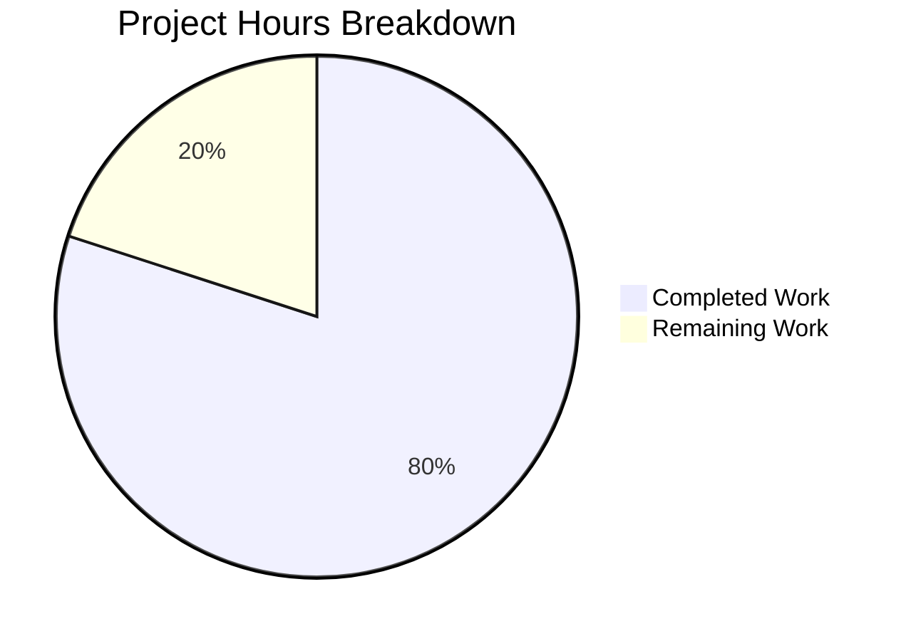

# Project Guide — hello_world Documentation Enhancement

## 1. Executive Summary

**Project completion: 80% (12 hours completed out of 15 total hours)**

This documentation-only project added JSDoc annotations to `server.js`, replaced the stub `README.md` with comprehensive 427-line project documentation, created a `jsdoc.json` configuration file, and updated `package.json` with documentation tooling. All 4 in-scope file deliverables are implemented and validated. All 6 validation gates passed without issues.

### Key Achievements
- 5 JSDoc annotation blocks and 6 inline comments added to `server.js` (14→53 lines)
- `README.md` rewritten from 2-line stub to 427-line document with 10 sections and 2 Mermaid diagrams
- `jsdoc.json` created; `npm run docs` generates HTML documentation successfully
- `package.json` updated with `jsdoc` v4.0.5 devDependency and `docs` script
- Server behavior confirmed unchanged: HTTP 200, `Content-Type: text/plain`, `Hello, World!\n`

### Remaining Work (3 hours)
Minor polish and production-readiness tasks remain for human developers: replacing the placeholder repository URL, verifying Mermaid diagram rendering, adding a `.gitignore`, creating a standalone LICENSE file, and performing a final content review.

---

## 2. Validation Results Summary

### Final Validator Outcome: ALL GATES PASSED

| Validation Gate | Status | Evidence |
|----------------|--------|----------|
| Dependencies | ✅ PASS | `npm install` succeeds; `jsdoc@4.0.5` installed with all transitive dependencies |
| Compilation | ✅ PASS | `node -c server.js` passes; `package.json` and `jsdoc.json` are valid JSON |
| Tests | ✅ PASS | No test suite by design (AAP §0.8.2 — test script intentionally non-functional) |
| JSDoc Generation | ✅ PASS | `npm run docs` generates `index.html`, `module-hello_world_server.html`, `server.js.html` in `docs-output/` |
| Runtime | ✅ PASS | `node server.js` → server starts; `curl http://127.0.0.1:3000/` → HTTP 200 `Hello, World!` |
| Git | ✅ PASS | All 4 in-scope files committed; working tree clean (only untracked: `docs-output/`, `node_modules/`) |

### Fixes Applied During Validation
None required — all files were correctly implemented by prior agents. All validation checks passed on first run.

### Git Commit History (7 commits on branch)

| Hash | Message |
|------|---------|
| `465d5e6` | Add jsdoc.json configuration file and install jsdoc devDependency |
| `08b5c36` | Add jsdoc devDependency and docs NPM script to package.json |
| `9a9500f` | docs(server.js): add comprehensive JSDoc annotations and inline comments |
| `3629dd6` | fix(server.js): address code review findings |
| `5a5764b` | docs: complete rewrite of README.md with comprehensive project documentation |
| `558c1d6` | fix(README): resolve 7 code review findings |
| `ab20301` | fix(docs): correct README API response header and server-Copy.js description |

### Code Change Statistics
- **Files changed:** 5 (README.md, jsdoc.json, package-lock.json, package.json, server.js)
- **Lines added:** 823
- **Lines removed:** 5
- **Net change:** +818 lines

---

## 3. Hours Breakdown and Completion Visualization

### Calculation

- **Completed hours:** 12h
  - `server.js` JSDoc annotations (research, 5 blocks, inline comments, review fixes): 3h
  - `README.md` comprehensive rewrite (10 sections, 2 diagrams, review fixes): 7h
  - `jsdoc.json` creation and testing: 0.5h
  - `package.json` updates and dependency installation: 0.5h
  - Validation and runtime testing: 1h
- **Remaining hours:** 3h (includes enterprise multipliers for compliance 1.10× and uncertainty 1.10×)
  - Placeholder URL replacement: 0.5h
  - Mermaid rendering verification: 0.5h
  - .gitignore creation: 0.5h
  - LICENSE file creation: 0.5h
  - Final documentation review: 1h
- **Total project hours:** 12h + 3h = 15h
- **Completion:** 12 / 15 = **80%**



---

## 4. Detailed Remaining Task Table

| # | Task | Description | Priority | Severity | Hours |
|---|------|-------------|----------|----------|-------|
| 1 | Replace placeholder repository URL in README | The `git clone` command in the Installation section uses `https://github.com/your-username/hello_world.git` — replace with the actual repository URL and verify the link works | High | Low | 0.5 |
| 2 | Verify Mermaid diagram rendering on hosting platform | The README contains 2 Mermaid diagrams (sequence diagram + flowchart). Verify they render correctly on the target hosting platform (GitHub, GitLab, or Bitbucket). Adjust syntax if needed for platform compatibility | Medium | Low | 0.5 |
| 3 | Add `.gitignore` for generated directories | Create a `.gitignore` file to exclude `node_modules/` and `docs-output/` from version control. These directories are currently untracked but could be accidentally committed | Medium | Low | 0.5 |
| 4 | Create standalone MIT LICENSE file | The README references the MIT license (declared in `package.json`). Create a standalone `LICENSE` file at the repository root containing the full MIT license text with the correct copyright holder and year | Low | Low | 0.5 |
| 5 | Final documentation review and organization-specific customization | Review all documentation content for accuracy, completeness, and alignment with organization standards. Customize README sections (e.g., contributing guidelines, team contact info, internal deployment procedures) as needed | Low | Low | 1 |
| | **Total Remaining Hours** | | | | **3** |

---

## 5. Development Guide

### 5.1 System Prerequisites

| Requirement | Minimum Version | Recommended | Verification Command |
|-------------|----------------|-------------|---------------------|
| Node.js | v12.0.0 | v20.x (LTS) | `node --version` |
| npm | v7.0.0 | v10.x | `npm --version` |
| Operating System | Any (cross-platform) | Linux/macOS/Windows | — |

> **Environment verified:** Node.js v20.19.5, npm v10.8.2

### 5.2 Environment Setup

No environment variables are required. The server uses hardcoded configuration (`127.0.0.1:3000`). No `.env` file, no database, no external services.

### 5.3 Dependency Installation

From the project root directory:

```bash
npm install
```

**Expected output:** Installs `jsdoc@4.0.5` and its transitive dependencies into `node_modules/`. Zero runtime dependencies — only devDependencies for documentation generation.

**Verification:**

```bash
npm ls jsdoc
```

Expected: `hello_world@1.0.0 └── jsdoc@4.0.5`

### 5.4 Application Startup

Start the HTTP server:

```bash
node server.js
```

**Expected console output:**

```
Server running at http://127.0.0.1:3000/
```

The server binds to `127.0.0.1:3000` (localhost only) and begins accepting HTTP connections.

### 5.5 Verification Steps

**Step 1 — Verify server is responding:**

```bash
curl http://127.0.0.1:3000/
```

Expected response body: `Hello, World!`

**Step 2 — Verify HTTP headers:**

```bash
curl -i http://127.0.0.1:3000/
```

Expected:
- Status: `HTTP/1.1 200 OK`
- Header: `Content-Type: text/plain`
- Body: `Hello, World!`

**Step 3 — Generate JSDoc HTML documentation:**

```bash
npm run docs
```

Expected: Creates `docs-output/` directory with `index.html`, `module-hello_world_server.html`, and `server.js.html`.

**Step 4 — Validate all source file syntax:**

```bash
node -c server.js
node -e "JSON.parse(require('fs').readFileSync('package.json','utf8'))"
node -e "JSON.parse(require('fs').readFileSync('jsdoc.json','utf8'))"
```

All three commands should exit with code 0 (no output = success).

### 5.6 Stopping the Server

Press `Ctrl+C` in the terminal running the server, or:

```bash
# Find and kill the Node.js process on port 3000
kill $(ss -tlnp | grep ':3000' | awk '{print $NF}' | grep -oP '\d+')
```

### 5.7 Common Issues

| Issue | Cause | Solution |
|-------|-------|---------|
| `EADDRINUSE: address already in use 127.0.0.1:3000` | Another process is using port 3000 | Kill the process or change the `port` constant in `server.js` |
| `curl: (7) Failed to connect` | Server not running | Run `node server.js` first and confirm startup message |
| `npm run docs` fails | `jsdoc` not installed | Run `npm install` first |

---

## 6. Risk Assessment

### Technical Risks

| Risk | Severity | Likelihood | Mitigation |
|------|----------|-----------|------------|
| `"main": "index.js"` anomaly in `package.json` | Low | N/A (existing, documented) | Documented in README Project Structure section as known anomaly. Fix by changing to `"main": "server.js"` if needed |
| No test suite | Low | N/A (intentional) | Project has no tests by design (test fixture). Document this status in README |
| Code walkthrough line references may drift if `server.js` is edited | Low | Low | README code walkthrough references exact line numbers in annotated `server.js`. Any future code changes require updating the README |

### Security Risks

| Risk | Severity | Likelihood | Mitigation |
|------|----------|-----------|------------|
| Server binds to localhost only (no external exposure) | Info | N/A | This is the intended configuration. Deployment guide covers changing to `0.0.0.0` for production |
| No HTTPS/TLS encryption | Low | Low | Deployment guide recommends reverse proxy (nginx/Caddy) for TLS termination in production |
| No authentication or authorization | Info | N/A | Single-endpoint "Hello World" server; authentication is out of scope per AAP §0.8.2 |

### Operational Risks

| Risk | Severity | Likelihood | Mitigation |
|------|----------|-----------|------------|
| No process manager configured | Low | Low | Deployment guide recommends PM2 for production restarts and clustering |
| No monitoring or logging beyond `console.log` | Low | Low | Production deployment should add structured logging |
| No `.gitignore` — risk of committing `node_modules/` or `docs-output/` | Medium | Medium | **Human task #3**: Create `.gitignore` excluding generated directories |

### Integration Risks

| Risk | Severity | Likelihood | Mitigation |
|------|----------|-----------|------------|
| Placeholder repository URL in README | Medium | High | **Human task #1**: Replace `https://github.com/your-username/hello_world.git` with actual URL |
| Mermaid diagrams may not render on all platforms | Low | Low | **Human task #2**: Verify rendering on target hosting platform |

---

## 7. File Inventory

### Files Modified/Created by Agents

| File | Action | Lines (Before → After) | Status |
|------|--------|----------------------|--------|
| `server.js` | UPDATED | 14 → 53 | ✅ Complete — 5 JSDoc blocks, 6 inline comments |
| `README.md` | UPDATED | 2 → 427 | ✅ Complete — 10 sections, 2 Mermaid diagrams |
| `jsdoc.json` | CREATED | 0 → 19 | ✅ Complete — JSDoc configuration |
| `package.json` | UPDATED | 11 → 15 | ✅ Complete — Added `docs` script and `jsdoc` devDependency |
| `package-lock.json` | AUTO-UPDATED | 13 → 331+ | ✅ Auto-generated by `npm install` |

### Files Unchanged (Out of Scope per AAP §0.8.2)

| File | Reason |
|------|--------|
| `server - Copy.js` | Duplicate test artifact |
| `LoginTest.java` / `LoginTest - Copy.java` | Java stub files |
| `industry.csv` / `industry - Copy.csv` | Data files |
| `test.py - Copy.txt` / `test.py.txt` / `test.txt.txt` | Zero-byte placeholders |
| `100Pages.pdf` / `100Pages - Copy.pdf` | PDF test artifacts |
| `demo.jpg` / `demo - Copy.jpg` | Image test artifacts |
| `sample.doc` / `sample - Copy.doc` | Document test artifacts |

---

## 8. AAP Requirement Compliance

| AAP Requirement | Status | Evidence |
|----------------|--------|----------|
| Add JSDoc comments to `server.js` functions | ✅ Complete | 5 JSDoc blocks: `@module`, `@constant` ×2, createServer `@param`, listen `@description` |
| JSDoc uses standard tags (`@description`, `@constant`, `@param`, `@type`, `@module`, `@author`) | ✅ Complete | All specified tags present in `server.js` |
| Create comprehensive README with setup instructions | ✅ Complete | Prerequisites, Installation, Usage sections in `README.md` |
| README API documentation | ✅ Complete | Endpoint spec table + `curl` examples in `README.md` |
| README deployment guide | ✅ Complete | Local + production sections with 4 production considerations |
| README inline code explanations | ✅ Complete | 4-part code walkthrough with annotated snippets and line references |
| Create `jsdoc.json` configuration | ✅ Complete | Valid config targeting `server.js`, outputting to `docs-output/` |
| Add `jsdoc` devDependency to `package.json` | ✅ Complete | `"jsdoc": "^4.0.5"` in devDependencies |
| Add `docs` script to `package.json` | ✅ Complete | `"docs": "jsdoc -c jsdoc.json"` in scripts |
| Preserve existing server behavior | ✅ Verified | Runtime test confirms HTTP 200, `text/plain`, `Hello, World!\n` |
| CommonJS compatibility | ✅ Complete | JSDoc annotations follow CommonJS patterns; `require()` syntax preserved |
| Mermaid diagrams in README | ✅ Complete | 2 diagrams: request-response sequence + server architecture flowchart |
| Document `"main": "index.js"` anomaly | ✅ Complete | Noted in README Project Structure section |
| `server - Copy.js` excluded from scope | ✅ Confirmed | No modifications made to duplicate file |
