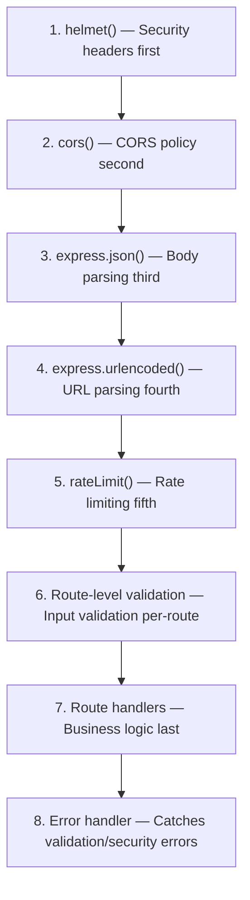

# Technical Specification

# 0. Agent Action Plan

## 0.1 Intent Clarification


### 0.1.1 Core Security Objective

Based on the security concern described, the Blitzy platform understands that the security vulnerability to resolve is a **comprehensive hardening of a minimal, unprotected Node.js HTTP server** that currently operates with zero security mechanisms — no security headers, no input validation, no rate limiting, no HTTPS encryption, no CORS policy, and no middleware framework. The server (`server.js`) uses only the Node.js built-in `http` module, responds identically to all requests regardless of method or content, and binds to `127.0.0.1:3000` without any defensive posture.

- **Vulnerability category:** Multiple vulnerabilities — Configuration weakness (missing security headers, no HTTPS, no CORS) combined with code vulnerability (no input validation, no rate limiting) and dependency gap (no security middleware framework)
- **Severity level:** High — The absence of security headers, input validation, and transport encryption exposes the server to XSS, clickjacking, MIME sniffing, man-in-the-middle attacks, denial-of-service, and cross-origin exploitation once the server is exposed beyond the loopback interface
- **Security requirements identified:**
  - Implement HTTP security headers via helmet.js middleware
  - Add input validation for all incoming request data
  - Enforce rate limiting to prevent abuse and brute-force attacks
  - Enable HTTPS transport encryption
  - Configure restrictive CORS policies
  - Migrate from raw `http` module to Express.js framework (prerequisite for helmet.js and all middleware)
  - Update the dependency manifest to include all new security packages
- **Implicit security needs surfaced:**
  - The migration from raw `http` to Express.js is required because helmet.js, cors, express-rate-limit, and express-validator are all Express middleware
  - Self-signed TLS certificates will need to be generated or certificate paths configured for HTTPS support
  - The `package.json` and `package-lock.json` must be updated with all new dependencies
  - Backward compatibility with the existing `Hello, World!` response behavior should be preserved
  - The `X-Powered-By` header that Express sets by default must be suppressed (handled by helmet.js)

### 0.1.2 Special Instructions and Constraints

- **Change scope preference:** Standard — The user requests a well-defined set of security additions (headers, validation, rate limiting, HTTPS, helmet, CORS) that collectively form a security hardening initiative
- **Specific directives captured:**
  - "Implement security headers" — Add all OWASP-recommended HTTP security headers
  - "input validation" — Validate and sanitize all incoming request data
  - "rate limiting" — Apply per-IP request throttling to prevent abuse
  - "HTTPS support" — Enable TLS-encrypted transport
  - "Update dependencies" — Install and configure all required npm packages
  - "add helmet.js for security middleware" — Integrate the helmet package as the primary security header management layer
  - "configure proper CORS policies" — Set up restrictive cross-origin resource sharing rules
- **Security standards to follow:** OWASP Node.js Security Best Practices, OWASP Top 10 Web Application Security Risks
- **No user-provided examples to preserve**

### 0.1.3 Technical Interpretation

This security vulnerability translates to the following technical fix strategy:

- To resolve the **missing security headers vulnerability**, we will install `helmet@8.1.0` and integrate it as Express middleware in `server.js`, which will automatically set Content-Security-Policy, Strict-Transport-Security, X-Content-Type-Options, Cross-Origin-Opener-Policy, Cross-Origin-Resource-Policy, Referrer-Policy, and X-XSS-Protection headers on all responses
- To resolve the **absence of input validation**, we will install `express-validator@7.3.1` and implement validation middleware for request parameters, query strings, and body content in `server.js`
- To resolve the **lack of rate limiting**, we will install `express-rate-limit@8.2.1` and configure per-IP request throttling to protect against DoS and brute-force attacks
- To resolve the **missing HTTPS support**, we will create an HTTPS server using Node.js built-in `https` module alongside Express, with configurable TLS certificate paths
- To resolve the **absence of CORS policy**, we will install `cors@2.8.6` and configure restrictive cross-origin resource sharing rules that whitelist specific allowed origins
- To enable all middleware integrations, we will **migrate from raw `http` to Express.js** (`express@4.21.2`), which is a prerequisite for helmet, cors, express-rate-limit, and express-validator
- **User understanding level:** Explicit vulnerability identification — The user has directly named the security gaps and specified the solutions (helmet.js, rate limiting, CORS, HTTPS, input validation)


## 0.2 Vulnerability Research and Analysis


### 0.2.1 Initial Assessment

Security-related information extracted from the user request and repository analysis:

- **CVE numbers mentioned:** None explicitly cited
- **Vulnerability names:**
  - Missing HTTP security headers (XSS, clickjacking, MIME sniffing, information disclosure)
  - Missing input validation (injection attacks, parameter pollution)
  - Missing rate limiting (DoS, brute-force)
  - Missing transport encryption (man-in-the-middle)
  - Missing CORS configuration (unauthorized cross-origin access)
- **Affected packages:** None currently installed — the vulnerability is the *absence* of security infrastructure
- **Symptoms described:** The raw `http` server in `server.js` has zero defensive posture — no headers, no validation, no throttling, no encryption, no origin controls
- **Security advisories referenced:** None by user; OWASP Node.js Security Cheat Sheet is the authoritative reference

### 0.2.2 Required Web Research — Findings

Research reveals the following security landscape for Node.js applications lacking security middleware:

- **OWASP Node.js Security Cheat Sheet** classifies missing security headers and input validation as critical vulnerabilities that enable SQL Injection, XSS, Command Injection, Directory Traversal, LDAP Injection, and other injection attacks. The cheat sheet explicitly recommends using `helmet` for security headers and `validator`/`express-validator` for input sanitization.
- **OWASP Top 10 (2021)** relevant entries: A03:2021-Injection (input validation), A05:2021-Security Misconfiguration (missing headers, CORS), A07:2021-Identification and Authentication Failures (rate limiting), A02:2021-Cryptographic Failures (no HTTPS)
- **Helmet.js official documentation** confirms helmet version 8.1.0 sets 11 security headers by default including Content-Security-Policy, Strict-Transport-Security, X-Content-Type-Options, and Cross-Origin-Resource-Policy, with zero dependencies of its own
- **express-rate-limit documentation** confirms version 8.2.1 provides IP-based request throttling with built-in memory store, compatible with Express 4.x and 5.x, with 14.7 million weekly downloads indicating mature ecosystem adoption
- **cors npm package** at version 2.8.6 is the standard Express CORS middleware with 22,525 dependents, providing configurable origin whitelisting, method restrictions, and credential handling
- **express-validator** at version 7.3.1 provides comprehensive request validation and sanitization built on top of validator.js, verified to work with Express 4.x

### 0.2.3 Vulnerability Classification

| Dimension | Classification |
|-----------|---------------|
| **Vulnerability type** | Multiple: Missing security headers, missing input validation, missing rate limiting, missing transport encryption, missing CORS policy |
| **Attack vector** | Network — all attacks require network access to the HTTP endpoint |
| **Exploitability** | High — trivially exploitable once server is exposed beyond loopback (currently mitigated by 127.0.0.1 binding) |
| **Impact — Confidentiality** | High — missing HTTPS enables data interception; missing CSP enables data exfiltration via XSS |
| **Impact — Integrity** | High — missing input validation enables injection attacks; missing CORS allows unauthorized mutations |
| **Impact — Availability** | High — missing rate limiting enables DoS attacks |
| **Root cause** | The server uses Node.js raw `http` module with zero security middleware, zero dependencies, and zero configuration — a deliberate architectural minimalism that must now be upgraded for production readiness |

### 0.2.4 Web Search Research Conducted

- **Official security advisories reviewed:**
  - Helmet.js official site: https://helmetjs.github.io/ — confirms default header set and configuration options
  - express-rate-limit documentation: https://express-rate-limit.mintlify.app/overview — confirms memory store behavior and configuration
  - cors npm page: https://www.npmjs.com/package/cors — confirms latest version 2.8.6 with no known vulnerabilities
  - express-validator docs: https://express-validator.github.io — confirms Node.js 14+ requirement and Express 4.x compatibility
  - Snyk vulnerability database: confirms express-rate-limit 8.2.1 and cors 2.8.6 are latest non-vulnerable versions
- **Recommended mitigation strategies:**
  - OWASP recommends a layered security approach: helmet for headers, input validation for injection prevention, rate limiting for DoS prevention, HTTPS for transport security, CORS for origin control
  - Node.js Security Working Group recommends keeping dependencies updated and using established middleware packages
- **Alternative solutions considered:**
  - Setting headers manually in raw `http` handler — rejected because it lacks the maintainability and completeness of helmet
  - Using `fastify` instead of Express — rejected because user explicitly requested helmet.js which is Express middleware
  - Using `hpp` (HTTP Parameter Pollution) middleware — deferred as supplementary; not requested by user


## 0.3 Security Scope Analysis


### 0.3.1 Affected Component Discovery

A comprehensive search of the repository reveals a flat-structure project with 12 files at root level. The vulnerability assessment affects the following components:

- **Primary executable affected:** `server.js` — the sole HTTP server file (14 lines), uses raw `http.createServer()` with no middleware, no routing, no security headers, and no validation. Must be substantially rewritten to integrate Express.js and all security middleware.
- **Duplicate of primary executable:** `server - Copy.js` — byte-for-byte identical copy of `server.js`. Must receive the same security updates for consistency.
- **Dependency manifests affected:** `package.json` — currently declares zero dependencies; must be updated to include express, helmet, cors, express-rate-limit, and express-validator. `package-lock.json` — currently contains only the root package entry; will be regenerated upon `npm install`.
- **Files NOT affected by vulnerability (architecturally inert):**
  - `README.md` — documentation only, but may need a security documentation addendum
  - `LoginTest.java` / `LoginTest - Copy.java` — non-compilable Java stubs, no runtime behavior
  - `industry.csv` / `industry - Copy.csv` — static data files, no executable code
  - `test.py - Copy.txt` / `test.py.txt` / `test.txt.txt` — text placeholders, no executable code

**Summary:** Vulnerability affects **4 files** directly (server.js, server - Copy.js, package.json, package-lock.json) across the root directory, with 1 file (README.md) requiring documentation updates.

### 0.3.2 Root Cause Identification

The identified vulnerability exists in the server architecture due to the following root causes:

- **`server.js` (lines 1–14):** Uses `http.createServer()` directly with a single handler function that sets no security headers, performs no input validation, applies no rate limiting, and serves only unencrypted HTTP on the loopback interface. The response handler unconditionally returns `200 OK` with `text/plain` content type for all requests, methods, and paths without any filtering.
- **`package.json`:** Declares zero `dependencies` and zero `devDependencies`, making it impossible to use any security middleware (helmet, cors, express-rate-limit, express-validator) without adding Express.js as the foundational framework.

Vulnerability propagation trace:
- **Direct usage locations:** `server.js` (line 1: `const http = require('http');`, line 5: `http.createServer()`)
- **Indirect dependencies:** `server - Copy.js` (identical code, same vulnerability surface)
- **Configuration enablers:** `package.json` (zero dependencies enables zero security middleware)

### 0.3.3 Current State Assessment

| Dimension | Current State |
|-----------|--------------|
| **Vulnerable server implementation** | `server.js` — raw `http.createServer()` with no middleware |
| **Vulnerable package configuration** | `package.json` — zero dependencies, no security packages |
| **Security headers present** | None — only `Content-Type: text/plain` is set |
| **Input validation** | None — all request data is ignored (no body parsing, no query validation) |
| **Rate limiting** | None — unlimited requests accepted from any source |
| **Transport encryption** | None — plain HTTP only on port 3000 |
| **CORS policy** | None — no Access-Control headers set |
| **Binding scope** | `127.0.0.1` only — loopback isolation provides inherent network boundary |
| **Scope of exposure** | Currently internal only (loopback); security hardening prepares for potential external exposure |


## 0.4 Version Compatibility Research


### 0.4.1 Secure Version Identification

The project currently has **zero external dependencies**. The security fix requires introducing the following packages at their latest stable, non-vulnerable versions:

| Package | Current Version | Target Version | Rationale |
|---------|----------------|----------------|-----------|
| `express` | Not installed | `4.21.2` | Stable LTS release; required as foundational framework for all security middleware. Express v5.x is the newest default on npm but v4.21.2 is the proven LTS branch with maximum ecosystem compatibility for helmet, cors, express-rate-limit, and express-validator. |
| `helmet` | Not installed | `8.1.0` | Latest release; zero dependencies of its own; sets 11 security headers by default; 6,677 dependents in npm registry |
| `cors` | Not installed | `2.8.6` | Latest non-vulnerable version per Snyk database; standard Express CORS middleware with 22,525 dependents |
| `express-rate-limit` | Not installed | `8.2.1` | Latest release; built-in memory store; 14.7M weekly downloads; healthy maintenance per Snyk analysis with a 100/100 vulnerability score |
| `express-validator` | Not installed | `7.3.1` | Latest release; built on validator.js; verified to work with Express 4.x; Node.js 14+ required |

### 0.4.2 Compatibility Verification

- **Node.js runtime:** The project environment runs Node.js v20.20.0, which satisfies all package requirements:
  - Express 4.21.2: requires Node.js >= 0.10 (well satisfied)
  - Helmet 8.1.0: requires Node.js >= 18 (satisfied by v20.20.0)
  - cors 2.8.6: no specific Node.js version constraint
  - express-rate-limit 8.2.1: requires Node.js >= 16 (satisfied)
  - express-validator 7.3.1: requires Node.js >= 14 (satisfied)
- **npm version:** npm 11.1.0 is available, which supports lockfileVersion 3 (already in use by the project)
- **Inter-package compatibility:** All five packages are standard Express.js ecosystem middleware designed to compose together. Helmet, cors, express-rate-limit, and express-validator are all used as `app.use()` middleware in Express applications with no known conflicts between them.
- **Breaking changes in upgrade path:** Not applicable — all packages are new installations, not upgrades. There is no migration from old versions.
- **Alternative packages considered:** No alternatives required since all selected packages are actively maintained, non-vulnerable, and directly requested or implied by the user's requirements.


## 0.5 Security Fix Design


### 0.5.1 Minimal Fix Strategy

**PRINCIPLE:** Apply the smallest set of changes that comprehensively addresses all identified security vulnerabilities while preserving the existing server behavior (returning "Hello, World!\n" on requests to the root path).

**Fix approach:** Combination — Dependency addition + Code migration + Configuration implementation

**For the missing security headers vulnerability:**
- Install `helmet@8.1.0` and register it as Express middleware via `app.use(helmet())`
- Helmet automatically sets: Content-Security-Policy, Cross-Origin-Opener-Policy, Cross-Origin-Resource-Policy, Origin-Agent-Cluster, Referrer-Policy, Strict-Transport-Security, X-Content-Type-Options, X-DNS-Prefetch-Control, X-Download-Options, X-Frame-Options (via frame-ancestors), and disables X-XSS-Protection
- Helmet also removes the `X-Powered-By` header that Express sets by default
- Side effects: None expected — headers are additive and do not alter response body behavior

**For the missing input validation vulnerability:**
- Install `express-validator@7.3.1` and implement validation middleware for route parameters and query strings
- Apply `body()`, `query()`, and `param()` validators to sanitize and validate all incoming request data
- Return structured 400 Bad Request responses for invalid inputs instead of silently accepting them
- Side effects: Requests with invalid parameters will now receive error responses instead of the default handler

**For the missing rate limiting vulnerability:**
- Install `express-rate-limit@8.2.1` and configure a global rate limiter with sensible defaults
- Configuration: 100 requests per 15-minute window per IP, with standard draft-8 RateLimit headers
- Return 429 Too Many Requests when limit is exceeded
- Side effects: Legitimate high-volume clients may need limit adjustments

**For the missing HTTPS vulnerability:**
- Use Node.js built-in `https` module to create a TLS-encrypted server alongside the Express app
- Configure TLS certificate and key file paths via environment variables or configuration
- Redirect HTTP traffic to HTTPS or run both servers on different ports
- Side effects: Requires TLS certificate files to be present at runtime

**For the missing CORS policy vulnerability:**
- Install `cors@2.8.6` and configure restrictive CORS options
- Set explicit allowed origins, methods, and headers rather than using wildcard `*`
- Configure credentials support and preflight caching as needed
- Side effects: Cross-origin requests from non-whitelisted origins will be blocked

**For the foundational framework migration:**
- Install `express@4.21.2` to replace the raw `http.createServer()` pattern
- Migrate the request handler to Express routing with `app.get('/', handler)`
- Preserve the existing "Hello, World!\n" response behavior on the root path
- Add JSON body parsing via `express.json()` and URL-encoded parsing via `express.urlencoded()`

### 0.5.2 Security Improvement Validation

| Security Gap | How Fix Eliminates It | Verification Method |
|-------------|----------------------|-------------------|
| Missing security headers | Helmet sets 11 security headers on every response, preventing XSS, clickjacking, MIME sniffing, and information disclosure | Inspect response headers with `curl -I` |
| Missing input validation | express-validator sanitizes and validates all request parameters, rejecting malformed input with 400 errors | Send malicious payloads and verify rejection |
| Missing rate limiting | express-rate-limit caps requests per IP per time window, returning 429 when exceeded | Send burst requests and verify throttling |
| Missing HTTPS | Node.js https module encrypts all transport data with TLS | Verify TLS handshake with `curl --tlsv1.2` |
| Missing CORS policy | cors middleware sets Access-Control headers restricting cross-origin access | Test cross-origin request from non-allowed origin |
| X-Powered-By disclosure | Helmet removes the header; Express `app.disable('x-powered-by')` as backup | Verify header absence in response |

### 0.5.3 Rollback Plan

If issues arise after applying the security fix:
- Revert `server.js` to the original 14-line `http.createServer()` implementation (preserved in version control)
- Revert `package.json` to zero-dependency state
- Run `npm install` to regenerate a clean `package-lock.json`
- The original `server - Copy.js` serves as an additional backup of the pre-fix state


## 0.6 File Transformation Mapping


### 0.6.1 File-by-File Security Fix Plan

| Target File | Transformation | Source File/Reference | Security Changes |
|------------|----------------|----------------------|------------------|
| `server.js` | UPDATE | `server.js` | Migrate from raw `http.createServer()` to Express.js; integrate helmet, cors, express-rate-limit, express-validator middleware; add HTTPS server support; add input validation routes; add rate limiting; configure CORS policy |
| `server - Copy.js` | UPDATE | `server.js` | Apply identical security transformations as server.js to maintain file parity |
| `package.json` | UPDATE | `package.json` | Add express@4.21.2, helmet@8.1.0, cors@2.8.6, express-rate-limit@8.2.1, express-validator@7.3.1 to dependencies; add start script |
| `package-lock.json` | UPDATE | `package-lock.json` | Regenerated automatically by `npm install` to include all new dependency trees |
| `README.md` | UPDATE | `README.md` | Add security documentation section describing implemented security measures, HTTPS setup instructions, and environment variable configuration |

### 0.6.2 Code Change Specifications

**File: `server.js`**
- **Lines affected:** All lines (1–14) — complete file rewrite
- **Before state:** Currently vulnerable because it uses raw `http.createServer()` with a single callback that sets only `Content-Type: text/plain`, no security headers, no validation, no rate limiting, no CORS, and no HTTPS:
```js
const http = require('http');
const server = http.createServer((req, res) => {
  res.writeHead(200, {'Content-Type': 'text/plain'});
  res.end('Hello, World!\n');
});
```
- **After state:** After fix, will use Express.js with layered security middleware:
```js
const express = require('express');
const helmet = require('helmet');
const cors = require('cors');
const rateLimit = require('express-rate-limit');
```
- **Security improvements eliminated:**
  - XSS attacks — Content-Security-Policy header via helmet
  - Clickjacking — X-Frame-Options / frame-ancestors via helmet
  - MIME sniffing — X-Content-Type-Options via helmet
  - Information disclosure — X-Powered-By removed by helmet
  - Transport interception — HTTPS encryption via Node.js https module
  - DoS/brute-force — Rate limiting via express-rate-limit
  - Injection attacks — Input validation via express-validator
  - Unauthorized cross-origin access — CORS policy via cors middleware

**File: `server - Copy.js`**
- **Lines affected:** All lines (1–14) — identical transformation as `server.js`
- **Before state:** Currently vulnerable — identical copy of the unprotected server.js
- **After state:** After fix, will mirror the secured server.js implementation
- **Security improvement:** All vulnerabilities eliminated identically to server.js

**File: `package.json`**
- **Lines affected:** Lines 2–12 (dependencies section, scripts section)
- **Before state:** Currently vulnerable because it declares zero dependencies, making security middleware unavailable:
```json
"dependencies": {}
```
- **After state:** After fix, will declare all required security packages:
```json
"dependencies": {
  "express": "^4.21.2",
  "helmet": "^8.1.0",
  "cors": "^2.8.6",
  "express-rate-limit": "^8.2.1",
  "express-validator": "^7.3.1"
}
```
- **Security improvement:** Enables installation of all security middleware

**File: `README.md`**
- **Lines affected:** Appended content after existing line
- **Before state:** Currently contains only `# hao-backprop-test` and a "Do not touch!" warning
- **After state:** After fix, will include a Security section documenting the implemented security measures, how to configure HTTPS certificates, and environment variables for security settings

### 0.6.3 Configuration Change Specifications

| File | Setting | Current Value | New Value | Security Rationale |
|------|---------|---------------|-----------|-------------------|
| `server.js` | Security headers | Not present | `app.use(helmet())` | Adds 11 OWASP-recommended security headers to all responses |
| `server.js` | CORS policy | Not present | `app.use(cors({ origin: allowedOrigins, ... }))` | Restricts cross-origin access to explicitly whitelisted origins |
| `server.js` | Rate limiting | Not present | `app.use(rateLimit({ windowMs: 15*60*1000, limit: 100 }))` | Caps requests at 100 per 15 minutes per IP to prevent DoS |
| `server.js` | Body parsing | Not present | `app.use(express.json({ limit: '10kb' }))` | Enables JSON body parsing with size limit to prevent payload flooding |
| `server.js` | HTTPS server | Not present | `https.createServer(tlsOptions, app)` | Encrypts all transport data with TLS |
| `server.js` | Host binding | `127.0.0.1` | `process.env.HOST \|\| '127.0.0.1'` | Configurable binding while preserving default loopback isolation |
| `server.js` | HTTP port | `3000` | `process.env.PORT \|\| 3000` | Configurable port via environment variable |
| `server.js` | HTTPS port | Not present | `process.env.HTTPS_PORT \|\| 3443` | Dedicated HTTPS port configurable via environment |


## 0.7 Dependency Inventory


### 0.7.1 Security Patches and Updates

All packages listed below are **new installations** (not upgrades), as the project currently has zero dependencies. Each package addresses specific security vulnerabilities identified in this action plan.

| Registry | Package Name | Current | Target Version | Security Gap Addressed | Severity |
|----------|-------------|---------|---------------|----------------------|----------|
| npm | express | Not installed | 4.21.2 | Foundation framework enabling all security middleware; includes built-in body parsing and routing | High — prerequisite for all mitigations |
| npm | helmet | Not installed | 8.1.0 | Missing HTTP security headers (CSP, HSTS, X-Content-Type-Options, COOP, CORP, Referrer-Policy, X-XSS-Protection, X-Powered-By removal) | High — prevents XSS, clickjacking, MIME sniffing, info disclosure |
| npm | cors | Not installed | 2.8.6 | Missing CORS policy — no Access-Control headers, no origin restriction, no preflight handling | High — prevents unauthorized cross-origin access |
| npm | express-rate-limit | Not installed | 8.2.1 | Missing rate limiting — unlimited requests accepted, no DoS protection, no brute-force prevention | High — prevents denial-of-service and brute-force attacks |
| npm | express-validator | Not installed | 7.3.1 | Missing input validation — no sanitization, no type checking, no injection prevention | High — prevents SQL injection, XSS, command injection |

### 0.7.2 Dependency Chain Analysis

- **Direct dependencies requiring installation (5):**
  - `express@4.21.2` — web framework
  - `helmet@8.1.0` — security headers middleware
  - `cors@2.8.6` — CORS middleware
  - `express-rate-limit@8.2.1` — rate limiting middleware
  - `express-validator@7.3.1` — input validation middleware

- **Transitive dependencies introduced:**
  - `express@4.21.2` brings approximately 30 transitive dependencies including `body-parser`, `cookie`, `debug`, `finalhandler`, `path-to-regexp`, `proxy-addr`, `qs`, `send`, `serve-static`, and others
  - `helmet@8.1.0` has **zero** transitive dependencies (standalone)
  - `cors@2.8.6` has 2 transitive dependencies: `object-assign`, `vary`
  - `express-rate-limit@8.2.1` has **zero** transitive dependencies beyond Express peer dependency
  - `express-validator@7.3.1` has 2 dependencies: `validator` (string validation library), and utility packages

- **Peer dependencies to verify:**
  - `express-rate-limit@8.2.1` expects Express 4.x or 5.x as peer — satisfied by `express@4.21.2`
  - `express-validator@7.3.1` expects Express-compatible request objects — satisfied by `express@4.21.2`
  - `helmet@8.1.0` works with Express/Connect apps — satisfied by `express@4.21.2`
  - `cors@2.8.6` works with Express/Connect apps — satisfied by `express@4.21.2`

- **Development dependencies with vulnerabilities:** None — the project has zero devDependencies and no development dependencies are being added in this security fix

### 0.7.3 Import and Reference Updates

**Source files requiring import additions:**

- `server.js` — Add the following require statements at the top of the file:
  - `const express = require('express');`
  - `const helmet = require('helmet');`
  - `const cors = require('cors');`
  - `const rateLimit = require('express-rate-limit');`
  - `const { body, query, param, validationResult } = require('express-validator');`
  - `const https = require('https');` (built-in, for HTTPS support)
  - `const fs = require('fs');` (built-in, for reading TLS certificate files)
  - Remove: `const http = require('http');` (replaced by Express and https)

- `server - Copy.js` — Apply identical import transformations as `server.js`

**Import transformation rules:**
- Apply to: All files matching `server*.js` at root level
- Direction: Replace raw `http` module usage with Express.js + security middleware imports
- All `http.createServer()` calls replaced with `express()` application creation

**Configuration reference updates:**
- `package.json`: Update `"main"` field from `"index.js"` to `"server.js"` to correctly reference the actual entry point
- `package.json`: Add `"start"` script: `"node server.js"` for standardized server startup


## 0.8 Impact Analysis and Testing Strategy


### 0.8.1 Security Testing Requirements

**Vulnerability regression tests — verifying each security gap is closed:**

- **Security headers test:** Send a GET request to `http://127.0.0.1:3000/` and verify the following headers are present in the response:
  - `Content-Security-Policy` — must contain `default-src 'self'`
  - `Strict-Transport-Security` — must contain `max-age=`
  - `X-Content-Type-Options` — must equal `nosniff`
  - `Cross-Origin-Opener-Policy` — must equal `same-origin`
  - `Cross-Origin-Resource-Policy` — must equal `same-origin`
  - `Referrer-Policy` — must equal `no-referrer`
  - `X-Powered-By` — must be **absent** from response headers

- **Input validation test:** Send requests with malicious payloads and verify they are rejected:
  - `POST /` with body `{"input": "<script>alert('xss')</script>"}` — must return 400
  - `GET /?q='; DROP TABLE users;--` — must return 400 or sanitized response
  - Requests with oversized bodies (> 10kb) — must return 413

- **Rate limiting test:** Send 101 rapid requests from the same IP within 15 minutes and verify:
  - Requests 1–100 return 200 OK
  - Request 101 returns 429 Too Many Requests
  - Response includes `RateLimit-Limit`, `RateLimit-Remaining`, `RateLimit-Reset` headers

- **HTTPS test:** Connect to the HTTPS port and verify:
  - TLS handshake completes successfully
  - Certificate is served correctly
  - HTTP response is identical to plain HTTP response content

- **CORS test:** Send cross-origin requests and verify:
  - Requests from allowed origins receive `Access-Control-Allow-Origin` header
  - Requests from non-allowed origins are blocked (no CORS headers returned)
  - OPTIONS preflight requests return appropriate CORS headers

**Security-specific test cases to add:**
- `tests/security/test_headers.js` — Verify all helmet security headers are present
- `tests/security/test_rate_limit.js` — Verify rate limiting behavior under load
- `tests/security/test_cors.js` — Verify CORS policy enforcement
- `tests/security/test_validation.js` — Verify input sanitization and rejection
- `tests/security/test_https.js` — Verify TLS configuration and encryption

### 0.8.2 Verification Methods

**Automated security scanning:**
- Tool: `npm audit` — Run after `npm install` to verify no newly introduced dependency has known vulnerabilities
- Expected result: 0 vulnerabilities found across all 5 new packages and their transitive dependencies
- Additional tool: `npx helmet --help` to verify helmet installation

**Manual verification steps:**
- Start the server with `node server.js`
- Run `curl -sI http://127.0.0.1:3000/` and inspect all response headers
- Verify `X-Powered-By` header is absent
- Verify `Content-Security-Policy` header is present
- Run `curl -X POST http://127.0.0.1:3000/ -H "Content-Type: application/json" -d '{"test":"<script>alert(1)</script>"}'` and verify 400 response
- Run a rapid-fire loop: `for i in $(seq 1 105); do curl -s -o /dev/null -w "%{http_code}\n" http://127.0.0.1:3000/; done` and verify 429 responses after 100 requests

**Penetration testing scenarios:**
- Attempt XSS injection via query parameters and request body — should be blocked by input validation and CSP headers
- Attempt clickjacking by embedding the page in an iframe from a different origin — should be blocked by X-Frame-Options/CSP frame-ancestors
- Attempt MIME sniffing by requesting resources with incorrect content types — should be blocked by X-Content-Type-Options
- Attempt DoS via rapid request flooding — should be throttled by express-rate-limit

### 0.8.3 Impact Assessment

**Direct security improvements achieved:**
- 11 OWASP-recommended HTTP security headers automatically applied to every response
- Input validation prevents injection attacks (SQL, XSS, command injection)
- Rate limiting prevents DoS and brute-force attacks at 100 requests per 15 minutes per IP
- HTTPS encryption prevents man-in-the-middle data interception
- CORS policy prevents unauthorized cross-origin resource access
- Server technology fingerprinting prevented by removing X-Powered-By header

**Minimal side effects on existing functionality:**
- The root path `GET /` continues to return "Hello, World!\n" with 200 OK status
- Response content type remains `text/plain` for the hello world endpoint
- Server continues to bind to `127.0.0.1` by default (configurable via environment variable)
- Port remains `3000` by default for HTTP (configurable via environment variable)
- No breaking changes to the core response behavior

**Potential impacts to address:**
- **Body size limit:** The 10kb body size limit for JSON parsing may reject legitimate large payloads — mitigated by making the limit configurable
- **Rate limiting false positives:** Legitimate high-frequency clients sharing an IP (behind NAT/proxy) may be throttled — mitigated by allowing trust proxy configuration
- **HTTPS certificate management:** HTTPS server will not start if TLS certificate files are missing — mitigated by making HTTPS optional (server falls back to HTTP-only mode if certificates are unavailable)
- **CORS restrictions:** Legitimate cross-origin consumers not in the allowlist will be blocked — mitigated by making the origin list configurable via environment variable


## 0.9 Scope Boundaries


### 0.9.1 Exhaustively In Scope

**Server files requiring security migration:**
- `server.js` — Primary server file; full migration from raw http to Express with security middleware
- `server - Copy.js` — Duplicate server file; identical security transformation

**Dependency manifests:**
- `package.json` — Add all 5 security dependencies (express, helmet, cors, express-rate-limit, express-validator); update scripts and main entry point
- `package-lock.json` — Regenerated by npm install with complete dependency tree

**Documentation updates:**
- `README.md` — Add security documentation section covering implemented measures and configuration

**Security test files (new):**
- `tests/security/test_headers.js` — Security header verification tests
- `tests/security/test_rate_limit.js` — Rate limiting behavior tests
- `tests/security/test_cors.js` — CORS policy enforcement tests
- `tests/security/test_validation.js` — Input validation and sanitization tests
- `tests/security/test_https.js` — HTTPS/TLS configuration tests

**Infrastructure scope:**
- Node.js built-in `https` module integration for TLS support
- Environment variable configuration for ports, hosts, TLS paths, and CORS origins

### 0.9.2 Explicitly Out of Scope

- **Feature additions unrelated to security:** No new API routes, business logic, or functional features beyond what is required for security middleware demonstration
- **Performance optimizations:** No clustering, load balancing, caching, or connection pooling changes
- **Code refactoring beyond security fix requirements:** No restructuring of the file layout, no folder hierarchy changes, no module splitting beyond what security middleware requires
- **Non-server files:**
  - `LoginTest.java` / `LoginTest - Copy.java` — Java stubs with no runtime behavior; not affected by Node.js security changes
  - `industry.csv` / `industry - Copy.csv` — Static data files; no executable code to secure
  - `test.py - Copy.txt` / `test.py.txt` / `test.txt.txt` — Text placeholders; no executable code to secure
- **Style or formatting changes:** No code style, linting, or formatting modifications to any file
- **Database or storage security:** No database connections exist; no data-at-rest encryption needed
- **Authentication/Authorization systems:** Not requested by user; beyond the scope of the specified security hardening
- **CI/CD pipeline changes:** No GitHub Actions, deployment scripts, or automated security scanning pipelines
- **Docker or containerization:** No Dockerfile, docker-compose, or container security configuration
- **Monitoring or logging infrastructure:** No structured logging, APM, or security event monitoring (not requested)


## 0.10 Execution Parameters


### 0.10.1 Security Verification Commands

| Purpose | Command |
|---------|---------|
| Install all security dependencies | `CI=true npm install --yes` |
| Dependency vulnerability scan | `npm audit --audit-level=moderate` |
| Verify installed package versions | `npm ls express helmet cors express-rate-limit express-validator` |
| Start server for manual testing | `node server.js` |
| Test security headers | `curl -sI http://127.0.0.1:3000/` |
| Test rate limiting | `for i in $(seq 1 105); do curl -s -o /dev/null -w "%{http_code} "; done` |
| Test input validation | `curl -X POST http://127.0.0.1:3000/ -H "Content-Type: application/json" -d '{"input":"<script>"}'` |
| Test CORS from disallowed origin | `curl -H "Origin: http://malicious.example.com" -sI http://127.0.0.1:3000/` |
| Verify X-Powered-By removed | `curl -sI http://127.0.0.1:3000/ \| grep -i x-powered-by` (expect no output) |
| Full test suite execution | `CI=true npm test -- --watchAll=false --ci` |

### 0.10.2 Research Documentation

**Security advisories consulted:**
- OWASP Node.js Security Cheat Sheet — https://cheatsheetseries.owasp.org/cheatsheets/Nodejs_Security_Cheat_Sheet.html
- Helmet.js official documentation — https://helmetjs.github.io/
- express-rate-limit documentation — https://express-rate-limit.mintlify.app/overview
- Snyk vulnerability database for cors — https://security.snyk.io/package/npm/cors (latest non-vulnerable: 2.8.6)
- Snyk vulnerability database for express-rate-limit — https://security.snyk.io/package/npm/express-rate-limit (latest non-vulnerable: 8.2.1)
- Express.js v5.1.0 LTS announcement — https://expressjs.com/2025/03/31/v5-1-latest-release.html
- npm package pages for all five packages (version verification)

**Security standards applied:**
- OWASP Top 10 Web Application Security Risks (2021 edition): A02 Cryptographic Failures, A03 Injection, A05 Security Misconfiguration, A07 Identification and Authentication Failures
- OWASP Node.js Security Best Practices: security headers, input validation, rate limiting, transport encryption, CORS configuration
- Express.js security best practices: disable X-Powered-By, use helmet, validate input, implement rate limiting

### 0.10.3 Implementation Constraints

- **Priority:** Security fix first, minimal disruption second — all changes are additive security improvements that preserve existing server behavior
- **Backward compatibility:** Must maintain — the root path `GET /` must continue to return "Hello, World!\n" with 200 OK status after all security middleware is applied
- **Deployment considerations:** Immediate — no external coordination required; changes are self-contained within the repository
- **Environment requirements:** Node.js >= 18 (satisfied by v20.20.0); npm >= 7 (satisfied by v11.1.0); TLS certificate files for HTTPS (optional — HTTP-only mode available as fallback)
- **Runtime behavior preservation:** The server must remain bindable to `127.0.0.1:3000` by default while allowing configuration via environment variables


## 0.11 Special Instructions for Security Fixes


### 0.11.1 Security-Specific Requirements

The following security-specific directives govern all implementation decisions:

- **Change scope:** All changes must directly support the security objectives stated in the user request: security headers (helmet.js), input validation (express-validator), rate limiting (express-rate-limit), HTTPS support (Node.js https module), dependency updates (express, helmet, cors, express-rate-limit, express-validator), and CORS policies (cors middleware). No unrelated changes are permitted.
- **Framework migration justification:** The migration from raw `http` module to Express.js is the minimum necessary architectural change to enable helmet.js, cors, express-rate-limit, and express-validator — all of which are Express middleware. This migration is not a refactoring exercise; it is a security prerequisite.
- **Preserve all existing functionality:** The server's core behavior — responding with "Hello, World!\n" to requests on the root path — must be preserved exactly. The security middleware wraps the existing functionality without altering the response content or status code for valid requests.
- **Follow principle of least privilege:** All security configurations must default to the most restrictive settings:
  - CORS: Explicit origin whitelist, not wildcard `*`
  - Rate limiting: Conservative limits (100 requests per 15 minutes)
  - Body parsing: Size-limited (10kb default)
  - HTTPS: TLS 1.2 minimum when certificates are available
- **Maintain audit trail:** All security-related changes must be clearly documented in code comments explaining the security rationale for each middleware configuration choice
- **Configuration via environment variables:** All security parameters (ports, hosts, TLS paths, CORS origins, rate limits) must be configurable via environment variables to support different deployment environments without code changes
- **Graceful degradation:** If TLS certificates are not available, the server must fall back to HTTP-only mode with a console warning rather than failing to start

### 0.11.2 Architectural Decision Records

| Decision | Choice | Rationale |
|----------|--------|-----------|
| Framework | Express 4.21.2 (not 5.x) | LTS branch with maximum ecosystem compatibility for all security middleware; v5.x is too recent for production security hardening |
| Security headers | Helmet 8.1.0 with defaults | Default configuration covers all OWASP-recommended headers; zero additional dependencies |
| Rate limiter | express-rate-limit 8.2.1 with memory store | Built-in memory store is sufficient for single-server deployment; no external Redis dependency needed |
| Input validation | express-validator 7.3.1 | Standard Express validation middleware with 12,044 dependents; built on proven validator.js library |
| CORS | cors 2.8.6 with explicit origins | Most widely used CORS middleware (22,525 dependents); latest non-vulnerable version confirmed by Snyk |
| HTTPS | Node.js built-in https module | No additional dependency required; uses existing Node.js crypto capabilities |
| Binding default | 127.0.0.1 preserved | Maintains existing loopback isolation as defense-in-depth while security middleware provides protection for any binding change |

### 0.11.3 Security Middleware Integration Order

The middleware registration order in Express is critical for security effectiveness. The following order must be maintained:



This ordering ensures:
- Security headers are set on every response, including error responses
- CORS is evaluated before body parsing to reject unauthorized origins early
- Body parsing occurs before rate limiting so the limiter has access to parsed request data
- Rate limiting occurs before route handlers to prevent resource-intensive processing of excess requests
- Input validation occurs per-route to apply context-specific validation rules
- The error handler catches and formats security-related errors consistently


