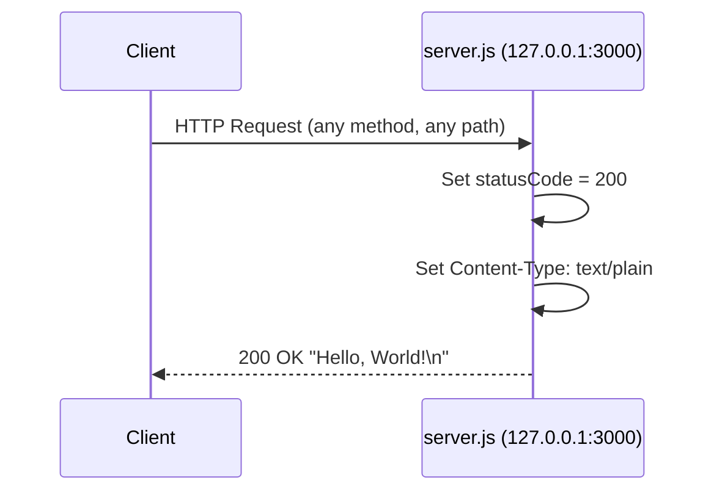
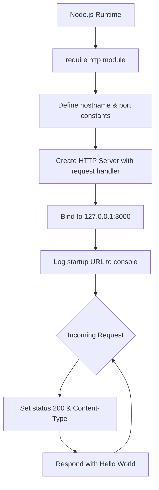

# Technical Specification

# 0. Agent Action Plan

## 0.1 Intent Clarification

### 0.1.1 Core Documentation Objective

Based on the provided requirements, the Blitzy platform understands that the documentation objective is to **create new documentation and update existing documentation** for a minimal Node.js HTTP server project (`hello_world` v1.0.0). The request encompasses two distinct but complementary documentation activities:

- **Add JSDoc comments to `server.js` functions** — Annotate all code-level elements in `server.js` (constants, the server factory callback, and the listen callback) with structured JSDoc documentation comments using standard tags (`@description`, `@constant`, `@param`, `@type`, `@module`, `@author`)
- **Create a comprehensive README** — Replace the current single-line `README.md` with a full-featured project README containing:
  - **Setup instructions** — Prerequisites, installation steps, and environment configuration
  - **API documentation** — HTTP endpoint specification including request/response format, status codes, headers, and content type
  - **Deployment guide** — Instructions for running the server locally and considerations for production deployment
  - **Inline code explanations** — Annotated code walkthroughs within the README that explain `server.js` logic line-by-line with embedded code snippets

**Documentation Types Identified:**
- Inline source code documentation (JSDoc comments)
- Project README (setup guide, API reference, deployment guide, code walkthrough)

### 0.1.2 Special Instructions and Constraints

- The existing `README.md` currently contains only a project title and a warning: `# hao-backprop-test` followed by `test project for backprop integration. Do not touch!`. The comprehensive README must replace this minimal content entirely.
- The project uses **CommonJS** module syntax (`require()`) — JSDoc annotations must be compatible with CommonJS patterns, not ES Modules.
- The project has **zero external dependencies** — documentation must accurately reflect this constraint and not introduce unnecessary tooling.
- `server.js` is a 14-line file with no named function declarations — JSDoc comments will target constants, the `http.createServer` callback, and the `server.listen` callback using appropriate JSDoc block patterns for anonymous functions and constants.
- The `server - Copy.js` file is a byte-for-byte duplicate of `server.js`. JSDoc comments should be added only to `server.js` (the canonical source); the copy file is out of scope.
- No user-provided templates or style guides were specified — documentation should follow standard JSDoc and Markdown conventions.

### 0.1.3 Technical Interpretation

These documentation requirements translate to the following technical documentation strategy:

- To **document the server module**, we will update `server.js` by adding a JSDoc `@module` block at the file header and `@description`/`@constant`/`@type` annotations for the `hostname` and `port` constants, a `@callback` block for the `http.createServer` request handler describing the `req` and `res` parameters, and a `@callback` block for the `server.listen` startup callback.
- To **create a comprehensive README**, we will update `README.md` by replacing its current content with a structured Markdown document containing: project title and description, table of contents, prerequisites section, installation and setup section, server startup instructions, API endpoint documentation (method, path, response format, status code), deployment considerations, annotated code walkthrough with syntax-highlighted snippets, project structure overview, and license information.
- To **support JSDoc HTML generation**, we will create a `jsdoc.json` configuration file and update `package.json` to include `jsdoc` as a dev dependency and add a `docs` script for generating HTML documentation from JSDoc comments.

### 0.1.4 Inferred Documentation Needs

Based on code analysis and repository structure, the following implicit documentation needs have been identified:

- **Module-level documentation** — `server.js` lacks a file-header comment describing its purpose, author, version, or license; a `@module` JSDoc block should be added
- **Project structure explanation** — The repository contains 12 files spanning JavaScript, Java, CSV, and text formats with intentional duplicates; the README should include a file/directory overview
- **Known anomalies documentation** — The `package.json` declares `"main": "index.js"` but this file does not exist; the README should note the actual entry point is `server.js`
- **NPM metadata documentation** — The `package.json` test script is non-functional (`echo "Error: no test specified" && exit 1`); the README should clarify the current testing status
- **JSDoc generation tooling** — Since JSDoc comments are being added, the project should include `jsdoc` as a dev dependency with a configuration file to enable HTML documentation generation
- **License documentation** — The project is MIT-licensed (per `package.json`) but lacks a `LICENSE` file; the README should reference the license

## 0.2 Documentation Discovery and Analysis

### 0.2.1 Existing Documentation Infrastructure Assessment

Repository analysis reveals a **minimal documentation structure with near-zero coverage**. The project contains no documentation framework, no generated docs, and no documentation tooling configuration.

**Documentation File Inventory:**

| File | Status | Content |
|------|--------|---------|
| `README.md` | Exists — severely incomplete | Two lines: project title `# hao-backprop-test` and single-sentence description |
| `package.json` | Exists — minimal metadata | Name, version, author, license fields populated; no `description` beyond empty string, no `keywords`, non-functional test script |
| `jsdoc.json` | Does not exist | No JSDoc configuration file present |
| `jsdoc.conf.json` | Does not exist | No alternative JSDoc configuration present |
| `.jsdoc.json` | Does not exist | No hidden JSDoc configuration present |
| `CHANGELOG.md` | Does not exist | No changelog file |
| `CONTRIBUTING.md` | Does not exist | No contribution guidelines |
| `LICENSE` | Does not exist | License is declared in `package.json` as MIT but no standalone license file |
| `docs/` | Does not exist | No documentation directory |

**Documentation Generator Search Results:**

| Configuration File | Found | Notes |
|-------------------|-------|-------|
| `mkdocs.yml` | No | No MkDocs configuration |
| `docusaurus.config.js` | No | No Docusaurus configuration |
| `sphinx/conf.py` | No | No Sphinx configuration |
| `.readthedocs.yml` | No | No ReadTheDocs configuration |
| `jsdoc.json` / `jsdoc.conf.json` | No | No JSDoc configuration |

- **Current documentation framework:** None
- **Documentation generator configuration:** None detected
- **API documentation tools in use:** None — no JSDoc, Swagger, or OpenAPI tooling
- **Diagram tools detected:** None
- **Documentation hosting/deployment setup:** None

### 0.2.2 Repository Code Analysis for Documentation

**Search patterns used for code to document:**

The repository is completely flat (no subdirectories) with 12 files at root level. All code analysis was conducted by reading each file directly.

| File | Type | Lines | Documentation Status | Public API Surface |
|------|------|-------|---------------------|-------------------|
| `server.js` | JavaScript (CommonJS) | 14 | **No JSDoc comments, no inline comments** | `hostname` constant, `port` constant, request handler callback, listen callback |
| `server - Copy.js` | JavaScript (CommonJS) | 14 | Identical duplicate of `server.js` — no documentation | Same as `server.js` |
| `package.json` | JSON | 11 | Minimal metadata fields populated | N/A (configuration) |
| `package-lock.json` | JSON | 13 | Auto-generated lockfile | N/A (auto-generated) |
| `LoginTest.java` | Java | 6 | Non-compilable stub with no Javadoc | Empty class body |
| `LoginTest - Copy.java` | Java | 6 | Identical duplicate | N/A |
| `industry.csv` | CSV | 44 | No header documentation | 43 industry categories |
| `industry - Copy.csv` | CSV | 44 | Identical duplicate | N/A |
| `test.py - Copy.txt` | Text | 0 | Zero-byte file | N/A |
| `test.py.txt` | Text | 0 | Zero-byte file | N/A |
| `test.txt.txt` | Text | 0 | Zero-byte file | N/A |

**Key code elements in `server.js` requiring documentation (Source: `server.js` lines 1–14):**

- Line 1: `const http = require('http');` — Module import
- Line 3: `const hostname = '127.0.0.1';` — Server bind address constant
- Line 4: `const port = 3000;` — Server port constant
- Lines 6–9: `http.createServer((req, res) => { ... })` — Request handler callback (sets status 200, Content-Type text/plain, writes "Hello, World!\n")
- Lines 11–13: `server.listen(port, hostname, () => { ... })` — Server listen callback (logs startup URL)

### 0.2.3 Web Search Research Conducted

| Research Topic | Key Findings | Source |
|----------------|-------------|--------|
| JSDoc best practices for Node.js | Use `@module`, `@constant`, `@param`, `@returns`, `@description` tags; keep comments descriptive but concise; document as you code | jsdoc.app, w3tutorials.net, Medium |
| JSDoc for CommonJS modules | JSDoc supports CommonJS annotation via `@module` tag at file level | jsdoc.app official documentation |
| JSDoc latest version | v4.0.5 (latest stable on npm); supports Node.js 12.0.0+; Apache 2.0 license | npmjs.com/package/jsdoc |
| Node.js README best practices | Include prerequisites, installation, usage, API docs, deployment, project structure, contributing, license sections | freeCodeCamp, GitHub Gist templates |
| JSDoc HTML generation | Install via `npm install --save-dev jsdoc`; configure with `jsdoc.json`; generate with `npx jsdoc` command; output to `out/` directory by default | npmjs.com/package/jsdoc |

## 0.3 Documentation Scope Analysis

### 0.3.1 Code-to-Documentation Mapping

**Module: `server.js` (Source: `server.js` lines 1–14)**

- Public API elements:
  - `hostname` constant (`'127.0.0.1'`) — Server bind address
  - `port` constant (`3000`) — Server listening port
  - `http.createServer` request handler — Anonymous callback `(req, res) => { ... }`
  - `server.listen` startup callback — Anonymous callback `() => { ... }`
- Current documentation: **None** — zero JSDoc comments, zero inline comments
- Documentation needed:
  - File-level `@module` JSDoc block with `@description`, `@author`, `@version`, `@license`
  - `@constant` annotations for `hostname` and `port` with `@type` tags
  - `@description` block for the `createServer` callback documenting `@param {http.IncomingMessage} req` and `@param {http.ServerResponse} res`
  - `@description` block for the `listen` callback documenting its role as a startup confirmation logger
  - Inline code comments explaining each logical section of the file

**Module: `package.json` (Source: `package.json` lines 1–11)**

- Configuration options documented: 3/7 (name, version, license are populated; description, keywords, repository, engines are missing/empty)
- Documentation needed: The README must explain the NPM project metadata and note the `"main": "index.js"` anomaly (file does not exist; actual entry point is `server.js`)

**HTTP API Endpoint (Derived from `server.js` lines 6–9)**

- Endpoint: `GET /` (single route — all requests to any path receive the same response)
- Method: Any HTTP method (no routing; server responds identically to GET, POST, PUT, etc.)
- Response status: `200 OK`
- Response header: `Content-Type: text/plain`
- Response body: `Hello, World!\n`
- Current documentation: **None** — no API docs, no OpenAPI spec, no Swagger
- Documentation needed: Full API specification in the README including method, path, status code, headers, response body, and example `curl` command

### 0.3.2 Documentation Gap Analysis

Given the requirements and repository analysis, documentation gaps include:

**Critical Gaps (required by user request):**

| Gap | Current State | Target State |
|-----|--------------|-------------|
| JSDoc comments in `server.js` | Zero comments of any kind | Full JSDoc annotation on all code elements |
| README setup instructions | Single sentence — no setup guidance | Complete prerequisites, install, and run instructions |
| README API documentation | Non-existent | Full HTTP endpoint spec with examples |
| README deployment guide | Non-existent | Local and production deployment instructions |
| README inline code explanations | Non-existent | Annotated code walkthrough with embedded snippets |

**Inferred Gaps (surfaced by analysis):**

| Gap | Current State | Target State |
|-----|--------------|-------------|
| Project structure overview | Not documented | File listing with purpose descriptions in README |
| JSDoc generation tooling | No `jsdoc` dev dependency, no config | `jsdoc` 4.0.5 as devDependency, `jsdoc.json` config |
| NPM scripts for docs | No `docs` script in `package.json` | `"docs": "jsdoc -c jsdoc.json"` script added |
| Entry point anomaly | `"main": "index.js"` (non-existent) | Documented in README as known issue |
| License reference | MIT declared in `package.json` only | License section in README |

**Undocumented Public APIs:** All — the `server.js` request handler is completely undocumented.

**Missing User Guides:** Complete — no setup, usage, or deployment instructions exist.

**Outdated Documentation:** The README title `# hao-backprop-test` does not match the `package.json` name `hello_world`.

## 0.4 Documentation Implementation Design

### 0.4.1 Documentation Structure Planning

Given the flat, minimal nature of this project, the documentation hierarchy targets two locations rather than a full `docs/` directory tree:

```
(root)/
├── README.md                    (comprehensive project documentation)
│   ├── Project Overview          (title, description, badges)
│   ├── Table of Contents         (navigational index)
│   ├── Prerequisites             (Node.js version, npm)
│   ├── Installation              (clone, npm install)
│   ├── Usage / Quick Start       (npm start / node server.js)
│   ├── API Documentation         (endpoint spec, examples)
│   ├── Code Walkthrough          (inline explanations of server.js)
│   ├── Project Structure         (file listing with descriptions)
│   ├── Deployment Guide          (local, production considerations)
│   ├── Troubleshooting           (common issues)
│   └── License                   (MIT reference)
├── server.js                    (JSDoc-annotated source code)
│   ├── @module header block      (file-level documentation)
│   ├── @constant annotations     (hostname, port)
│   ├── createServer callback doc (request handler)
│   └── listen callback doc       (startup log)
├── jsdoc.json                   (JSDoc generator configuration)
└── package.json                 (updated with docs script and jsdoc devDependency)
```

### 0.4.2 Content Generation Strategy

**Information Extraction Approach:**

- Extract API signatures from `server.js` lines 6–9 (request handler callback parameters and response behavior)
- Extract server configuration from `server.js` lines 3–4 (`hostname`, `port` constants)
- Extract project metadata from `package.json` (name, version, author, license)
- Derive deployment instructions from the server binding pattern (`127.0.0.1:3000`)
- Reference `package-lock.json` for dependency verification (zero dependencies confirmed)

**Documentation Standards:**

- Markdown formatting with hierarchical headers (`#`, `##`, `###`)
- Code examples using fenced blocks with `javascript` and `bash` language identifiers for syntax highlighting
- HTTP endpoint documentation in tabular format with method, path, status, and response body
- Source citations embedded as comments: `Source: server.js:L6-L9`
- Consistent terminology: "server" (not "app"), "request handler" (not "route"), "startup" (not "boot")

**JSDoc Standards for `server.js`:**

- All JSDoc blocks use `/** ... */` syntax
- File header block includes `@module`, `@description`, `@author`, `@version`, `@license`
- Constants use `@constant` with `@type` and `@default`
- Callback functions documented with `@description`, `@param`, `@returns` (or `@return`)
- Inline comments use `//` for single-line explanations of each logical section

### 0.4.3 Diagram and Visual Strategy

**Mermaid Diagrams to Include in README:**

- **Request-Response Sequence Diagram** — Illustrating the HTTP request flow from client through `server.js` to response:



- **Server Architecture Flowchart** — Showing the startup and request handling flow:



**No screenshots or images required** — the project has no UI, no web interface, and no visual components beyond terminal output.

## 0.5 Documentation File Transformation Mapping

### 0.5.1 File-by-File Documentation Plan

| Target Documentation File | Transformation | Source Code/Docs | Content/Changes |
|---------------------------|----------------|------------------|-----------------|
| `server.js` | UPDATE | `server.js` | Add JSDoc `@module` header block, `@constant` annotations for `hostname` and `port`, `@description`/`@param` block for `createServer` callback, `@description` block for `listen` callback, inline `//` comments for each code section |
| `README.md` | UPDATE | `server.js`, `package.json` | Complete rewrite — replace two-line stub with comprehensive documentation: project overview, table of contents, prerequisites, installation, usage, API documentation, code walkthrough, project structure, deployment guide, troubleshooting, license |
| `jsdoc.json` | CREATE | N/A | New JSDoc configuration file specifying source include path, plugins, output destination, and template options |
| `package.json` | UPDATE | `package.json` | Add `jsdoc` v4.0.5 as devDependency, add `"docs": "jsdoc -c jsdoc.json"` script to scripts section |

### 0.5.2 New Documentation Files Detail

```
File: jsdoc.json
Type: Documentation Configuration
Source Code: N/A (new configuration file)
Sections:
    - source: include/exclude patterns for JavaScript files
    - plugins: markdown plugin for JSDoc
    - opts: output destination (./docs-output), recurse option, README inclusion
    - templates: cleverLinks, monospaceLinks settings
Key Purpose: Enable HTML documentation generation from JSDoc comments via `npm run docs`
```

### 0.5.3 Documentation Files to Update Detail

**`server.js` — Add JSDoc comments and inline explanations**

- New content: File-level `@module` block
  - `@module hello_world/server`
  - `@description` — Static HTTP server for the hello_world project
  - `@author hxu`
  - `@version 1.0.0`
  - `@license MIT`
- New content: `@constant` block for `hostname` with `@type {string}` and `@default '127.0.0.1'`
- New content: `@constant` block for `port` with `@type {number}` and `@default 3000`
- New content: JSDoc block for `http.createServer` callback
  - `@description` — Request handler that responds with plain-text greeting
  - `@param {http.IncomingMessage} req` — Incoming HTTP request object
  - `@param {http.ServerResponse} res` — Server response object
- New content: JSDoc block for `server.listen` callback
  - `@description` — Startup callback that logs the server URL
- New content: Inline `//` comments explaining each logical section
- Source citation: `server.js` lines 1–14

**`README.md` — Complete rewrite with comprehensive documentation**

- Replace existing content (2 lines) with structured documentation containing:
  - Project title and description (derived from `package.json` name and tech spec context)
  - Table of contents with anchor links
  - Prerequisites section listing Node.js (v12.0.0 or later) and npm
  - Installation section with `git clone` and `npm install` commands
  - Usage section with `node server.js` startup command and expected console output
  - API Documentation section with endpoint table (method, path, status, headers, body) and `curl` example
  - Code Walkthrough section with annotated `server.js` snippets explaining each block
  - Project Structure section listing all 12 files with one-line descriptions
  - Deployment Guide section covering local development and production considerations (binding to `0.0.0.0`, environment variables, process managers)
  - Troubleshooting section for common issues (port conflicts, address binding)
  - License section referencing MIT license
  - Mermaid request-response sequence diagram
- Source citations: `server.js` lines 1–14, `package.json` lines 1–11

**`package.json` — Add documentation tooling**

- Add to `devDependencies`: `"jsdoc": "^4.0.5"`
- Add to `scripts`: `"docs": "jsdoc -c jsdoc.json"`
- Source citation: `package.json` lines 1–11

### 0.5.4 Documentation Configuration Updates

| Config File | Change | Purpose |
|-------------|--------|---------|
| `jsdoc.json` | CREATE new file | JSDoc generator configuration for HTML doc output |
| `package.json` | UPDATE `scripts` and `devDependencies` | Add `docs` script and `jsdoc` dev dependency |

No other documentation configuration files are applicable — this project does not use MkDocs, Docusaurus, Sphinx, ReadTheDocs, or any other documentation framework.

### 0.5.5 Cross-Documentation Dependencies

- **JSDoc ↔ README linkage:** The README's "Generating Documentation" subsection within the deployment guide references the `npm run docs` script, which relies on `jsdoc.json` existing and `jsdoc` being installed as a dev dependency
- **`server.js` JSDoc ↔ `jsdoc.json`:** The `jsdoc.json` source include path must reference `server.js` at the root level
- **`package.json` ↔ `jsdoc.json`:** The `docs` script in `package.json` invokes `jsdoc -c jsdoc.json`, creating a hard dependency on the config file's existence and location
- **README code walkthrough ↔ `server.js`:** Code snippets in the README must exactly match the JSDoc-annotated version of `server.js` to maintain consistency

## 0.6 Dependency Inventory

### 0.6.1 Documentation Dependencies

| Registry | Package Name | Version | Purpose |
|----------|--------------|---------|---------|
| npm | jsdoc | 4.0.5 | JavaScript API documentation generator — parses JSDoc comments in `server.js` and produces HTML documentation output |

**Dependency Rationale:**

- `jsdoc` v4.0.5 is the latest stable release on npm, supporting Node.js 12.0.0 and later. The project runs on Node.js v20.20.0, which is fully compatible. The package is licensed under Apache License 2.0, compatible with the project's MIT license.
- No additional documentation dependencies are required. The project is intentionally minimal with zero runtime dependencies, and the documentation strategy preserves this by adding only a single dev dependency.
- Markdown-based documentation (README) requires no additional tooling — it is rendered natively by GitHub, GitLab, Bitbucket, and all major code hosting platforms.
- Mermaid diagrams embedded in the README are rendered natively by GitHub Flavored Markdown and do not require a separate build step.

**Runtime Dependencies (unchanged):**

| Registry | Package Name | Version | Purpose |
|----------|--------------|---------|---------|
| (built-in) | http | N/A (Node.js core module) | HTTP server functionality — the only dependency of `server.js` |

No runtime dependencies are added or modified by this documentation effort.

### 0.6.2 Documentation Reference Updates

**Internal link updates required:**

The current README contains no internal links or cross-references. The new comprehensive README will establish the following internal navigation structure:

- Table of contents with anchor links to each section (`#prerequisites`, `#installation`, `#api-documentation`, `#deployment-guide`, etc.)
- Code walkthrough section will reference line numbers in `server.js`
- Deployment guide will reference the `npm run docs` script for generating JSDoc HTML output

**No external link transformations are needed** — the existing README contains no links, and no other documentation files reference the README.

## 0.7 Coverage and Quality Targets

### 0.7.1 Documentation Coverage Metrics

**Current coverage analysis:**

| Category | Documented | Total | Coverage |
|----------|-----------|-------|----------|
| Public API elements in `server.js` (constants, callbacks) | 0 | 4 | 0% |
| HTTP endpoints | 0 | 1 | 0% |
| Setup/installation instructions | 0 | 1 | 0% |
| Deployment guidance | 0 | 1 | 0% |
| Code walkthroughs | 0 | 1 | 0% |
| Project structure descriptions | 0 | 12 files | 0% |
| NPM script documentation | 0 | 2 (start, docs) | 0% |

**Target coverage after documentation effort:**

| Category | Documented | Total | Coverage |
|----------|-----------|-------|----------|
| Public API elements in `server.js` | 4 | 4 | 100% |
| HTTP endpoints | 1 | 1 | 100% |
| Setup/installation instructions | 1 | 1 | 100% |
| Deployment guidance | 1 | 1 | 100% |
| Code walkthroughs | 1 | 1 | 100% |
| Project structure descriptions | 12 | 12 files | 100% |
| NPM script documentation | 2 | 2 | 100% |

**Coverage gaps to address:**

- `server.js`: Currently 0% documented → target 100% with JSDoc comments on all 4 code elements
- README: Currently covers project title only → target 100% with all requested sections
- JSDoc generation tooling: Currently 0% configured → target 100% with `jsdoc.json` and `package.json` updates

### 0.7.2 Documentation Quality Criteria

**Completeness requirements:**

- All public API elements in `server.js` have JSDoc blocks with `@description`, `@param` (where applicable), `@type`, and `@constant`/`@returns` tags
- README includes prerequisites, installation, usage, API spec, code walkthrough, deployment guide, and project structure — each as a distinct section
- API documentation includes HTTP method, path, status code, response headers, response body, and a working `curl` example
- Code walkthrough includes annotated snippets covering every section of `server.js`
- Deployment guide covers both local development and production considerations

**Accuracy validation:**

- Code examples in the README must be verified against the actual `server.js` content (14 lines, `127.0.0.1:3000`, "Hello, World!\n" response)
- API documentation must reflect the actual server behavior (any method/any path returns 200 with plain text)
- `curl` examples must produce the documented output when executed against a running server
- JSDoc `@type` annotations must match the actual JavaScript types (`string` for hostname, `number` for port)

**Clarity standards:**

- Technical accuracy with accessible language — suitable for developers of all experience levels
- Progressive disclosure: Quick Start for fast onboarding, then detailed sections for deeper understanding
- Consistent terminology: "server" throughout (not alternating with "app" or "application")
- Code snippets include syntax highlighting via fenced code blocks with language identifiers

**Maintainability:**

- Source citations in JSDoc comments (`@version`, `@author`) for traceability
- README sections organized with a table of contents for easy navigation
- JSDoc configuration in a dedicated `jsdoc.json` file (not inline in `package.json`)

### 0.7.3 Example and Diagram Requirements

| Requirement | Minimum Count | Details |
|-------------|--------------|---------|
| API `curl` examples | 1 | Full `curl` command with expected response output |
| Code walkthrough snippets | 4 | One per logical section of `server.js` (import, constants, request handler, listen) |
| Mermaid diagrams | 2 | Request-response sequence diagram; server startup flowchart |
| JSDoc blocks in `server.js` | 5 | Module header, hostname constant, port constant, createServer callback, listen callback |
| Inline comments in `server.js` | 4+ | One per logical code section |

## 0.8 Scope Boundaries

### 0.8.1 Exhaustively In Scope

**Source code documentation modifications (explicitly requested):**

- `server.js` — Add JSDoc comment blocks and inline `//` comments throughout

**Documentation file updates:**

- `README.md` — Complete rewrite with comprehensive project documentation

**New documentation files:**

- `jsdoc.json` — JSDoc generator configuration file

**Package configuration updates:**

- `package.json` — Add `jsdoc` devDependency (v4.0.5) and `docs` NPM script

**Documentation content scope (all within README.md):**

- Setup instructions (prerequisites, installation, running the server)
- API documentation (HTTP endpoint specification, `curl` examples)
- Deployment guide (local development, production considerations)
- Inline code explanations (annotated code walkthrough of `server.js`)
- Project structure overview (all 12 root-level files described)
- Mermaid diagrams (request-response flow, server architecture)
- Troubleshooting section (common issues and solutions)
- License reference (MIT)

**File patterns in scope:**

- `server.js` — JSDoc and inline comment additions
- `README.md` — Full content replacement
- `jsdoc.json` — New file creation
- `package.json` — Targeted field additions only (`scripts.docs`, `devDependencies.jsdoc`)

### 0.8.2 Explicitly Out of Scope

- **`server - Copy.js`** — Byte-for-byte duplicate of `server.js`; documentation is applied only to the canonical `server.js`
- **`LoginTest.java` / `LoginTest - Copy.java`** — Java stub files; not part of the documentation request
- **`industry.csv` / `industry - Copy.csv`** — Data files; not part of the documentation request
- **`test.py - Copy.txt` / `test.py.txt` / `test.txt.txt`** — Zero-byte placeholder files; not part of the documentation request
- **`package-lock.json`** — Auto-generated file; will be updated automatically when `jsdoc` devDependency is installed; no manual edits
- **Source code logic changes** — No modifications to `server.js` behavior, no new features, no bug fixes, no refactoring of existing code
- **Test file creation or modification** — No new tests, no updates to the non-functional test script
- **CI/CD configuration** — No pipeline, workflow, or automation files
- **Containerization** — No Dockerfile, docker-compose, or container configuration
- **Environment configuration** — No `.env` files, no environment variable setup
- **TypeScript migration** — No type definitions, no TypeScript configuration
- **Additional documentation frameworks** — No MkDocs, Docusaurus, Sphinx, or ReadTheDocs setup beyond the JSDoc configuration
- **Fixing the `"main": "index.js"` anomaly** — The README will document this discrepancy but the `package.json` `main` field will not be corrected (code change, not documentation)
- **Creating a `LICENSE` file** — Out of scope; the README will reference the MIT license from `package.json`
- **Items explicitly excluded by project context** — Routing, database integration, authentication, frontend development, error handling middleware (per tech spec Section 1.3 Scope)

## 0.9 Execution Parameters

### 0.9.1 Documentation-Specific Instructions

| Parameter | Value |
|-----------|-------|
| **Documentation build command** | `npx jsdoc -c jsdoc.json` (or `npm run docs` after `package.json` update) |
| **Documentation preview command** | `open docs-output/index.html` (macOS) / `xdg-open docs-output/index.html` (Linux) |
| **Diagram generation command** | Not applicable — Mermaid diagrams are embedded in `README.md` and rendered natively by GitHub |
| **Documentation deployment command** | Not applicable — documentation is served via repository hosting (GitHub/GitLab native Markdown rendering) |
| **Default format** | Markdown (README) with JSDoc annotations (source code); Mermaid for diagrams |
| **Citation requirement** | Every JSDoc block must include the target code element; README walkthrough must reference `server.js` line numbers |
| **Style guide** | Standard JSDoc 4.x tag conventions; GitHub Flavored Markdown for README |
| **Documentation validation** | Verify JSDoc parsing: `npx jsdoc -c jsdoc.json` exits cleanly; Verify README rendering: visual inspection in GitHub/GitLab preview |

### 0.9.2 Environment Requirements

| Requirement | Value | Source |
|-------------|-------|--------|
| Node.js runtime | v12.0.0 or later (project runs on v20.20.0) | `package-lock.json` lockfileVersion 3 (requires npm 7+ / Node.js 16+); JSDoc 4.0.5 requires Node.js 12+ |
| npm | v7.0.0 or later (environment has v11.1.0) | `package-lock.json` lockfileVersion 3 |
| JSDoc | v4.0.5 (to be added as devDependency) | npmjs.com/package/jsdoc |
| Operating System | Any — Node.js is cross-platform | No OS-specific code in `server.js` |

### 0.9.3 Validation Checklist

After documentation changes are applied, the following validations confirm correctness:

- `npx jsdoc -c jsdoc.json` completes without errors and generates HTML output in `docs-output/`
- `node server.js` starts the server and prints `Server running at http://127.0.0.1:3000/` to stdout (unchanged behavior)
- `curl http://127.0.0.1:3000/` returns `Hello, World!` with status 200 and `Content-Type: text/plain` (unchanged behavior)
- `README.md` renders correctly in GitHub Flavored Markdown with all sections, code blocks, tables, and Mermaid diagrams visible
- All JSDoc comments in `server.js` follow `/** ... */` syntax and include appropriate tags
- `npm run docs` executes the JSDoc generation script successfully

## 0.10 Rules for Documentation

The following rules govern all documentation changes in this effort:

- **JSDoc comments must use standard JSDoc 4.x syntax** — All comment blocks must begin with `/**` and end with `*/`, using recognized tags (`@module`, `@description`, `@constant`, `@type`, `@param`, `@returns`, `@author`, `@version`, `@license`)
- **CommonJS module documentation pattern** — Since `server.js` uses `require()` (not ES Module `import`), JSDoc annotations must follow CommonJS conventions as documented at jsdoc.app
- **Preserve existing server behavior** — Adding JSDoc comments and inline comments must not alter any executable code in `server.js`; the server must continue to bind to `127.0.0.1:3000` and respond with "Hello, World!\n"
- **README must be self-contained** — All documentation within `README.md` must be readable and useful without requiring generated JSDoc HTML output; the JSDoc HTML generation is supplementary
- **Code snippets in README must match actual source** — Any JavaScript code shown in the README code walkthrough must exactly reflect the corresponding lines in the JSDoc-annotated `server.js`
- **Use fenced code blocks with language identifiers** — All code examples must use triple-backtick fencing with `javascript`, `bash`, or `json` language specifiers for syntax highlighting
- **Mermaid diagrams must be renderable** — Diagrams must use valid Mermaid syntax compatible with GitHub Flavored Markdown rendering
- **Minimal dependency footprint** — Only `jsdoc` v4.0.5 is added as a devDependency; no additional documentation frameworks, linters, or build tools
- **Consistent naming and terminology** — Use "server" (not "app"), "request handler" (not "route handler"), "startup" (not "boot"), and "hello_world" (matching `package.json` name) throughout all documentation
- **Document known anomalies without fixing them** — The `"main": "index.js"` discrepancy, duplicate files, and zero-byte placeholders are documented as-is in the project structure section; no source code corrections are made

## 0.11 References

### 0.11.1 Repository Files and Folders Searched

| File Path | Purpose in Analysis | Key Findings |
|-----------|-------------------|-------------|
| `server.js` | Primary documentation target — analyzed for JSDoc annotation points | 14-line HTTP server, CommonJS, `http.createServer` with anonymous callback, binds to `127.0.0.1:3000`, responds "Hello, World!\n"; zero existing comments |
| `server - Copy.js` | Evaluated for scope determination | Byte-for-byte duplicate of `server.js` — excluded from documentation scope |
| `package.json` | Project metadata extraction, dependency analysis | Name: `hello_world`, version: `1.0.0`, author: `hxu`, license: `MIT`, main: `index.js` (non-existent), zero dependencies, non-functional test script |
| `package-lock.json` | Dependency verification | lockfileVersion 3, confirms zero external dependencies |
| `README.md` | Current documentation state assessment | Two lines only: `# hao-backprop-test` and single-sentence description |
| `LoginTest.java` | Evaluated for scope determination | Non-compilable Java stub under `com.blitzyTest` — excluded from scope |
| `LoginTest - Copy.java` | Evaluated for scope determination | Duplicate of `LoginTest.java` — excluded from scope |
| `industry.csv` | Evaluated for scope determination | 43-row CSV with industry categories — excluded from scope |
| `industry - Copy.csv` | Evaluated for scope determination | Duplicate of `industry.csv` — excluded from scope |
| `test.py - Copy.txt` | Evaluated for scope determination | Zero-byte placeholder — excluded from scope |
| `test.py.txt` | Evaluated for scope determination | Zero-byte placeholder — excluded from scope |
| `test.txt.txt` | Evaluated for scope determination | Zero-byte placeholder — excluded from scope |
| Root folder (`""`) | Repository structure discovery | Flat directory structure with 12 files, no subdirectories, no documentation tooling |

### 0.11.2 Technical Specification Sections Retrieved

| Section | Key Information Extracted |
|---------|------------------------|
| 1.1 Executive Summary | Project is a frozen test fixture for Blitzy Backprop integration; intentional anomalies for robustness testing; stakeholders: Backprop engineers, QA, tooling architects |
| 1.2 System Overview | 12 files, flat structure, 6 component categories, CommonJS module system, zero dependencies, static HTTP response |
| 1.3 Scope | In-scope: static HTTP server, NPM scaffolding; Out-of-scope: routing, database, auth, CI/CD, TypeScript, API docs (prior to this documentation effort) |
| 2.1 Feature Catalog | Five features (F-001 through F-005) all Status: Completed; six known structural anomalies documented |
| 3.1 Stack Overview | Node.js runtime + CommonJS + built-in `http` module + npm; "minimum viable technology" design philosophy |

### 0.11.3 External Research Sources

| Source | Topic Researched | Key Insight Applied |
|--------|-----------------|-------------------|
| npmjs.com/package/jsdoc | JSDoc latest version and compatibility | v4.0.5 latest stable; supports Node.js 12.0.0+; Apache 2.0 license |
| jsdoc.app (official docs) | JSDoc tag reference and CommonJS documentation patterns | `@module`, `@constant`, `@param`, `@type`, `@description` tag usage for CommonJS |
| w3tutorials.net | JSDoc best practices for Node.js | Descriptive but concise comments; update comments when code changes |
| freeCodeCamp (README structure guide) | README file structuring best practices | Include prerequisites, installation, API docs, deployment, project structure sections |
| Medium (JSDoc comprehensive guide) | JSDoc comment syntax and tag examples | `/** */` block syntax; `@param {type} name - description` pattern; `@callback` for anonymous functions |

### 0.11.4 Attachments and External Resources

No attachments were provided for this project. No Figma designs, wireframes, or external design files are referenced.

