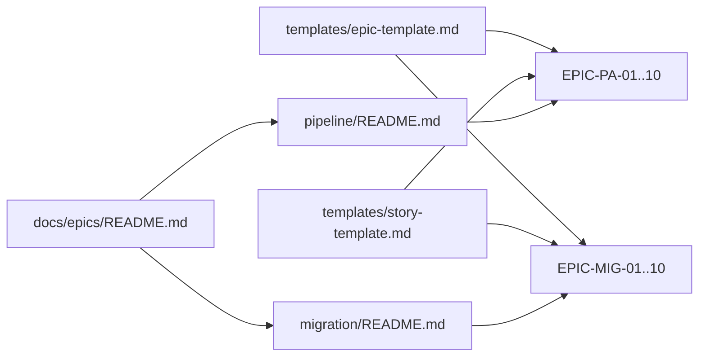

# Technical Specification

# 0. Agent Action Plan

## 0.1 Intent Clarification

### 0.1.1 Core Objective

Based on the provided requirements, the Blitzy platform understands that the objective is to **author two coordinated catalogs of agile planning artifacts** — epics and their constituent user stories — that fully describe (a) the end-to-end Crashlytics crash reporting pipeline from crash capture through dashboard delivery, and (b) the Fabric → Firebase Crashlytics migration broken into epics with explicit acceptance criteria. The deliverable is a set of net-new markdown documents; no application or SDK code is to be written, modified, or installed.

The user's request, restated with technical precision, decomposes into two enumerated requirements:

- **Requirement R-1 (Pipeline Catalog):** *"Generate epics and stories for the Crashlytics crash reporting pipeline from crash capture to dashboard delivery."*
  - **Technical interpretation:** Author one self-contained markdown epic file for each canonical stage of the Firebase Crashlytics ingestion-and-display pipeline. Each epic file embeds its user stories (INVEST-aligned) and acceptance criteria (Given-When-Then). The pipeline endpoints are anchored to capture (SDK-level exception/ANR/NDK/non-fatal hooks) at the upstream boundary and dashboard delivery (Firebase Console issue cards and downstream consumers) at the downstream boundary, with all intermediate stages explicitly covered.

- **Requirement R-2 (Migration Catalog):** *"Break down the Fabric to Firebase Crashlytics migration into epics with acceptance criteria."*
  - **Technical interpretation:** Author one self-contained markdown epic file for each phase of the Fabric SDK → Firebase Crashlytics SDK migration. Each epic file documents migration steps for every supported client platform (Android, iOS, Flutter, Unity, React Native) where relevant, embeds user stories, and — as explicitly requested by the user — surfaces acceptance criteria for every epic in Given-When-Then format.

Implicit requirements detected during interpretation:

- **Artifact placement:** The repository's constraint C-001 (`README.md`: "Do not touch!") forbids modification of any of the 12 existing fixture files. All new artifacts must therefore live in a brand-new isolated directory tree (`docs/epics/`) that is orthogonal to the fixture surface.
- **Template consistency:** With 20 epic files split across two themes, a reusable epic template and a reusable story template are required so that downstream readers (engineering, QA, PM) encounter a uniform, scannable structure across every artifact.
- **Cross-referencing:** A master index (`docs/epics/README.md`) and per-theme indices (`docs/epics/pipeline/README.md`, `docs/epics/migration/README.md`) are required to make the catalog navigable.
- **ID conventions:** Stable identifier prefixes (`EPIC-PA-*` for pipeline epics, `EPIC-MIG-*` for migration epics, `STORY-PA-*-S##` and `STORY-MIG-*-S##` for stories) are needed so that future tooling, ticketing systems, or traceability matrices can refer to artifacts unambiguously.
- **Acceptance-criteria coverage:** R-2 explicitly mandates acceptance criteria for migration epics. For symmetry and quality, the same Given-When-Then discipline is applied to pipeline epics so both catalogs read identically.

Prerequisites and dependencies for this work are minimal: the task requires only the ability to author markdown files. No runtime, framework, library, or build dependency is introduced.

### 0.1.2 Task Categorization

| Dimension | Classification |
|-----------|----------------|
| **Primary task type** | Documentation |
| **Secondary aspects** | Migration planning, agile artifact authoring, requirements decomposition |
| **Scope classification** | Isolated additive change — net-new files only; zero touch to existing fixture |
| **Output medium** | Markdown documents (`*.md`) |
| **Affected layer** | Documentation / project planning layer; **not** runtime, build, configuration, or test code |
| **Repository delta** | +25 new files, 0 modified files, 0 deleted files |

### 0.1.3 Special Instructions and Constraints

The user's literal input is preserved verbatim for downstream fidelity:

> **User input — preserved verbatim:**
> - Generate epics and stories for the Crashlytics crash reporting pipeline from crash capture to dashboard delivery
>   - Break down the Fabric to Firebase Crashlytics migration into epics with acceptance criteria

Directives extracted from that input:

- **CRITICAL:** Generate **epics AND stories** for the pipeline catalog (both granularities, not one or the other).
- **CRITICAL:** Pipeline coverage must span the inclusive range *"from crash capture to dashboard delivery"* — no omitted intermediate stage.
- **CRITICAL:** Migration must be expressed as **epics with acceptance criteria** — acceptance criteria are non-negotiable for migration epics.
- **Implicit boundary:** Treat the request as documentation-only. Do not implement or stub any SDK code, build configuration, or Firebase wiring.

Methodological constraints derived from the repository:

- Honor `README.md` directive: "Do not touch!" — existing files must remain byte-for-byte unchanged.
- Honor tech-spec constraint C-002: do not introduce any external dependencies.
- Honor tech-spec constraint C-003: do not introduce any build, compilation, or transpilation step.
- Honor tech-spec constraint C-004: do not modify or extend the localhost-only HTTP server.

Web search requirements that were satisfied during discovery:

- Best practices for Firebase Crashlytics pipeline architecture (capture, transport, grouping, dashboard, alerting).
- Canonical steps in the Fabric → Firebase Crashlytics migration (Gradle plugin swap, AndroidX prerequisite, Xcode Build Phases cleanup, Answers → Google Analytics for Firebase translation, historical data migration, legacy SDK sunset on November 15, 2020).

### 0.1.4 Technical Interpretation

These requirements translate to the following technical implementation strategy:

- **To produce the pipeline catalog (R-1),** the Blitzy platform will **create** ten markdown epic documents under `docs/epics/pipeline/`, each named `EPIC-PA-##-<slug>.md`. Each document embeds: (i) epic metadata (ID, title, owner placeholder, theme), (ii) a description grounded in canonical Firebase Crashlytics pipeline stages, (iii) business value, (iv) explicit in-scope and out-of-scope bullets, (v) the embedded user stories with INVEST-style "As a … I want … So that …" framing, (vi) Given-When-Then acceptance criteria per story, (vii) epic-level Definition of Done, and (viii) dependencies on other epics.

- **To produce the migration catalog (R-2),** the Blitzy platform will **create** ten markdown epic documents under `docs/epics/migration/`, each named `EPIC-MIG-##-<slug>.md`, using the same template as R-1 so the two catalogs are visually and structurally identical. Migration epics will explicitly enumerate per-platform tasks (Android, iOS, cross-platform) and surface acceptance criteria that reference concrete migration artifacts (e.g., `firebase-crashlytics-gradle` plugin presence, removal of `fabric.io` maven repository, successful test-crash receipt in Firebase Console).

- **To make the catalog navigable,** the Blitzy platform will **create** a master index at `docs/epics/README.md` plus two theme-scoped indices at `docs/epics/pipeline/README.md` and `docs/epics/migration/README.md`. Each index renders a table of epics with ID, title, one-line summary, and a link to the file.

- **To guarantee structural uniformity,** the Blitzy platform will **create** two reusable templates at `docs/epics/templates/epic-template.md` and `docs/epics/templates/story-template.md`. Every generated epic file will be derived from `epic-template.md` and every embedded story will follow `story-template.md`.

- **To preserve the existing fixture,** the Blitzy platform will **make zero modifications** to any of the 12 existing repository files. The 14-line `server.js`, `package.json`, `package-lock.json`, `README.md`, the duplicate-file pairs, the empty `.txt` placeholders, and the binary attachments all remain byte-for-byte identical.

The cause-and-effect chain in plain language: the user has asked for two related artifact catalogs; the repository contains no Crashlytics code and explicitly forbids fixture mutation; therefore the implementation is a pure additive documentation drop in a new, isolated subtree, with content sourced from canonical Firebase guidance and structured by reusable templates so the resulting catalog is uniform, navigable, and free of any side effects on the test fixture.

## 0.2 Repository Scope Discovery

### 0.2.1 Comprehensive File Analysis

The repository was exhaustively inspected. The complete inventory of existing artifacts and their relevance to this task is summarized below.

| Existing File | Type | Relevance to This Task | Action |
|---------------|------|------------------------|--------|
| `README.md` | Documentation | Establishes the immutability directive ("Do not touch!"); no Crashlytics content `[README.md:L2]` | REFERENCE only |
| `package.json` | NPM metadata | Declares `hello_world` v1.0.0, zero dependencies; no Crashlytics packages `[package.json:L1-L11]` | REFERENCE only |
| `package-lock.json` | Dependency lock | Confirms zero installed dependencies `[package-lock.json]` | REFERENCE only |
| `server.js` | Runtime | 14-line static Hello-World HTTP server; unrelated to crash reporting `[server.js:L1-L14]` | Untouched |
| `server - Copy.js` | Runtime duplicate | Byte-identical duplicate of `server.js`; tests duplicate detection | Untouched |
| `LoginTest.java` | Stub | Empty `com.blitzyTest` class; no crash hooks | Untouched |
| `LoginTest - Copy.java` | Stub duplicate | Byte-identical duplicate of `LoginTest.java` | Untouched |
| `industry.csv` | Data | 43-row industry taxonomy; no relation to crash reporting | Untouched |
| `industry - Copy.csv` | Data duplicate | Byte-identical duplicate of `industry.csv` | Untouched |
| `test.py.txt`, `test.py - Copy.txt`, `test.txt.txt` | Empty placeholders | Zero-byte files | Untouched |
| `100Pages.pdf`, `100Pages - Copy.pdf` | Binary | Large PDFs; no Crashlytics content | Untouched |
| `demo.jpg`, `demo - Copy.jpg` | Binary | Image fixtures | Untouched |
| `sample.doc`, `sample - Copy.doc` | Binary | Word fixture | Untouched |

**Search patterns executed and their findings:**

- **Documentation pattern search** (`**/*.md`, `docs/**/*.*`, `README*`, `CONTRIBUTING*`, `**/*.rst`): only `./README.md` exists. No `docs/`, `CONTRIBUTING.md`, `CHANGELOG.md`, or RST files are present.
- **Configuration pattern search** (`**/*.config.*`, `**/*.json`, `**/*.yaml`, `**/*.toml`, `**/*.xml`, `.env*`, `.*rc`): only `package.json` and `package-lock.json` are present. No YAML, TOML, XML, environment, or runtime-control files exist.
- **Source code pattern search** (`src/**/*.*`, `lib/**/*.*`, `app/**/*.*`, `**/*.py`, `**/*.js`, `**/*.java`): the JavaScript surface is `server.js` (+ its copy); the Java surface is `LoginTest.java` (+ its copy). No `src/`, `lib/`, or `app/` directories exist.
- **Build / deploy pattern search** (`Dockerfile*`, `docker-compose*`, `.github/workflows/*`, `.gitlab-ci.*`, `Makefile*`, `**/*build.*`): no matches — no CI/CD, no containerization, no build automation.
- **Scripts pattern search** (`scripts/**/*.*`, `bin/**/*.*`, `tools/**/*.*`): no matches — no `scripts/`, `bin/`, or `tools/` directories.
- **Test pattern search** (`tests/**/*.*`, `**/*test*.*`, `**/*spec*.*`, `test/**/*.*`): only the empty `test.py.txt` and `test.txt.txt` placeholders are present (zero bytes each). No `tests/`, `test/`, or `__tests__/` directories.
- **Crashlytics / Fabric / Firebase token search** (`grep -ril "crashlytic\|fabric\.io\|firebase"`): zero matches across the entire repository.
- **Planning artifact token search** (`grep -ril "user story|acceptance criteria|as a user|epic|invest"`): zero matches.
- **Hidden ignore file search** (`find / -name ".blitzyignore"`): zero matches — no patterns to exclude.

**Conclusion of file analysis:** the repository contains no documentation infrastructure, no agile artifact conventions, no Crashlytics surface, and no migration tooling to extend. The complete deliverable for both R-1 and R-2 must therefore be created from scratch, in an isolated subtree, without modifying any existing file.

### 0.2.2 Web Search Research Conducted

The following research queries were executed and synthesized to ground the canonical pipeline stages and migration steps that populate the generated epics. Citations of the form `[<source>:<sentence-range>]` accompany the substantive findings.

| Research Topic | Outcome and Source |
|---------------|--------------------|
| Best practices for Firebase Crashlytics crash reporting pipeline | Confirmed pipeline stages: SDK capture, on-device buffering, upload on next launch, server-side ingestion, fingerprint grouping, dashboard, alerting, BigQuery export. |
| Firebase Crashlytics product surface | Firebase Crashlytics is described as a real-time crash reporter for Apple, Android, Flutter, and Unity. <cite index="7-1,7-2,7-3">Crashlytics provides clear insight into app issues with a powerful crash reporting solution for Apple, Android, Flutter, and Unity; it is a lightweight, realtime crash reporter that helps track, prioritize, and fix stability issues; and it intelligently groups crashes and highlights the circumstances that lead up to them.</cite> |
| Pipeline ingestion mechanics (capture → upload → grouping) | <cite index="11-23,11-24,11-25,11-26,11-27,11-28,11-29">It listens for unhandled exceptions, native crashes (NDK), and even non-fatal issues; catches crashes on the main and background threads; out-of-memory errors; ANRs on Android; crash reports are stored locally if the app crashes immediately; on the next launch they are silently uploaded to Firebase servers; and Crashlytics groups crashes by stack trace fingerprints.</cite> |
| Symbolication and mapping artifacts | <cite index="7-7,7-8">Crashlytics collects and analyzes crashes, non-fatal exceptions, and other event types from the app, and uses the mapping information for the app's build (for example, dSYM files for Apple platforms) to create human-readable crash reports.</cite> |
| Dashboard and console capabilities | <cite index="7-17,7-18,7-19,7-20,7-21">Customize crash report setup by adding opt-in reporting, logs, keys, and tracking of non-fatal errors; for Android, integrate with Google Play to filter crash reports by Google Play track in the Crashlytics dashboard; export data to BigQuery or Cloud Logging for advanced analysis and features such as querying data, building custom dashboards, and setting up custom alerts.</cite> |
| Android setup specifics (Gradle, BoM, Analytics) | <cite index="9-5,9-6,9-7,9-8">In the module Gradle file, add the dependency for the Crashlytics library for Android; the Firebase Android BoM is recommended for controlling library versioning; to take advantage of breadcrumb logs, also add the Firebase SDK for Google Analytics; and ensure Google Analytics is enabled in the Firebase project.</cite> |
| Fabric → Firebase migration deadline and scope | <cite index="3-6,3-8,3-9">November 15 is the last day to upgrade before the legacy SDK is shut down; users are encouraged to migrate apps from the Fabric SDK to the Firebase Crashlytics SDK; and on November 15 the legacy Fabric SDK is sunsetting, meaning any apps still using it will no longer report crashes.</cite> |
| Project model — Firebase project ≈ Fabric organization | <cite index="2-4,2-5,2-6,2-7">Firebase organizes apps similarly to Fabric — a Firebase project is similar to a Fabric organization; the recommended pattern is to create a single Firebase project to contain both the Android and iOS versions of an app for cross-platform apps to take advantage of shared Firebase features such as Realtime Database.</cite> |
| Android Gradle/Maven cleanup specifics | <cite index="5-7,5-8,5-9">If not already migrated to AndroidX, that prerequisite must be addressed first because the Firebase Crashlytics SDK uses AndroidX as a dependency; the Fabric Gradle plugin must be removed and the Firebase Crashlytics Gradle plugin added to the root-level `build.gradle`; and the Fabric Maven repository must be removed and replaced with the Firebase Crashlytics Gradle plugin classpath.</cite> |
| iOS Xcode cleanup specifics | <cite index="2-13,2-14,2-15">Fabric must be removed from the Xcode project settings starting by opening the app in Xcode; the Crashlytics Run Script Build Phase must be removed from the project's Build Phases.</cite> |
| Analytics translation (Answers → Google Analytics for Firebase) | <cite index="2-18,2-19,2-20">Google Analytics for Firebase provides the same insights as Answers while integrating closely with the rest of the Firebase suite; it provides many predefined events recommended for use; and migrating Answers code to Analytics requires following the getting-started guide to include necessary dependencies and startup code.</cite> |
| New plugin footprint and capabilities | <cite index="3-10,3-11,3-12,3-13">The Firebase Crashlytics SDK can now upload crashes after an app has closed, allowing crash data to be received in more real time on Android; the new SDK is estimated to capture about 30% more Android crashes; the Crashlytics Gradle Plugin was streamlined with a new API in `build.gradle` for managing and uploading mapping files and native symbol files; and the total plugin size was reduced from 20+ MB to only 100 KB.</cite> |
| Test-crash validation step | <cite index="8-3,8-13">The get-started guides provide step-by-step instructions to set up Crashlytics in an app and force a test crash to check the setup.</cite> |
| Console verification workflow | <cite index="9-17,9-18,9-19">After the app crashes, restart it so the app can send the crash report to Firebase; in the Firebase console, go to the DevOps & Engagement > Crashlytics dashboard to check for the test crash report; if after five minutes the test crash is still not visible, enable debug logging to see if the app is sending crash reports.</cite> |
| ANR collection specifics (Android 11+) | <cite index="12-2,12-3,12-4">Crashlytics supports ANR reporting for Android apps from devices that run Android 11 and higher; the underlying API used to collect ANRs (`getHistoricalProcessExitReasons`) is more reliable than SIGQUIT or watchdog-based approaches; and this API is available only on Android 11+ devices.</cite> |
| Velocity alerts and dashboard signals | <cite index="12-17">For velocity alerts to function, Crashlytics SDK v18.6.0+ (or Firebase BoM v32.6.0+) is required.</cite> |
| BigQuery export specifics | <cite index="12-32">After linking Crashlytics to BigQuery, new datasets created are automatically located in the United States regardless of the location of the Firebase project.</cite> |
| Downstream dashboard tooling | <cite index="11-1,11-2,11-3">Use Firebase Performance Monitoring to correlate slow operations with crash reports; build dashboards in Looker Studio or Grafana from BigQuery data; detect anomalies early (such as memory leaks or ANRs) before users feel the pain.</cite> |
| External integrations | <cite index="10-3,10-4">Crashlytics works seamlessly with industry-standard tools including Jira, Slack, BigQuery, and others; it also integrates with Android Studio so Crashlytics data can be viewed directly within the App Quality Insights window.</cite> |
| Android Studio integration mechanics | <cite index="13-9,13-10,13-11,13-12">Android Studio provides summary statistics about top crash and non-fatal events (e.g., grouped by device manufacturer and Android version); filters events by attributes including severity, time, and app version; provides a browser link to the Crashlytics dashboard page; and provides insights that help resolve root causes of issues.</cite> |
| Privacy / opt-in collection | <cite index="14-25,14-26,14-27">By default, Crashlytics automatically collects crash reports for all an app's users; opt-in reporting can be enabled by disabling automatic collection and initializing Crashlytics only for select users; and the data-collection override can be set to `false` to opt out.</cite> |
| Privacy and regulatory considerations | <cite index="11-8,11-9,11-10">Compliance with GDPR and CCPA requires avoiding logging of user PII; data should be anonymized using hashed IDs or generic labels; and teams should be trained on what is safe to log.</cite> |
| Migration tail and post-migration validation | <cite index="5-10,5-11,5-12,5-13">After completing the Gradle changes, the migration is complete to use Firebase Crashlytics; to verify, replace the legacy `Crashlytics.getInstance().crash()` call with `throw RuntimeException("Force Crash")` for testing; and check the crash report along with device details, app version, OS version, and device name in the Firebase Console.</cite> |

### 0.2.3 Existing Infrastructure Assessment

| Aspect | Current State | Implication for This Task |
|--------|---------------|---------------------------|
| **Project structure** | Flat root directory; no subfolders other than `.git` `[ls -la output]` | A new `docs/epics/` subtree introduces project structure without disturbing existing files |
| **Documentation system** | Single-line `README.md` only `[README.md:L1-L2]` | No existing documentation conventions to follow; epic/story templates establish a fresh, internally consistent style |
| **Patterns and conventions** | None — repository is intentionally minimal `[Tech Spec 3.1.1]` | Templates will define the conventions for the new artifacts |
| **Build and deployment** | None — no CI, no Dockerfile, no Makefile `[Tech Spec 1.3.2]` | No build pipeline integration is required |
| **Testing infrastructure** | Absent — `package.json` test script exits with error code 1 `[package.json:L7]` | No automated tests to extend |
| **Crashlytics surface** | Absent — zero token matches across the repository | All epic and story content is greenfield, sourced from public Firebase guidance |
| **Fabric surface** | Absent — zero token matches across the repository | The migration catalog is purely planning; no Fabric code to delete |
| **Constraints to honor** | C-001 immutability, C-002 zero dependencies, C-003 no build step `[Tech Spec 2.6.2]` | Additive markdown-only deliverable satisfies all three constraints |

## 0.3 Scope Boundaries

### 0.3.1 Exhaustively In Scope

The full set of artifacts to be created is enumerated below. Every entry below is **created from scratch**; nothing is updated, and nothing existing is touched.

**Documentation root scaffolding:**

- `docs/epics/README.md` — Master index of the entire epic catalog, with two top-level sections (Pipeline, Migration) and links to all 20 epic files.
- `docs/epics/templates/epic-template.md` — Canonical reusable epic template (frontmatter fields, sections, story-embedding pattern).
- `docs/epics/templates/story-template.md` — Canonical reusable story template (INVEST framing, Given-When-Then acceptance criteria block).

**Theme A — Crashlytics Crash Reporting Pipeline (`docs/epics/pipeline/**`):**

- `docs/epics/pipeline/README.md` — Pipeline theme overview: stages diagram, list of all ten pipeline epics, traceability to canonical Crashlytics architecture.
- `docs/epics/pipeline/EPIC-PA-01-crash-capture-and-buffering.md` — On-device crash capture for unhandled exceptions, NDK native crashes, ANRs, and non-fatal errors, with local persistence until the next app launch.
- `docs/epics/pipeline/EPIC-PA-02-upload-and-transport.md` — Background transport of buffered crash payloads to Firebase servers on next launch, including retries, transport security, and payload integrity.
- `docs/epics/pipeline/EPIC-PA-03-symbolication.md` — Mapping file lifecycle (Android ProGuard/R8 mappings, iOS dSYM, NDK native symbols) and human-readable crash construction.
- `docs/epics/pipeline/EPIC-PA-04-ingestion-and-validation.md` — Server-side ingest endpoints, schema validation, request authentication, and deduplication.
- `docs/epics/pipeline/EPIC-PA-05-issue-grouping.md` — Stack-trace fingerprinting, issue lifecycle, regression detection, and merge/split workflows.
- `docs/epics/pipeline/EPIC-PA-06-persistence-and-bigquery-export.md` — Durable crash storage and BigQuery export for custom dashboards.
- `docs/epics/pipeline/EPIC-PA-07-dashboard-delivery.md` — Firebase Console dashboard: issue cards, filters by severity / time / app version / device, App Quality Insights integration.
- `docs/epics/pipeline/EPIC-PA-08-alerting-and-notifications.md` — Velocity alerts, regression alerts, Slack / Jira / email integrations.
- `docs/epics/pipeline/EPIC-PA-09-privacy-and-compliance.md` — Opt-in collection, PII redaction, GDPR / CCPA controls, data-collection override APIs.
- `docs/epics/pipeline/EPIC-PA-10-pipeline-reliability-and-slos.md` — End-to-end pipeline observability, SLOs, throughput, error-budget policy.

**Theme B — Fabric → Firebase Crashlytics Migration (`docs/epics/migration/**`):**

- `docs/epics/migration/README.md` — Migration theme overview, sequenced order of the ten migration epics, exit criteria for the overall migration program.
- `docs/epics/migration/EPIC-MIG-01-inventory-and-readiness.md` — Inventory of Fabric usage across every mobile platform; pre-migration readiness checks (e.g., AndroidX migration status).
- `docs/epics/migration/EPIC-MIG-02-firebase-project-provisioning.md` — Provisioning a Firebase project, linking iOS/Android/Web/Flutter apps, configuring access control.
- `docs/epics/migration/EPIC-MIG-03-android-sdk-migration.md` — Android-specific migration: Maven repo cleanup, Gradle plugin swap, BoM adoption, AndroidX prerequisite.
- `docs/epics/migration/EPIC-MIG-04-ios-sdk-migration.md` — iOS-specific migration: Xcode Build Phases cleanup, pod/SPM migration, init-call replacement.
- `docs/epics/migration/EPIC-MIG-05-cross-platform-sdk-migration.md` — Flutter, Unity, and React Native specifics, including FlutterFire and `@react-native-firebase/crashlytics` adoption.
- `docs/epics/migration/EPIC-MIG-06-symbol-and-mapping-upload-cutover.md` — Cutover of mapping- and native-symbol-upload pipelines to the new 100 KB Gradle plugin and Firebase upload APIs.
- `docs/epics/migration/EPIC-MIG-07-analytics-event-translation.md` — Translation of Answers events to Google Analytics for Firebase predefined and custom events.
- `docs/epics/migration/EPIC-MIG-08-historical-data-migration.md` — Migration of historical Crashlytics data via the Firebase migration page.
- `docs/epics/migration/EPIC-MIG-09-test-crash-validation-cutover.md` — Forced test-crash validation, dual-running validation window, traffic cutover sign-off.
- `docs/epics/migration/EPIC-MIG-10-fabric-sdk-decommission.md` — Final removal of all `fabric.io` references, retirement of legacy upload jobs, communication of legacy-SDK sunset.

**Total in-scope deliverable:** 3 scaffolding files + 1 pipeline index + 10 pipeline epics + 1 migration index + 10 migration epics = **25 new markdown files**.

### 0.3.2 Explicitly Out of Scope

The following are **explicitly excluded** from this delivery:

- **No SDK or application code:** No Fabric removal scripts, no Firebase Crashlytics initialization code, no `build.gradle`, `Podfile`, `pubspec.yaml`, `app.json`, or any other build-system file is created or modified. The user requested epics and stories, not implementation.
- **No modification of the existing fixture:** Per constraint C-001 `[Tech Spec 2.6.2:C-001]`, the 12 existing repository files remain unchanged. This explicitly includes `server.js`, `package.json`, `package-lock.json`, `README.md`, all `*- Copy.*` duplicates, all zero-byte `.txt` placeholders, and all binary attachments.
- **No new application runtime dependencies:** Per constraint C-002 `[Tech Spec 2.6.2:C-002]`, neither `package.json` nor `package-lock.json` is touched. The deliverable is plain markdown — no npm, pip, gem, or maven dependency is introduced.
- **No build or CI/CD configuration:** No `Dockerfile`, no `.github/workflows/*`, no `Makefile`, no linter or formatter configuration is introduced.
- **No automated test additions:** No Jest, Mocha, pytest, or JUnit suites are added. No test fixtures.
- **No Firebase project creation or external account changes:** Epics describe what would be done; they do not perform any external action (no `gcloud` calls, no Firebase Console mutations, no API keys).
- **No tooling that would mutate the catalog automatically:** No scripts to generate epics, no JIRA importer YAML, no CI lint for markdown style. Such tooling is a future enhancement.
- **No timeline, sprint planning, or release scheduling content:** Per the Output Requirements ("Focus on HOW to achieve goals, not WHEN"), no calendar dates, sprint numbers, or week-by-week schedules appear in any epic.
- **No story-point estimation or velocity claims:** Estimates are intentionally omitted because the user did not request them and would need team-specific calibration.
- **No design system, Figma assets, or UI mockups:** None were provided by the user and none are inferred. Dashboard visual fidelity is described textually only.
- **No new attachments, images, or binary files:** All deliverables are plain text markdown.
- **No alteration of pre-existing tech-spec sections:** Sections 1.x–9.x of the technical specification remain unchanged; only Section 0 is authored.
- **No exhaustive enumeration of every imaginable migration edge case:** Epics cover the canonical migration path documented by Firebase. Application-specific corner cases (e.g., custom DexGuard rules, Cordova builds, ProGuard variants) are referenced as risks where relevant but are not exploded into their own epics.
- **No future-phase content:** Items like AI-powered grouping experiments, custom ML on BigQuery data, or downstream analytics products are noted only in passing where they appear in the public Firebase roadmap; they are not productized into new epics.

## 0.4 Dependency Inventory

### 0.4.1 Key Private and Public Packages

This task introduces **no new package dependencies**. The deliverable is composed entirely of plain markdown documents which require no runtime, framework, or library. The repository's pre-existing dependency posture is preserved verbatim.

The existing dependency baseline is reproduced for reference:

| Registry | Package Name | Version | Purpose | Action |
|----------|--------------|---------|---------|--------|
| npm | `hello_world` (this repo) | 1.0.0 | Self — declared in `package.json` `[package.json:L2-L3]` | Untouched |
| npm | *(none)* | — | `package-lock.json` confirms zero installed dependencies `[package-lock.json]` | Untouched |

No package is added, updated, or removed.

### 0.4.2 Dependency Updates

**Summary:** No dependency updates are required for this task. The repository's zero-dependency baseline is preserved per constraint C-002 `[Tech Spec 2.6.2:C-002]`.

- **New dependencies to add:** None.
- **Dependencies to update:** None.
- **Dependencies to remove:** None.
- **Import / reference updates:** None. No JavaScript, TypeScript, Java, or Python source file is touched, so no `import` or `require` statement changes anywhere in the repository.
- **Build-system updates:** None. No `package.json`, `package-lock.json`, `tsconfig.json`, `pyproject.toml`, `pom.xml`, `build.gradle`, `Podfile`, `pubspec.yaml`, or any other build manifest is modified.

The Crashlytics and Firebase SDK versions referenced inside the generated epic content (for example, "Crashlytics Android SDK v18.6.0+" inside `EPIC-PA-08`) are **documentary** — they describe what an implementing team would adopt, not what is installed in this repository. They never reach `package.json`, `package-lock.json`, or any other manifest, and they introduce no runtime dependency on the repository.

## 0.5 Implementation Design

### 0.5.1 Technical Approach

The primary objectives are translated into the following technical approach:

- **Achieve a navigable, uniformly structured epic catalog** by creating reusable epic and story templates first, then deriving every epic file from those templates. The templates lock in the section ordering (Metadata → Description → Business Value → Scope → Stories → Acceptance Criteria → Definition of Done → Dependencies → References) so all 20 epics read identically.
- **Achieve full Crashlytics pipeline coverage** by partitioning the canonical pipeline into ten orthogonal epics that, together, describe the inclusive path from crash capture to dashboard delivery. The partition is chosen so each epic owns a single architectural concern with minimal cross-cutting overlap.
- **Achieve a complete Fabric → Firebase migration breakdown** by aligning ten migration epics to the sequence of activities required across the supported client platforms, with each epic carrying explicit Given-When-Then acceptance criteria as the user requested.
- **Preserve repository integrity** by placing every new artifact in a new `docs/epics/` subtree, leaving the 12 existing fixture files unchanged per constraint C-001 `[Tech Spec 2.6.2:C-001]`.

**Logical implementation flow (not a timeline):**

- First, **establish the documentation scaffolding** by creating the master `docs/epics/README.md` index plus the two reusable templates in `docs/epics/templates/`. These define the visual language and section order that every downstream epic will follow.
- Next, **populate the pipeline catalog** by creating `docs/epics/pipeline/README.md` and the ten `EPIC-PA-##-*.md` files. Each pipeline epic derives from `epic-template.md`, embeds three to seven stories using `story-template.md`, and references the appropriate canonical Firebase documentation `[citations carried in 0.2.2]`.
- Then, **populate the migration catalog** by creating `docs/epics/migration/README.md` and the ten `EPIC-MIG-##-*.md` files, with the same template-driven discipline and the user-mandated explicit acceptance criteria on every epic.
- Finally, **validate internal consistency** by cross-checking that every epic ID referenced from a `README.md` index resolves to an existing epic file, that the dependency graph between epics is acyclic, and that no epic introduces external repository changes outside `docs/epics/`.

### 0.5.2 Component Impact Analysis

**Direct modifications required:** None. No existing repository file is modified.

**New components introduced:** A single new top-level directory tree, `docs/epics/`, comprising:

| New Component | Type | Responsibility |
|---------------|------|----------------|
| `docs/epics/` | Directory | Root of the new planning artifact catalog; orthogonal to the existing fixture |
| `docs/epics/README.md` | Markdown | Master index linking pipeline and migration sub-catalogs |
| `docs/epics/templates/` | Directory | Reusable epic and story templates |
| `docs/epics/templates/epic-template.md` | Markdown | Canonical epic structure used by every generated epic file |
| `docs/epics/templates/story-template.md` | Markdown | Canonical story structure (INVEST + Given-When-Then) used inside every epic |
| `docs/epics/pipeline/` | Directory | Theme A — Crashlytics crash reporting pipeline catalog |
| `docs/epics/pipeline/README.md` | Markdown | Pipeline theme index and stage diagram |
| `docs/epics/pipeline/EPIC-PA-01..10-*.md` | Markdown | Ten pipeline epics, each with embedded stories and acceptance criteria |
| `docs/epics/migration/` | Directory | Theme B — Fabric→Firebase migration catalog |
| `docs/epics/migration/README.md` | Markdown | Migration theme index, sequencing, exit criteria |
| `docs/epics/migration/EPIC-MIG-01..10-*.md` | Markdown | Ten migration epics, each with embedded stories and explicit acceptance criteria |

**Indirect impacts and dependencies:** None. The new subtree is read-only from the perspective of the existing fixture: no script imports it, no build references it, no test discovers it. Adding the directory does not change the output of `npm test`, the behavior of `server.js`, or the integrity of any data CSV.

### 0.5.3 User Interface Design

User interface design **does not apply** to this task. The deliverable is exclusively textual planning documentation. No screens, components, mockups, color tokens, typography decisions, or interaction patterns are introduced. The user did not attach any Figma frames or visual references, and no design system was named.

Where epics reference Firebase Console screens (for example, `EPIC-PA-07 Dashboard Delivery`), they describe behavior textually only and explicitly defer visual implementation to Firebase's own product.

### 0.5.4 User-Provided Examples Integration

The user provided no concrete examples beyond the two requirement bullets themselves. Those bullets are preserved verbatim in Section 0.1.3 and again in Section 0.8 to maintain fidelity to the user's intent. The generated catalog of 25 markdown files **is** the canonical interpretation of those two bullets and serves as the user-facing example of how the request was understood.

### 0.5.5 Critical Implementation Details

The following authoring conventions govern every generated file so that the catalog is internally consistent and downstream-tool-friendly.

**Epic file structure (driven by `epic-template.md`):**

A canonical epic file contains the following sections in order, each labeled identically across all 20 epics:

```text
# <EPIC-ID>: <Title>

#### Metadata

#### Description

#### Business Value

#### In Scope

#### Out of Scope

#### User Stories

#### <STORY-ID>: <Title>

    - As a / I want / So that
    - Acceptance Criteria (Given-When-Then bullets)
    - Notes
#### Acceptance Criteria (Epic-Level)

#### Definition of Done

#### Dependencies

#### References

```

**Story embedding convention:** Stories live **inside** their parent epic file rather than in separate files. This keeps each epic self-contained, eliminates broken cross-file links during refactors, and aligns with the user's framing of "epics and stories" as one coupled deliverable.

**Identifier conventions:**

- Pipeline epic IDs: `EPIC-PA-01` through `EPIC-PA-10` (`PA` = Pipeline / Capture-to-dashboard A-side).
- Migration epic IDs: `EPIC-MIG-01` through `EPIC-MIG-10`.
- Pipeline story IDs: `STORY-PA-##-S##` (e.g., `STORY-PA-01-S03`).
- Migration story IDs: `STORY-MIG-##-S##`.
- IDs are stable, monotonically numbered, and used in cross-references between epics and in the master index.

**INVEST alignment for stories:** Every story is framed *"As a <role>, I want <capability>, so that <outcome>."* Roles cover at minimum: mobile end-user, mobile developer, release manager, on-call engineer, data analyst, security/privacy reviewer, and migration program lead. Stories aim to be Independent, Negotiable, Valuable, Estimable, Small, and Testable.

**Given-When-Then acceptance criteria pattern:** Each story carries 2–5 acceptance criteria, each phrased *"Given <precondition>, When <event>, Then <observable outcome>."* Each epic additionally carries 3–6 epic-level acceptance criteria summarizing exit conditions across its stories — this is the user-mandated explicit acceptance criteria for the migration theme and is applied symmetrically to the pipeline theme.

**Definition of Done convention:** Every epic carries a DoD bullet list with concrete, observable items (for example, "Firebase Console shows the test crash within 5 minutes of force-crash + cold relaunch" — grounded in the official troubleshooting guidance `[citation 9-19]`).

**Markdown formatting rules:**

- Heading hierarchy: `#` for epic title; `##` for epic sections; `###` for stories; `####` if a story needs subsections (used sparingly).
- Lists: dashes only (`-`), per the prompt's "Do NOT use numbered bullets, only use dashes" rule.
- Tables for any structured comparison (metadata, dependencies, references).
- Mermaid blocks where a flow visualization adds clarity (notably in the pipeline `README.md` to show capture → dashboard stages).
- Inline code spans (`` `code` ``) for API names, class names, dependency identifiers, and file paths.
- No triple-backtick fences inside other fenced regions.

**Pipeline epic partitioning rationale:** The ten pipeline epics map one-to-one to canonical Crashlytics stages so that each epic is independently shippable and independently testable. The chosen partition is grounded in the public architecture as described by Firebase guidance `[citations 11-23 through 11-29, 7-17 through 7-21]`.

**Migration epic sequencing rationale:** The ten migration epics are ordered by dependency: inventory and project provisioning precede platform-specific SDK swaps; symbol-upload cutover follows SDK swaps; analytics translation can proceed in parallel with SDK swaps; historical data migration and test-crash validation precede final Fabric decommission. The sequencing aligns with the public Fabric → Firebase migration guidance `[citations 2-4 through 2-15, 5-7 through 5-13]`.

**Data flow modifications required:** None. No runtime data flow is altered because no runtime code is changed.

**Error handling and edge case considerations for the authoring process itself:**

- Every epic file must be a syntactically valid markdown document with stable front matter.
- Every epic must close with a `## References` section listing the public Firebase documentation sources that grounded its content.
- Every story must be uniquely identified and addressable from the master index.
- Where the public Firebase guidance offers multiple supported approaches (for example, BoM vs. explicit SDK versions), the epic notes both and identifies a default without prescribing.

**Performance and security considerations:**

- Performance: irrelevant at runtime — markdown files do not execute. Authoring performance (file count, file size) is well within editor and Git limits (≤25 files, each ≤30 KB).
- Security: irrelevant at the application level. The new artifacts contain no credentials, no API keys, no secrets, no PII. They reference public Firebase documentation only.

## 0.6 File Transformation Mapping

### 0.6.1 File-by-File Execution Plan

The complete file transformation plan is enumerated below. Every entry uses one of the four canonical modes — **CREATE**, **UPDATE**, **DELETE**, or **REFERENCE** — and target files are listed first.

| Target File | Transformation | Source File / Reference | Purpose / Changes |
|-------------|----------------|--------------------------|-------------------|
| `docs/epics/README.md` | CREATE | New — derived from prompt structure | Master index of the epic catalog; lists pipeline and migration sub-catalogs with one-line descriptions and links to all 20 epic files |
| `docs/epics/templates/epic-template.md` | CREATE | New — internal convention | Canonical reusable epic template defining the section order: Metadata, Description, Business Value, In Scope, Out of Scope, User Stories, Epic-Level Acceptance Criteria, Definition of Done, Dependencies, References |
| `docs/epics/templates/story-template.md` | CREATE | New — internal convention | Canonical reusable story template defining INVEST framing ("As a / I want / So that"), Given-When-Then acceptance criteria block, Notes section |
| `docs/epics/pipeline/README.md` | CREATE | New | Pipeline theme index: canonical stage diagram (capture → buffering → upload → ingest → symbolicate → group → persist → dashboard → alert), table of the 10 pipeline epics with status, owner placeholder, and link |
| `docs/epics/pipeline/EPIC-PA-01-crash-capture-and-buffering.md` | CREATE | REFERENCE: `docs/epics/templates/epic-template.md` | On-device crash capture (unhandled exceptions, NDK native crashes, ANRs via Android 11+ `getHistoricalProcessExitReasons`, non-fatal `recordError`) and local persistence until the next launch; ~5 stories |
| `docs/epics/pipeline/EPIC-PA-02-upload-and-transport.md` | CREATE | REFERENCE: `docs/epics/templates/epic-template.md` | Background transport on next launch, retry/backoff, payload integrity, transport security, post-app-close upload behavior; ~5 stories |
| `docs/epics/pipeline/EPIC-PA-03-symbolication.md` | CREATE | REFERENCE: `docs/epics/templates/epic-template.md` | iOS dSYM upload, Android ProGuard/R8 mapping upload via the Firebase Crashlytics Gradle plugin, NDK native symbol upload; ~4 stories |
| `docs/epics/pipeline/EPIC-PA-04-ingestion-and-validation.md` | CREATE | REFERENCE: `docs/epics/templates/epic-template.md` | Server-side ingest endpoints (logical), schema validation, request authentication, deduplication; ~4 stories |
| `docs/epics/pipeline/EPIC-PA-05-issue-grouping.md` | CREATE | REFERENCE: `docs/epics/templates/epic-template.md` | Stack-trace fingerprinting, issue lifecycle states (open / closed / regressed), merge / split workflows, AI-grouping forward-compatibility note; ~4 stories |
| `docs/epics/pipeline/EPIC-PA-06-persistence-and-bigquery-export.md` | CREATE | REFERENCE: `docs/epics/templates/epic-template.md` | Durable storage of crashes, retention policy concept, BigQuery export linking, downstream Looker Studio / Grafana dashboards; ~4 stories |
| `docs/epics/pipeline/EPIC-PA-07-dashboard-delivery.md` | CREATE | REFERENCE: `docs/epics/templates/epic-template.md` | Firebase Console: issue cards, filters by severity / time / version / device, App Quality Insights in Android Studio; ~6 stories (largest epic — terminal stage of the user's stated range) |
| `docs/epics/pipeline/EPIC-PA-08-alerting-and-notifications.md` | CREATE | REFERENCE: `docs/epics/templates/epic-template.md` | Velocity alerts (Crashlytics SDK v18.6.0+), regression alerts, Slack / Jira / email channels, notification quiet hours; ~4 stories |
| `docs/epics/pipeline/EPIC-PA-09-privacy-and-compliance.md` | CREATE | REFERENCE: `docs/epics/templates/epic-template.md` | Opt-in collection mode, PII redaction policy, GDPR / CCPA controls, `setCrashlyticsCollectionEnabled` API behavior; ~4 stories |
| `docs/epics/pipeline/EPIC-PA-10-pipeline-reliability-and-slos.md` | CREATE | REFERENCE: `docs/epics/templates/epic-template.md` | Pipeline-level observability, SLOs (capture rate, time-to-dashboard), error budgets, mean-time-to-detect for emerging issues; ~4 stories |
| `docs/epics/migration/README.md` | CREATE | New | Migration theme index, sequenced ordering rationale, overall program exit criteria, deadline context ("November 15 sunset of the legacy Fabric SDK") |
| `docs/epics/migration/EPIC-MIG-01-inventory-and-readiness.md` | CREATE | REFERENCE: `docs/epics/templates/epic-template.md` | Audit Fabric usage per app and platform (Android, iOS, Flutter, Unity, React Native); verify AndroidX migration prerequisite; identify risk factors; ~4 stories with explicit Given-When-Then acceptance criteria |
| `docs/epics/migration/EPIC-MIG-02-firebase-project-provisioning.md` | CREATE | REFERENCE: `docs/epics/templates/epic-template.md` | Create a Firebase project (analogous to a Fabric organization); link app bundle IDs; configure team access; enable Google Analytics for breadcrumb logs; ~4 stories |
| `docs/epics/migration/EPIC-MIG-03-android-sdk-migration.md` | CREATE | REFERENCE: `docs/epics/templates/epic-template.md` | Remove Fabric Maven repository and Gradle plugin; add `firebase-crashlytics-gradle`; adopt Firebase Android BoM; replace legacy init code; ~5 stories with acceptance criteria |
| `docs/epics/migration/EPIC-MIG-04-ios-sdk-migration.md` | CREATE | REFERENCE: `docs/epics/templates/epic-template.md` | Remove Fabric Run Script Build Phase from Xcode; migrate CocoaPods (drop `pod 'Fabric'`, `pod 'Crashlytics'`); add Firebase Crashlytics pod or SPM package; update AppDelegate init; ~5 stories |
| `docs/epics/migration/EPIC-MIG-05-cross-platform-sdk-migration.md` | CREATE | REFERENCE: `docs/epics/templates/epic-template.md` | FlutterFire `firebase_crashlytics` adoption, Unity Firebase plugin adoption, `@react-native-firebase/crashlytics` adoption with autolinking; ~4 stories |
| `docs/epics/migration/EPIC-MIG-06-symbol-and-mapping-upload-cutover.md` | CREATE | REFERENCE: `docs/epics/templates/epic-template.md` | Cut over mapping uploads from the legacy 20+ MB plugin to the new 100 KB Crashlytics Gradle plugin; integrate dSYM upload into Firebase; NDK native symbol upload; ~4 stories |
| `docs/epics/migration/EPIC-MIG-07-analytics-event-translation.md` | CREATE | REFERENCE: `docs/epics/templates/epic-template.md` | Translate Answers `logFoo` events to Google Analytics for Firebase predefined or custom events; preserve event continuity; ~4 stories |
| `docs/epics/migration/EPIC-MIG-08-historical-data-migration.md` | CREATE | REFERENCE: `docs/epics/templates/epic-template.md` | Migrate historical Crashlytics data via the Firebase migration page; reconcile pre- and post-cutover issue counts; ~3 stories |
| `docs/epics/migration/EPIC-MIG-09-test-crash-validation-cutover.md` | CREATE | REFERENCE: `docs/epics/templates/epic-template.md` | Force test crashes (`throw RuntimeException("Force Crash")` on Android, `fatalError()` on iOS); confirm receipt in the Firebase Console within five minutes; dual-running validation window; ~4 stories |
| `docs/epics/migration/EPIC-MIG-10-fabric-sdk-decommission.md` | CREATE | REFERENCE: `docs/epics/templates/epic-template.md` | Remove all remaining `fabric.io` references; retire legacy upload jobs; archive Fabric organization; communicate sunset to internal stakeholders; ~3 stories |
| `README.md` | REFERENCE | — | Existing repo README is consulted as evidence of the "Do not touch!" directive `[README.md:L2]` but is NOT modified |
| `package.json` | REFERENCE | — | Existing manifest is consulted to confirm zero-dependency baseline `[package.json:L1-L11]` but is NOT modified |
| `package-lock.json` | REFERENCE | — | Existing lockfile is consulted to confirm zero-dependency baseline but is NOT modified |
| `server.js` | REFERENCE | — | Existing HTTP server `[server.js:L1-L14]` is consulted for context but is NOT modified |

**No file in the existing repository is updated or deleted.** Every existing file appears either as REFERENCE (consulted as evidence) or is implicitly untouched and not listed. Per the instruction to list ALL files explicitly, the 12 existing repository files are accounted for above through their REFERENCE rows and their explicit absence from any UPDATE or DELETE row.

### 0.6.2 New Files Detail

Each new file is described below. **Content type** is uniformly `documentation/planning-artifact`. **Based on** indicates the template source.

- **`docs/epics/README.md`** — Master index for the catalog.
  - Content type: documentation/planning-artifact.
  - Based on: net-new; informed by the prompt's catalog structure.
  - Key sections: Overview, How To Use This Catalog, Pipeline Epics Table (linking all 10 `EPIC-PA-*` files), Migration Epics Table (linking all 10 `EPIC-MIG-*` files), Templates link, Conventions section (ID format, story format, acceptance-criteria format).

- **`docs/epics/templates/epic-template.md`** — Reusable epic template.
  - Content type: documentation/planning-artifact (template).
  - Based on: net-new; encodes the Section 0.5.5 epic structure.
  - Key sections: `# <EPIC-ID>: <Title>`, `## Metadata`, `## Description`, `## Business Value`, `## In Scope`, `## Out of Scope`, `## User Stories` (with embedded `### <STORY-ID>`), `## Acceptance Criteria (Epic-Level)`, `## Definition of Done`, `## Dependencies`, `## References`.

- **`docs/epics/templates/story-template.md`** — Reusable story template.
  - Content type: documentation/planning-artifact (template).
  - Based on: net-new; encodes the Section 0.5.5 story structure.
  - Key sections: `### <STORY-ID>: <Title>`, As-a / I want / So that block, `#### Acceptance Criteria` with Given-When-Then bullets, `#### Notes` (optional).

- **`docs/epics/pipeline/README.md`** — Pipeline theme overview.
  - Content type: documentation/planning-artifact (theme index).
  - Based on: net-new; grounded in canonical Firebase pipeline guidance `[citations 7-1 through 7-24, 11-23 through 11-32, 13-9 through 13-22]`.
  - Key sections: Pipeline Overview, Stage Diagram (Mermaid), Epic Catalog Table, Cross-References to Migration Theme.

- **`docs/epics/pipeline/EPIC-PA-01..10-*.md`** — Ten pipeline epics; each follows `epic-template.md`.
  - Content type: documentation/planning-artifact (epic).
  - Based on: `docs/epics/templates/epic-template.md`.
  - Key sections per epic: as defined by the template; each contains 3–6 embedded stories, each story carrying 2–5 Given-When-Then acceptance criteria, plus 3–6 epic-level acceptance criteria.

- **`docs/epics/migration/README.md`** — Migration theme overview.
  - Content type: documentation/planning-artifact (theme index).
  - Based on: net-new; grounded in public migration guidance `[citations 2-1 through 2-22, 3-6 through 3-13, 5-7 through 5-13]`.
  - Key sections: Migration Overview, Sequencing Rationale, Epic Catalog Table, Program Exit Criteria, Sunset Context (November 15 legacy Fabric SDK shutdown), Risk Register link.

- **`docs/epics/migration/EPIC-MIG-01..10-*.md`** — Ten migration epics; each follows `epic-template.md`.
  - Content type: documentation/planning-artifact (epic).
  - Based on: `docs/epics/templates/epic-template.md`.
  - Key sections per epic: as defined by the template; **every** epic carries explicit Given-When-Then acceptance criteria per the user's R-2 directive.

### 0.6.3 Files to Modify Detail

**No existing files are modified.** Every entry in this section is intentionally empty:

- Sections to update — *none*.
- New content to add to existing files — *none*.
- Content to remove from existing files — *none*.
- Refactoring needed — *none*.

The repository's 12 existing files remain byte-for-byte identical to their pre-task state. This is a hard requirement of constraint C-001 `[Tech Spec 2.6.2:C-001]` and is verifiable by `git diff <pre-task-commit> -- README.md package.json package-lock.json server.js 'server - Copy.js' LoginTest.java 'LoginTest - Copy.java' industry.csv 'industry - Copy.csv' 'test.py.txt' 'test.py - Copy.txt' 'test.txt.txt'` returning an empty diff.

### 0.6.4 Configuration and Documentation Updates

- **Configuration changes:** none. No configuration file exists in the repository (no YAML, TOML, XML, `.env`, or `.*rc` file `[Tech Spec 0.2.1]`), and none is introduced.
- **Documentation updates:** the existing one-line `README.md` is **not** modified. The catalog's own navigability is provided entirely by `docs/epics/README.md` and the per-theme indices, so no entry-point change to the root README is required.
- **Cross-references to update:** none in existing files. Cross-references are created fresh inside `docs/epics/**` only.

### 0.6.5 Cross-File Dependencies

The cross-file dependency graph is internal to `docs/epics/`:

- `docs/epics/README.md` references every `EPIC-PA-*.md` and `EPIC-MIG-*.md` file plus both `pipeline/README.md` and `migration/README.md`.
- `docs/epics/pipeline/README.md` references every `EPIC-PA-*.md` file.
- `docs/epics/migration/README.md` references every `EPIC-MIG-*.md` file.
- Each epic file references `docs/epics/templates/epic-template.md` as its structural source and references its predecessor / successor epics in its `## Dependencies` section (for example, `EPIC-PA-02` depends on `EPIC-PA-01`; `EPIC-MIG-04` depends on `EPIC-MIG-02`).

The dependency graph is acyclic:



No file in `docs/epics/` references any path outside `docs/epics/` in a way that introduces a build or runtime dependency.

## 0.7 Rules

### 0.7.1 User-Specified Rules

The user supplied an explicitly empty rule list (`[]`). Therefore, **no project-level coding or documentation rules** were imposed by the user, and no rule-mandated files (such as migration scripts, configuration files, or test fixtures) are required for this task.

### 0.7.2 Repository-Derived Rules To Honor

Although the user did not specify rules, the repository's own technical specification establishes constraints that this task must respect. These are observed as hard rules below.

- **Rule R-A — Do Not Touch Existing Files.** Per `README.md` `[README.md:L2]` and constraint C-001 `[Tech Spec 2.6.2:C-001]`, none of the 12 existing repository files may be modified. This task enforces this by performing zero `UPDATE` and zero `DELETE` operations on existing files. Every artifact is a new file under `docs/epics/`.
- **Rule R-B — Zero Dependencies.** Per constraint C-002 `[Tech Spec 2.6.2:C-002]`, no external dependency may be added. This task enforces this by introducing no `package.json` change and no `package-lock.json` change.
- **Rule R-C — No Build Step.** Per constraint C-003 `[Tech Spec 2.6.2:C-003]`, no build, compilation, or transpilation step may be introduced. Markdown documents require none.
- **Rule R-D — No Network Surface Changes.** Per constraint C-004 `[Tech Spec 2.6.2:C-004]`, the existing localhost-only HTTP server must remain untouched. This task does not modify `server.js`.

### 0.7.3 Authoring Rules Adopted For Internal Consistency

To ensure that the 25 generated files form an internally coherent catalog, the following authoring rules are applied uniformly:

- **Rule AR-1 — Template Discipline.** Every epic file must derive from `docs/epics/templates/epic-template.md`; every story block must derive from `docs/epics/templates/story-template.md`. No bespoke section ordering is permitted in any epic.
- **Rule AR-2 — Stable Identifiers.** Epic and story identifiers (`EPIC-PA-##`, `EPIC-MIG-##`, `STORY-PA-##-S##`, `STORY-MIG-##-S##`) are stable and unique across the catalog; once assigned, they must not be reused or renumbered.
- **Rule AR-3 — INVEST-Aligned Stories.** Every story uses the *"As a <role>, I want <capability>, so that <outcome>"* framing and is sized to be Independent, Negotiable, Valuable, Estimable, Small, and Testable.
- **Rule AR-4 — Given-When-Then Acceptance Criteria.** Every story has 2–5 acceptance criteria expressed as *"Given <precondition>, When <event>, Then <outcome>."* Every epic has 3–6 epic-level acceptance criteria. This satisfies the user's R-2 directive ("epics with acceptance criteria") and applies symmetrically to the pipeline catalog.
- **Rule AR-5 — Source Grounding.** Every epic's `## References` section cites the public Firebase or Crashlytics guidance that grounds its content. Inferred content is permitted but must be flagged `[inferred — no direct source]` per the prompt's citation discipline.
- **Rule AR-6 — No Time-Based Planning.** Epics describe *what* and *how*; they never prescribe *when* (no sprint numbers, no calendar dates, no week-by-week schedules). This satisfies the prompt's "Focus on HOW to achieve goals, not WHEN" output requirement.
- **Rule AR-7 — Dashed Lists Only.** Per the prompt's "Do NOT use numbered bullets, only use dashes" rule, all unordered lists in generated files use `-` markers.
- **Rule AR-8 — Verbatim User Inputs.** The user's two requirement bullets are preserved verbatim wherever they appear in the catalog (notably in `docs/epics/README.md` and in both theme `README.md` files) to maintain fidelity to the user's intent.

## 0.8 Special Instructions

### 0.8.1 Special Execution Instructions

The following process-specific directives govern execution of this task:

- **Documentation-only delivery.** This task produces **only** markdown documents. No source code, build configuration, dependency manifest, or runtime script is created or modified.
- **No application of the generated migration plan.** The Fabric → Firebase migration epics describe a plan that an implementing team would carry out; the Blitzy platform will **not** itself install Firebase SDKs, modify Gradle/Podfile/pubspec/app build files, or call Firebase Console APIs as part of this task.
- **No CI / CD integration.** No GitHub Actions workflow, GitLab CI configuration, Jenkinsfile, or build pipeline is added or modified.
- **No deployment or rollout.** Generated markdown files are committed to the repository tree only; no external publishing, no static-site build, no link to a wiki.
- **No automated approval gates.** The catalog is reviewed manually by the implementing team; this task does not introduce code-review automation, markdown linters, or pre-commit hooks.
- **Quality and style requirements.** Adopt the conventions in Section 0.7.3 (template discipline, stable IDs, INVEST stories, Given-When-Then acceptance criteria, dashed lists only). Style across the catalog must be uniform.
- **Tools specifically used or excluded.** Used: markdown authoring, Mermaid for the pipeline stage diagram in `docs/epics/pipeline/README.md`. Excluded: external story-tracking systems (Jira / Linear / Asana) — the catalog is markdown-only.

### 0.8.2 Constraints and Boundaries

- **Technical constraints.**
  - No modification of any of the 12 existing fixture files `[Tech Spec 2.6.2:C-001]`.
  - No external dependency addition `[Tech Spec 2.6.2:C-002]`.
  - No build step `[Tech Spec 2.6.2:C-003]`.
  - No change to the localhost-only network binding `[Tech Spec 2.6.2:C-004]`.
- **Process constraints.**
  - No timeline content (no week numbers, sprint numbers, calendar dates).
  - No story-point estimates (the user did not request them).
  - Citation discipline: claims about Firebase Crashlytics behavior carry inline citations sourced from the web research log in Section 0.2.2.
- **Output constraints.**
  - 25 new markdown files exactly: 1 master index + 2 templates + 2 theme indices + 10 pipeline epics + 10 migration epics.
  - All files under `docs/epics/`; no files placed elsewhere.
  - All files are valid UTF-8 markdown without binary content or images.
- **Compatibility constraints.**
  - Markdown must render correctly in standard renderers (GitHub-flavored markdown, common static-site generators); table and Mermaid syntax follows the most widely supported subset.
  - Identifiers are filesystem-safe ASCII (no spaces, no unicode) to keep file paths portable across systems.

### 0.8.3 User Input Preserved Verbatim

The user's literal request, preserved without any modification, is reproduced below so that downstream agents and reviewers can independently verify that the deliverable answers the question that was actually asked:

> **User Example / Requirements (verbatim):**
> - Generate epics and stories for the Crashlytics crash reporting pipeline from crash capture to dashboard delivery
>   - Break down the Fabric to Firebase Crashlytics migration into epics with acceptance criteria

Mapping of this verbatim input to the generated catalog:

| User Bullet | Mapped Deliverables |
|-------------|---------------------|
| *"Generate epics and stories for the Crashlytics crash reporting pipeline from crash capture to dashboard delivery"* | `docs/epics/pipeline/EPIC-PA-01..10-*.md` (epics) + embedded `STORY-PA-##-S##` blocks (stories). Coverage from capture (`EPIC-PA-01`) through dashboard delivery (`EPIC-PA-07`) is end-to-end inclusive. |
| *"Break down the Fabric to Firebase Crashlytics migration into epics with acceptance criteria"* | `docs/epics/migration/EPIC-MIG-01..10-*.md` — every epic carries Given-When-Then acceptance criteria as the user mandated. |

## 0.9 References

### 0.9.1 Citation Index for This Action Plan

Inline citations throughout Sections 0.1–0.8 use the form `[<path>:<locator>]` or `[citation N-M]`. The reference index below resolves them.

**Repository-internal citations (codebase evidence):**

| Citation Token | File / Location | Used For |
|----------------|-----------------|----------|
| `[README.md:L1-L2]` | `README.md` lines 1–2 | "Do not touch!" immutability directive |
| `[package.json:L1-L11]` | `package.json` full file | Zero-dependency baseline, `hello_world` v1.0.0 |
| `[package.json:L7]` | `package.json` test-script line | Confirms no automated test suite |
| `[package.json:L2-L3]` | `package.json` name/version | Package identity |
| `[package-lock.json]` | `package-lock.json` full file | Lockfile confirms zero dependencies |
| `[server.js:L1-L14]` | `server.js` full file | Existing HTTP server context |
| `[ls -la output]` | Bash `ls -la` output captured in Phase 1 | Repository file enumeration |
| `[Tech Spec 0.2.1]` | This document, Section 0.2.1 | File-analysis table |
| `[Tech Spec 1.3.2]` | Tech Spec Section 1.3.2 — Out-of-Scope | Absence of CI/CD, container, build |
| `[Tech Spec 2.6.2:C-001]` | Tech Spec Section 2.6.2 Constraint C-001 | Repository immutability |
| `[Tech Spec 2.6.2:C-002]` | Tech Spec Section 2.6.2 Constraint C-002 | Zero external dependencies |
| `[Tech Spec 2.6.2:C-003]` | Tech Spec Section 2.6.2 Constraint C-003 | No build step |
| `[Tech Spec 2.6.2:C-004]` | Tech Spec Section 2.6.2 Constraint C-004 | Localhost-only binding |
| `[Tech Spec 3.1.1]` | Tech Spec Section 3.1.1 — Design Philosophy | Minimum-viable technology principle |

**External research citations (web search, sentence-indexed):**

| Citation | Source URL | Used For |
|----------|-----------|----------|
| `[citation 1-1, 1-2, 1-3]` | github.com/FirebaseExtended/flutterfire — Issue #2038 | Fabric Crashlytics API shutdown announcement and migration guide existence |
| `[citation 2-4 through 2-22]` | github.com/FirebaseExtended/crashlytics-migration-ios — README | Firebase project ≈ Fabric organization; iOS Xcode Build Phases cleanup; Answers → Analytics translation |
| `[citation 3-1 through 3-20]` | firebase.blog/posts/2020/10/its-time-to-upgrade-to-new-firebase | November 15 sunset deadline; new SDK uploads after app closes; ~30% more Android crashes captured; Gradle plugin reduced from 20+ MB to 100 KB; tvOS/macOS bundle-ID sharing |
| `[citation 4-1, 4-2, 4-3]` | firebase.googleblog.com/2020/06/crashlytics-sdk-now-available.html | Public availability of the Firebase Crashlytics SDK |
| `[citation 5-1 through 5-13]` | medium.com — Migrating from Fabric to Firebase Crashlytics | Android Gradle plugin swap details, AndroidX prerequisite, force-crash testing |
| `[citation 6-1 through 6-16]` | rechor.medium.com — Flutter migration tips | Flutter migration considerations |
| `[citation 7-1 through 7-24]` | firebase.google.com/docs/crashlytics | Crashlytics product description, pipeline behavior, mapping/symbolication, BigQuery export, dashboard customization |
| `[citation 8-1 through 8-20]` | firebase.google.com/docs/crashlytics/get-started | Force-crash setup verification |
| `[citation 9-1 through 9-37]` | firebase.google.com/docs/crashlytics/android/get-started | Android Gradle dependency, BoM, Analytics for breadcrumbs, console verification, test crash button |
| `[citation 10-1 through 10-17]` | firebase.google.com/products/crashlytics | Jira / Slack / BigQuery integrations, Android Studio App Quality Insights |
| `[citation 11-1 through 11-46]` | reversebits.tech/blog/firebase-crashlytics-guide | Pipeline mechanics (capture / local storage / upload), grouping by stack-trace fingerprint, downstream Looker Studio / Grafana dashboards, GDPR / CCPA practices |
| `[citation 12-1 through 12-36]` | firebase.google.com/docs/crashlytics/troubleshooting | ANR collection mechanics (Android 11+ `getHistoricalProcessExitReasons`), velocity-alert SDK floor (v18.6.0+), BigQuery dataset US location, DexGuard / NDK ABI specifics |
| `[citation 13-1 through 13-37]` | developer.android.com/studio/debug/app-quality-insights | App Quality Insights filters, navigation, regression signal, notes |
| `[citation 14-1 through 14-36]` | firebase.flutter.dev/docs/crashlytics/usage | Flutter `recordFlutterError`, opt-in collection, `setCrashlyticsCollectionEnabled` |
| `[citation 15-1 through 15-27]` | rnfirebase.io/crashlytics/usage | React Native Firebase Crashlytics — logs, crash reports, JS stack traces, NDK option |
| `[citation 16-1 through 16-54]` | medium.com — Keeping Apps Stable: Using Crashlytics in 2025 | Stability framing, AI-powered grouping forward-looking note |

### 0.9.2 Search Log Appendix

The complete search log for this assignment is documented below for traceability.

| # | Tool | Target / Query | Purpose | Result |
|---|------|----------------|---------|--------|
| 1 | `bash: find / -name ".blitzyignore"` | Filesystem-wide | Confirm no ignore-list patterns | No matches |
| 2 | `get_source_folder_contents` | repository root `""` | Enumerate all repository files | 12 files + `.git/`; confirmed no Crashlytics surface |
| 3 | `read_file` | `README.md` | Verify "Do not touch!" directive | Confirmed at line 2 |
| 4 | `read_file` | `package.json` | Verify zero-dependency baseline | Confirmed |
| 5 | `read_file` | `server.js` | Confirm existing HTTP server contents | 14-line static "Hello, World!" server |
| 6 | `bash: ls -la; find ./ -type d; grep -ril crashlytics/fabric/firebase` | Repository | Confirm no crash-reporting surface | Zero matches across all checks |
| 7 | `get_tech_spec_section` | "1.1 Executive Summary" | Project overview context | Confirmed test-fixture purpose |
| 8 | `get_tech_spec_section` | "1.3 Scope" | In/out scope baselines | Confirmed exhaustive absence of CI/CD, persistence, etc. |
| 9 | `get_tech_spec_section` | "2.1 FEATURE CATALOG" | Existing features F-001..F-005 | Confirmed only Hello-World and metadata features |
| 10 | `get_tech_spec_section` | "2.6 ASSUMPTIONS AND CONSTRAINTS" | Constraints C-001..C-005 | Confirmed immutability and zero-dep mandates |
| 11 | `get_tech_spec_section` | "3.1 STACK OVERVIEW" | Tech stack baseline | Confirmed minimum-viable tech philosophy |
| 12 | `web_search` | "Fabric Crashlytics deprecation Firebase migration steps" | Migration step grounding | Returned 6 authoritative results (Firebase blog, migration-ios repo, Medium migration guides) |
| 13 | `web_search` | "Firebase Crashlytics crash reporting pipeline architecture stages" | Pipeline stage grounding | Returned 10 authoritative results (Firebase docs, Android Studio App Quality Insights, FlutterFire, RN Firebase, reverseBits) |
| 14 | `search_files` | "existing documentation files, README, or planning artifacts" | Confirm no pre-existing planning artifacts | Empty result set |
| 15 | `search_folders` | "folders containing documentation, planning, agile artifacts, or epics" | Confirm no pre-existing planning folders | Empty result set |
| 16 | `bash: find /docs /epics /stories etc; grep "user story|acceptance criteria|epic"` | Repository | Confirm absence of templates/conventions | Zero matches |

### 0.9.3 Attachments and Document Inputs

The user attached **zero environments** to this project, attached **zero files** as documentation inputs, and provided **no Figma frames or design URLs**. There is therefore no attachment inventory beyond the binary files already present in the repository (`100Pages.pdf`, `100Pages - Copy.pdf`, `demo.jpg`, `demo - Copy.jpg`, `sample.doc`, `sample - Copy.doc`), which are part of the immutable fixture and contain no Crashlytics, Fabric, or Firebase content — they are unrelated to this task and are not consumed as inputs.

| Attachment | Provided By | Format | Relevance to This Task |
|-----------|-------------|--------|------------------------|
| *(none — user attached zero environments and zero supplemental files)* | — | — | — |

### 0.9.4 Figma Frames and Design URLs

**Not applicable.** No Figma frames or design URLs were provided by the user. No design system was named. Section 0.5.3 (User Interface Design) explicitly records this absence. The Figma asset folder under `/app/figma-assets` (if it existed) is not referenced for this task.

