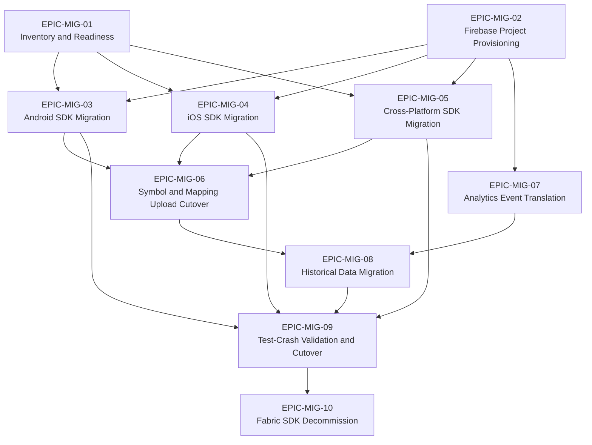

# Theme B — Fabric → Firebase Crashlytics Migration

This folder contains the agile planning artifacts for the one-time transition from the legacy Fabric SDK to the Firebase Crashlytics SDK. The migration spans every supported client platform — Android, iOS, Flutter, Unity, and React Native — and covers the full transition lifecycle from initial inventory through final Fabric SDK decommission. Per the user's R-2 mandate, every epic in this folder carries explicit Given-When-Then acceptance criteria (Rule AR-4) so that downstream readers — engineering, QA, product management, release management, and security — can independently verify epic completion against observable conditions. The ten epics are sequenced into six logical phases that minimize rework, identify parallelization opportunities, and keep the dependency graph between epics acyclic. All content is grounded in public Fabric → Firebase Crashlytics migration guidance; see each epic's `## References` section for the canonical sources.

## User Request (Preserved Verbatim)

This theme directly satisfies the second bullet of the user's two-part request, preserved verbatim below per Rule AR-8:

> User input — preserved verbatim:
> - Generate epics and stories for the Crashlytics crash reporting pipeline from crash capture to dashboard delivery
>   - Break down the Fabric to Firebase Crashlytics migration into epics with acceptance criteria

This theme implements the indented second bullet ("Break down the Fabric to Firebase Crashlytics migration into epics with acceptance criteria"). The pipeline catalog under [../pipeline/README.md](../pipeline/README.md) implements the parent bullet.

## Sunset Context

The migration program exists because November 15 was the last day to upgrade before the legacy Fabric SDK was shut down, and on that date the legacy Fabric SDK sunset, meaning any apps still using it no longer report crashes to the legacy service. This deadline is documented here as **deadline context**, NOT as a scheduling directive: per Rule AR-6, this catalog describes what work is needed and how to perform it, never when to schedule it. Implementing teams consult their own release calendars to decide when each epic is worked; the only invariant the catalog enforces is the dependency ordering between epics established in the sections below.

In addition to the unavoidable sunset deadline, several concrete improvements in the new Firebase Crashlytics SDK motivate adoption independently of the legacy shutdown:

- The new Firebase Crashlytics SDK can upload crashes after an app has closed, allowing crash data to be received more nearly in real time on Android than the legacy "upload on next launch" model permitted.
- The new SDK is estimated to capture approximately 30% more Android crashes than the legacy Fabric SDK across comparable workloads.
- The Crashlytics Gradle Plugin was streamlined with a new API in `build.gradle` for managing and uploading mapping files and native symbol files — replacing the heavier legacy Fabric plugin.
- The total plugin size was reduced from 20+ MB to only approximately 100 KB, materially reducing build-tooling footprint and CI download time per build.
- The Firebase Crashlytics SDK is a real-time crash reporter available for Apple, Android, Flutter, and Unity — and via `@react-native-firebase/crashlytics` for React Native — providing a single uniform SDK surface across every supported client platform.

## Sequencing Rationale

The ten migration epics are organized into six logical phases that minimize rework, surface parallelization opportunities for migration program coordinators, and keep the dependency graph between epics acyclic. Each epic's `## Dependencies` section identifies its predecessors and successors with one-line justifications; this section provides the program-level roll-up. The phases are presented in dependency order — Phase 1 must complete before Phase 2 begins, and so on through Phase 6.

### Phase 1 — Foundation (parallel)

`EPIC-MIG-01` (inventory and readiness) and `EPIC-MIG-02` (Firebase project provisioning) can proceed in parallel — they have no inter-dependency and both must complete before Phase 2 begins. The inventory establishes the source-of-truth scope for migration, the AndroidX prerequisite verification, and the risk register; the project provisioning establishes the Firebase project (analogous to the Fabric organization), the per-platform app bindings, and the Google Analytics integration that downstream epics consume.

- [`EPIC-MIG-01`](EPIC-MIG-01-inventory-and-readiness.md) — Inventory and Readiness
- [`EPIC-MIG-02`](EPIC-MIG-02-firebase-project-provisioning.md) — Firebase Project Provisioning

### Phase 2 — Platform SDK Swaps (parallel)

`EPIC-MIG-03`, `EPIC-MIG-04`, and `EPIC-MIG-05` all depend on Phase 1 (inventory readiness AND Firebase project provisioning) and can be executed in parallel by separate platform teams. Each epic owns the SDK installation, build-system cleanup, and initialization code changes for its platform surface; the three together produce a Firebase Crashlytics SDK installation across every client platform in scope.

- [`EPIC-MIG-03`](EPIC-MIG-03-android-sdk-migration.md) — Android SDK Migration
- [`EPIC-MIG-04`](EPIC-MIG-04-ios-sdk-migration.md) — iOS SDK Migration
- [`EPIC-MIG-05`](EPIC-MIG-05-cross-platform-sdk-migration.md) — Cross-Platform SDK Migration (Flutter, Unity, React Native)

### Phase 3 — Cutover Mechanics

`EPIC-MIG-06` (symbol and mapping upload cutover) depends on all three Phase 2 platform SDK swaps because it consumes their installed build configurations to wire up mapping- and symbol-upload tasks against the new Crashlytics Gradle plugin, the iOS Run Script Build Phase, and the cross-platform framework symbol artifacts. `EPIC-MIG-07` (analytics event translation) can proceed in parallel with Phase 2 — it has no SDK build-system dependency and requires only `EPIC-MIG-02` to ensure Google Analytics for Firebase is enabled.

- [`EPIC-MIG-06`](EPIC-MIG-06-symbol-and-mapping-upload-cutover.md) — Symbol and Mapping Upload Cutover
- [`EPIC-MIG-07`](EPIC-MIG-07-analytics-event-translation.md) — Analytics Event Translation

### Phase 4 — Data Reconciliation

`EPIC-MIG-08` (historical data migration) depends on Phase 3 because reconciliation requires both the forward symbol-upload pathway (so symbolicated stacks exist on both sides of the cutover) and the translated analytics surface (so historical data is correlated against a stable analytics property). The epic migrates historical Crashlytics data via the Firebase migration page and produces the reconciliation report comparing pre- and post-cutover issue counts.

- [`EPIC-MIG-08`](EPIC-MIG-08-historical-data-migration.md) — Historical Data Migration

### Phase 5 — Validation

`EPIC-MIG-09` (test-crash validation and cutover) depends on Phases 2, 3, and 4 and is the gate for the dual-running validation window and the traffic cutover sign-off. The epic forces test crashes from release builds of every platform, verifies receipt in the Firebase Console within five minutes of cold relaunch, runs the dual-running parity comparison against pre-cutover baselines, and produces the formal cutover sign-off artifact that authorizes Phase 6.

- [`EPIC-MIG-09`](EPIC-MIG-09-test-crash-validation-cutover.md) — Test-Crash Validation and Cutover

### Phase 6 — Decommission

`EPIC-MIG-10` (Fabric SDK decommission) is the terminal epic of the migration program. It depends on Phase 5's successful cutover sign-off and produces the final repository-wide removal of every `fabric.io` reference, the retirement of legacy upload jobs and CI integrations, the archival of the Fabric organization, and the internal stakeholder communication that acknowledges the legacy SDK sunset.

- [`EPIC-MIG-10`](EPIC-MIG-10-fabric-sdk-decommission.md) — Fabric SDK Decommission

## Phase Dependency Diagram

The following Mermaid diagram visualizes the dependency graph between the ten migration epics across the six phases. The graph is acyclic and topologically sortable; arrows point from predecessor to successor.

The diagram makes the parallelization opportunities visually explicit: Phase 1 has two parallel epics (`M1` and `M2`), Phase 2 has three parallel epics (`M3`, `M4`, `M5`), and `M7` in Phase 3 can run in parallel with all of Phase 2 because its only predecessor is `M2`.

## Epic Catalog

The following table lists all ten migration epics in numerical order with their phase assignment, a one-line summary, and the predecessor epics that must complete before the row's epic can begin. The Epic ID column links to the epic file.

| Epic ID | Title | Phase | Summary | Predecessors |
|---------|-------|-------|---------|--------------|
| [EPIC-MIG-01](EPIC-MIG-01-inventory-and-readiness.md) | Inventory and Readiness | Phase 1 | Audit Fabric usage per app and platform; verify AndroidX migration prerequisite; identify risk factors and custom integrations | none |
| [EPIC-MIG-02](EPIC-MIG-02-firebase-project-provisioning.md) | Firebase Project Provisioning | Phase 1 | Create Firebase project (analogous to Fabric organization); link iOS/Android/Flutter/Unity/RN app bundle IDs; enable Google Analytics for breadcrumb logs | none |
| [EPIC-MIG-03](EPIC-MIG-03-android-sdk-migration.md) | Android SDK Migration | Phase 2 | Remove Fabric Maven repo and Gradle plugin; add `firebase-crashlytics-gradle`; adopt Firebase Android BoM; replace legacy init code | EPIC-MIG-01, EPIC-MIG-02 |
| [EPIC-MIG-04](EPIC-MIG-04-ios-sdk-migration.md) | iOS SDK Migration | Phase 2 | Remove Fabric Run Script Build Phase; drop `pod 'Fabric'` and `pod 'Crashlytics'`; add Firebase Crashlytics via CocoaPods or SPM; update `AppDelegate` init | EPIC-MIG-01, EPIC-MIG-02 |
| [EPIC-MIG-05](EPIC-MIG-05-cross-platform-sdk-migration.md) | Cross-Platform SDK Migration | Phase 2 | FlutterFire `firebase_crashlytics`, Unity Firebase plugin, and `@react-native-firebase/crashlytics` adoption with autolinking | EPIC-MIG-01, EPIC-MIG-02 |
| [EPIC-MIG-06](EPIC-MIG-06-symbol-and-mapping-upload-cutover.md) | Symbol and Mapping Upload Cutover | Phase 3 | Cutover mapping uploads from legacy 20+ MB Fabric plugin to new ~100 KB Crashlytics Gradle plugin; integrate dSYM and NDK symbol upload | EPIC-MIG-03, EPIC-MIG-04, EPIC-MIG-05 |
| [EPIC-MIG-07](EPIC-MIG-07-analytics-event-translation.md) | Analytics Event Translation | Phase 3 | Translate Answers `logFoo` events to Google Analytics for Firebase predefined or custom events; preserve event continuity | EPIC-MIG-02 |
| [EPIC-MIG-08](EPIC-MIG-08-historical-data-migration.md) | Historical Data Migration | Phase 4 | Migrate historical Crashlytics data via Firebase migration page; reconcile pre- and post-cutover issue counts | EPIC-MIG-06, EPIC-MIG-07 |
| [EPIC-MIG-09](EPIC-MIG-09-test-crash-validation-cutover.md) | Test-Crash Validation and Cutover | Phase 5 | Force test crashes (Android `RuntimeException`, iOS `fatalError()`); confirm receipt in Firebase Console within 5 minutes; dual-running validation window | EPIC-MIG-03, EPIC-MIG-04, EPIC-MIG-05, EPIC-MIG-08 |
| [EPIC-MIG-10](EPIC-MIG-10-fabric-sdk-decommission.md) | Fabric SDK Decommission | Phase 6 | Remove all `fabric.io` references; retire legacy upload jobs; archive Fabric organization; communicate sunset to internal stakeholders | EPIC-MIG-09 |

## Program Exit Criteria

The migration program is considered complete when ALL of the following observable conditions are simultaneously true. These criteria are expressed in Given-When-Then form (Rule AR-4) to align with the catalog's acceptance-criteria discipline and to give the program coordinator an audit-ready checklist that mirrors the format used in every individual epic.

- **Given** all ten migration epics (`EPIC-MIG-01` through `EPIC-MIG-10`) have their epic-level Given-When-Then acceptance criteria satisfied and their Definition of Done items observably true, **When** the migration program coordinator audits this folder, **Then** every epic's Metadata table shows a `Done` Status value and every epic's References section is populated with public Firebase or Crashlytics guidance.
- **Given** the dual-running validation window from `EPIC-MIG-09` has elapsed without regression, **When** the on-call engineer queries the Firebase Console and the reconciled pre-cutover baseline from `EPIC-MIG-08`, **Then** crash-volume parity within an agreed tolerance (typically ±10%) is observed between Firebase Crashlytics and the legacy Fabric SDK for the same window, with any documented Known Gaps from `EPIC-MIG-08` accounted for.
- **Given** all client platforms (Android, iOS, Flutter, Unity, React Native) have shipped the Firebase Crashlytics SDK to production via release-channel builds, **When** a force-crash is triggered from a release build of each platform and the app is cold-relaunched, **Then** the resulting crash is visible in the Firebase Console within five minutes per canonical Firebase troubleshooting guidance.
- **Given** `EPIC-MIG-10` has completed, **When** a repository-wide `grep -ril "fabric.io"` runs against every in-scope client repository, **Then** no `fabric.io` Maven repository reference, no `io.fabric` Gradle plugin classpath, no Fabric Run Script Build Phase, no `pod 'Fabric'` or `pod 'Crashlytics'` declaration, and no Fabric API key remains in any client app's build configuration or source.
- **Given** the Fabric organization has been archived per `EPIC-MIG-10`, **When** an internal stakeholder consults the migration status communication, **Then** the communication acknowledges the legacy-SDK sunset as deadline CONTEXT, confirms that crash collection is sourced EXCLUSIVELY from Firebase Crashlytics post-cutover, and links to `EPIC-MIG-09`'s cutover sign-off artifact and `EPIC-MIG-08`'s historical data reconciliation report as supporting evidence.
- **Given** every risk recorded in the Risk Register Summary below, **When** the program coordinator reviews each risk's owning epic, **Then** every risk is either marked `Mitigated` with a link to the mitigation evidence or marked `Accepted` with a documented rationale and an assigned residual-risk owner.

## Risk Register Summary

The following table summarizes the principal risks tracked across the migration program. This summary is a roll-up for stakeholders skimming the theme; detailed risk treatment lives in the owning epic's `## Out of Scope` and `## Notes` sections and is reinforced by the epic's Given-When-Then acceptance criteria.

| Risk ID | Description | Mitigation | Owning Epic |
|---------|-------------|------------|-------------|
| `R-MIG-01` | App not yet migrated to AndroidX, blocking adoption of the Firebase Crashlytics SDK (the SDK uses AndroidX as a hard dependency) | Verify AndroidX migration as a prerequisite during inventory; defer Crashlytics migration for that app until AndroidX migration completes; record a clear re-entry path in the readiness report | [`EPIC-MIG-01`](EPIC-MIG-01-inventory-and-readiness.md), [`EPIC-MIG-03`](EPIC-MIG-03-android-sdk-migration.md) |
| `R-MIG-02` | Custom DexGuard or non-standard ProGuard/R8 variants break symbol upload to the new 100 KB Crashlytics Gradle plugin | Audit custom obfuscation tooling during inventory; surface non-standard configurations as known risks; pilot symbol upload on a non-production app first and verify the symbolicated stack in the Firebase Console before generalizing | [`EPIC-MIG-01`](EPIC-MIG-01-inventory-and-readiness.md), [`EPIC-MIG-06`](EPIC-MIG-06-symbol-and-mapping-upload-cutover.md) |
| `R-MIG-03` | Test-crash not visible in Firebase Console within five minutes of cold relaunch, blocking validation sign-off | Enable Crashlytics debug logging when troubleshooting; verify `google-services.json` (Android) / `GoogleService-Info.plist` (iOS) presence and bundle-ID match; confirm Google Analytics is enabled in the Firebase project; verify network egress is not blocked on the test device | [`EPIC-MIG-09`](EPIC-MIG-09-test-crash-validation-cutover.md) |
| `R-MIG-04` | Answers events not cleanly mappable to Google Analytics for Firebase predefined events, causing reporting discontinuity | Inventory all Answers events during analytics translation; prefer GA4F predefined events where semantically equivalent; convert non-mappable events to custom events with a documented naming convention; preserve the legacy-event → GA4F-event mapping table as the authoritative translation artifact | [`EPIC-MIG-07`](EPIC-MIG-07-analytics-event-translation.md) |
| `R-MIG-05` | Historical Crashlytics data not accessible via the Firebase migration page, causing loss of trend visibility across the cutover | Verify migration page eligibility during readiness; reconcile pre- and post-cutover issue counts against the migration page output; export pre-cutover data to BigQuery as a hedge if the migration page is unavailable for the project | [`EPIC-MIG-08`](EPIC-MIG-08-historical-data-migration.md) |
| `R-MIG-06` | Stale references to `fabric.io` Maven repository, `io.fabric` Gradle plugin, Fabric Build Phases, `pod 'Fabric'`, `pod 'Crashlytics'`, or Fabric API keys remain after platform SDK swap, causing build warnings or runtime conflicts | Run a repository-wide `grep -ril "fabric.io"` and `grep -ril "io.fabric"` discipline as part of the decommission epic's Definition of Done; add a CI lint check that fails on `fabric.io` references; verify the cleanup against the inventory baseline from `EPIC-MIG-01` | [`EPIC-MIG-10`](EPIC-MIG-10-fabric-sdk-decommission.md) |

## Authoring Rules Enforced in This Theme

All eleven markdown files in this folder (this README plus the ten `EPIC-MIG-*.md` epics) follow the uniform authoring rules established for the catalog. Particular emphasis on Rule AR-4 per the user's R-2 mandate; the rules are summarized below for reader convenience and are documented in full in the master catalog index at [`../README.md`](../README.md).

- `Rule AR-1 (Template Discipline):` Every epic in this folder derives from [`../templates/epic-template.md`](../templates/epic-template.md); every embedded story derives from [`../templates/story-template.md`](../templates/story-template.md). Section ordering inside each epic is fixed and must not be reordered, renamed, removed, or added to.
- `Rule AR-2 (Stable Identifiers):` Epic IDs use the pattern `EPIC-MIG-NN` where `NN` is a zero-padded two-digit ordinal. Story IDs use the pattern `STORY-MIG-NN-SMM` where `NN` matches the parent epic's number and `MM` is the zero-padded two-digit story ordinal within that epic. IDs are stable, unique across the entire catalog, monotonically numbered, and must never be reused or renumbered.
- `Rule AR-3 (INVEST-Aligned Stories):` Every story uses the framing `As a <role>, I want <capability>, so that <outcome>.` Roles cover at minimum the migration program lead, mobile developers per platform, release management, on-call engineers, data analysts, and security/privacy reviewers.
- `Rule AR-4 (Given-When-Then Acceptance Criteria — CRITICAL FOR THIS FOLDER):` Every story has 2–5 acceptance criteria phrased as `Given <precondition>, When <event>, Then <observable outcome>` and every epic has 3–6 epic-level acceptance criteria in the same form. The user explicitly mandated acceptance criteria for migration epics; this rule is the catalog's mechanism for satisfying that mandate.
- `Rule AR-5 (Source Grounding):` Every epic's `## References` section cites public Fabric → Firebase Crashlytics migration guidance — including the Firebase Crashlytics overview, the get-started guides per platform, the migration blog post, and the troubleshooting documentation. Inferred content not directly traceable to a public source is explicitly flagged inline.
- `Rule AR-6 (No Time-Based Planning):` Epics describe WHAT and HOW, never WHEN. No sprint numbers, no calendar dates, no week-by-week schedules appear in any epic. Even the legacy Fabric SDK sunset of November 15 is referenced as deadline CONTEXT only, never as a scheduling directive.
- `Rule AR-7 (Dashed Lists Only):` All unordered lists in this folder use `-` markers. Numbered bullets are not used anywhere in the catalog.
- `Rule AR-8 (Verbatim User Inputs):` The user's second requirement bullet appears verbatim once in this README (see the User Request (Preserved Verbatim) section above). The full two-bullet user input is preserved in the master catalog index at [`../README.md`](../README.md).

## Relationship to the Pipeline Theme

Migration epics in this folder describe the one-time transition from the legacy Fabric SDK to the Firebase Crashlytics SDK; they have a defined start (Phase 1 inventory and provisioning) and a defined end (Phase 6 Fabric SDK decommission). Pipeline epics under [`../pipeline/README.md`](../pipeline/README.md), by contrast, describe the steady-state Crashlytics crash reporting pipeline that operates continuously AFTER the migration program completes — from on-device crash capture through dashboard delivery and downstream BigQuery export. Migration epics may reference pipeline epics for semantic context (for example, `EPIC-MIG-06` Symbol and Mapping Upload Cutover aligns with `EPIC-PA-03` Symbolication, and `EPIC-MIG-09` test-crash receipt validation aligns with `EPIC-PA-07` Dashboard Delivery), but no cyclic dependency exists between the two themes: the migration theme is self-contained and readable independently, and the pipeline theme assumes the SDK is already installed.
