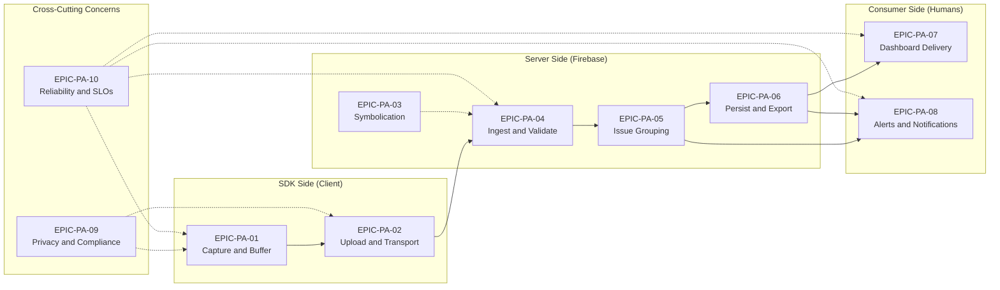

# Crashlytics Crash Reporting Pipeline — Theme A

This folder contains the agile planning artifacts for the **end-to-end Crashlytics ingestion-and-display pipeline**, covering the inclusive range from on-device crash capture (SDK-level hooks for unhandled exceptions, NDK native crashes, ANRs, and non-fatal errors) through dashboard delivery (Firebase Console issue cards and downstream consumers). The ten epics partition the canonical pipeline into eight sequential stages plus two cross-cutting concerns. This theme directly satisfies the user's first requirement bullet (preserved verbatim below); the companion migration theme under [`../migration/README.md`](../migration/README.md) implements the user's second requirement bullet.

## User Requirement (Verbatim)

The user's first requirement bullet is preserved character-for-character below per Rule AR-8. The complete two-bullet user input is preserved in the master catalog index at [`../README.md`](../README.md).

> Generate epics and stories for the Crashlytics crash reporting pipeline from crash capture to dashboard delivery

This catalog of 10 epics with embedded user stories and Given-When-Then acceptance criteria is the direct response to the requirement above.

## Pipeline Stage Diagram

The Crashlytics pipeline is partitioned into 8 stages plus 2 cross-cutting concerns. Each stage maps one-to-one to a single pipeline epic so each epic is independently shippable and independently testable. Solid arrows denote data flow; dashed arrows denote cross-cutting observation or gating.

Symbolication (`EPIC-PA-03`) runs at build time but applies at ingest time and is drawn as a parallel input into `EPIC-PA-04`. Privacy (`EPIC-PA-09`) gates the SDK-side stages; reliability (`EPIC-PA-10`) observes the entire pipeline.

## Pipeline Epic Catalog

The following table lists all ten pipeline epics in numerical order with stage, one-line summary, and status. The Title column links to the epic file.

| Epic ID | Title | Pipeline Stage | Summary | Status |
|---------|-------|----------------|---------|--------|
| `EPIC-PA-01` | [Crash Capture and On-Device Buffering](./EPIC-PA-01-crash-capture-and-buffering.md) | Stage 1 — SDK-Side Capture | On-device hooks for unhandled exceptions, NDK native crashes, ANRs (Android 11+ via `getHistoricalProcessExitReasons`), and non-fatal errors; local persistence until next app launch. | Proposed |
| `EPIC-PA-02` | [Upload and Transport](./EPIC-PA-02-upload-and-transport.md) | Stage 2 — SDK-Side Transport | Background transport on next launch, post-app-close uploads (new Firebase SDK capability), exponential backoff retries, HTTPS transport security. | Proposed |
| `EPIC-PA-03` | [Symbolication](./EPIC-PA-03-symbolication.md) | Stage 3 — Build-Time / Server-Side (parallel) | ProGuard/R8 mapping, iOS dSYM, and NDK native symbol upload via the streamlined Crashlytics Gradle plugin; human-readable crash report construction. | Proposed |
| `EPIC-PA-04` | [Server-Side Ingestion and Validation](./EPIC-PA-04-ingestion-and-validation.md) | Stage 4 — Server-Side Ingest | Logical ingest endpoints, schema validation, request authentication, deduplication of retried payloads. | Proposed |
| `EPIC-PA-05` | [Issue Grouping and Lifecycle](./EPIC-PA-05-issue-grouping.md) | Stage 5 — Server-Side Grouping | Stack-trace fingerprinting, issue lifecycle (`Open`/`Closed`/`Regressed`), merge/split workflows, AI-grouping forward compatibility. | Proposed |
| `EPIC-PA-06` | [Persistence and BigQuery Export](./EPIC-PA-06-persistence-and-bigquery-export.md) | Stage 6 — Persistence and Export | Durable storage of grouped issues; BigQuery linking (datasets auto-located in US); Looker Studio / Grafana downstream dashboards. | Proposed |
| `EPIC-PA-07` | [Dashboard Delivery](./EPIC-PA-07-dashboard-delivery.md) | Stage 7 — Consumer-Side Dashboard (TERMINAL stage) | Firebase Console issue cards, filters (severity / time / version / device / Google Play track), App Quality Insights in Android Studio, 5-minute end-to-end SLA. | Proposed |
| `EPIC-PA-08` | [Alerting and Notifications](./EPIC-PA-08-alerting-and-notifications.md) | Stage 8 — Consumer-Side Alerts | Velocity alerts (Crashlytics SDK v18.6.0+), regression alerts, Slack/Jira/email integrations, quiet hours and severity-aware routing. | Proposed |
| `EPIC-PA-09` | [Privacy and Compliance](./EPIC-PA-09-privacy-and-compliance.md) | Cross-Cutting — Privacy | Opt-in collection, PII redaction policy, GDPR/CCPA data-subject rights, `setCrashlyticsCollectionEnabled` runtime override. | Proposed |
| `EPIC-PA-10` | [Pipeline Reliability and SLOs](./EPIC-PA-10-pipeline-reliability-and-slos.md) | Cross-Cutting — Reliability | Capture-rate SLO, 5-minute time-to-dashboard SLO, MTTD tracking, error-budget policy, synthetic monitoring. | Proposed |

## Pipeline Partitioning Rationale

The ten epics map one-to-one to canonical Crashlytics stages so each owns a single architectural concern. The partition is grouped into four categories.

- **SDK-side stages** ([`EPIC-PA-01`](./EPIC-PA-01-crash-capture-and-buffering.md) Capture, [`EPIC-PA-02`](./EPIC-PA-02-upload-and-transport.md) Upload) — what runs on the user's device: runtime hooks (exception handlers, NDK signal handlers, ANR detection, non-fatal `recordError`) plus the transport pathway that delivers buffered payloads on next launch or post-app-close.
- **Server-side stages** ([`EPIC-PA-03`](./EPIC-PA-03-symbolication.md) Symbolication, [`EPIC-PA-04`](./EPIC-PA-04-ingestion-and-validation.md) Ingestion, [`EPIC-PA-05`](./EPIC-PA-05-issue-grouping.md) Grouping, [`EPIC-PA-06`](./EPIC-PA-06-persistence-and-bigquery-export.md) Persistence) — what runs in Firebase infrastructure: ingest endpoints, schema validation, deduplication, fingerprinting and issue lifecycle, durable persistence, BigQuery export linking.
- **Consumer-side stages** ([`EPIC-PA-07`](./EPIC-PA-07-dashboard-delivery.md) Dashboard, [`EPIC-PA-08`](./EPIC-PA-08-alerting-and-notifications.md) Alerts) — what surfaces to humans: Firebase Console issue cards, Android Studio App Quality Insights, alert channels routing to Slack, Jira, and email.
- **Cross-cutting concerns** ([`EPIC-PA-09`](./EPIC-PA-09-privacy-and-compliance.md) Privacy, [`EPIC-PA-10`](./EPIC-PA-10-pipeline-reliability-and-slos.md) Reliability/SLOs) — what gates or observes all preceding stages: privacy gates SDK-side stages (opt-in collection, `setCrashlyticsCollectionEnabled`, PII redaction); reliability observes the entire pipeline (capture-rate SLO, 5-minute time-to-dashboard SLO, MTTD, error-budget policy).

## Internal Dependencies

The pipeline epic dependency graph is acyclic and topologically sortable. Each epic's `## Dependencies` section enumerates predecessor/successor relationships in detail; the roll-up is summarized below.

- `EPIC-PA-02` depends on `EPIC-PA-01` — transport consumes captured payloads.
- `EPIC-PA-04` depends on `EPIC-PA-02` — ingestion consumes uploaded payloads.
- `EPIC-PA-03` is parallel to `EPIC-PA-04` — symbolication artifacts are uploaded at build time and applied at ingest time.
- `EPIC-PA-05` depends on `EPIC-PA-04` and `EPIC-PA-03` — grouping consumes validated, symbolicated payloads.
- `EPIC-PA-06` depends on `EPIC-PA-05` — persistence stores grouped issues.
- `EPIC-PA-07` depends on `EPIC-PA-06` — dashboard reads from persisted storage.
- `EPIC-PA-08` depends on `EPIC-PA-05` and `EPIC-PA-06` — alerts trigger on issue events (new, regressed, velocity threshold breached).
- `EPIC-PA-09` gates `EPIC-PA-01` and `EPIC-PA-02` — capture and upload respect privacy controls.
- `EPIC-PA-10` observes `EPIC-PA-01` through `EPIC-PA-08` — reliability covers the entire pipeline via SLOs.

## Relationship to the Migration Theme

Pipeline epics describe the **steady-state pipeline** after migration is complete; migration epics in [`../migration/README.md`](../migration/README.md) describe the **one-time transition** from the legacy Fabric SDK to the Firebase Crashlytics SDK. The two themes share semantic context at the following seams.

- `EPIC-PA-03` Symbolication (steady-state mapping uploads via the ~100 KB Crashlytics Gradle plugin) ↔ [`EPIC-MIG-06`](../migration/EPIC-MIG-06-symbol-and-mapping-upload-cutover.md) Symbol and Mapping Upload Cutover (one-time cutover from Fabric to Firebase).
- `EPIC-PA-08` Alerting (velocity alerts require Crashlytics Android SDK v18.6.0+) ↔ [`EPIC-MIG-03`](../migration/EPIC-MIG-03-android-sdk-migration.md) Android SDK Migration (minimum-SDK-version enforced so velocity alerts work post-cutover).
- `EPIC-PA-09` Privacy and Compliance ↔ [`EPIC-MIG-07`](../migration/EPIC-MIG-07-analytics-event-translation.md) Analytics Event Translation (user-ID handling and PII discipline carried over from Answers into Google Analytics for Firebase).
- `EPIC-PA-10` Pipeline Reliability and SLOs ↔ [`EPIC-MIG-09`](../migration/EPIC-MIG-09-test-crash-validation-cutover.md) Test-Crash Validation and Cutover (post-migration capture-rate baseline feeds reliability SLO target setting).

No cyclic dependency exists between the two themes — pipeline epics may reference migration epics for semantic context only.

## Authoring Rules Enforced

All 10 pipeline epics in this folder follow the uniform authoring rules established for the catalog. See the master [`../README.md`](../README.md) for the canonical definitions.

- **Rule AR-1 — Template Discipline:** Every epic derives from [`../templates/epic-template.md`](../templates/epic-template.md); every embedded story derives from [`../templates/story-template.md`](../templates/story-template.md).
- **Rule AR-2 — Stable Identifiers:** Pipeline epic IDs use `EPIC-PA-NN` (zero-padded two-digit). Story IDs use `STORY-PA-NN-SMM`.
- **Rule AR-3 — INVEST-Aligned Stories:** Every story uses *"As a `<role>`, I want `<capability>`, so that `<outcome>`"* framing.
- **Rule AR-4 — Given-When-Then Acceptance Criteria:** Every story has 2–5 Given-When-Then criteria; every epic has 3–6 epic-level criteria; all bolded `**Given**`, `**When**`, `**Then**`.
- **Rule AR-5 — Source Grounding:** Every epic's `## References` section cites public Firebase or Crashlytics guidance.
- **Rule AR-6 — No Time-Based Planning:** Epics describe WHAT and HOW, never WHEN. No sprint numbers, no calendar dates.
- **Rule AR-7 — Dashed Lists Only:** All unordered lists use `-` markers.
- **Rule AR-8 — Verbatim User Inputs:** The user's first requirement bullet appears verbatim above. The full two-bullet user input is preserved in [`../README.md`](../README.md).

## Provenance

Created in response to the user's first requirement bullet (preserved verbatim above per Rule AR-8). Content is grounded in canonical public Firebase Crashlytics guidance; per-epic citations live in each epic's `## References` section. See [`../README.md`](../README.md) and [`../migration/README.md`](../migration/README.md) for catalog-wide navigation.
